# 梯度下降算法

模型训练是以训练损失最小化为目标的参数估计过程。梯度下降及其改进方法利用损失函数的梯度构造参数更新，通过迭代降低模型在训练数据上的预测误差。

本文依次讨论常规梯度下降、随机梯度下降、动量法、Nesterov 加速动量和 Adam，重点说明各方法的定义、更新机制及适用限制，并最终解释其差异。[1]

## 1. 模型训练与优化目标

### 模型参数与损失函数

给定训练数据 $\{(x_i,y_i)\}_{i=1}^{N}$，模型 $f(x_i;\theta)$ 根据输入 $x_i$ 给出预测。$\theta$ 表示模型参数。

损失函数将模型预测与观测值之间的差异量化为标量。以平方误差损失为例：

$$
\ell_i(\theta)=\bigl(f(x_i;\theta)-y_i\bigr)^2,
\qquad
L(\theta)=\frac{1}{N}\sum_{i=1}^{N}\ell_i(\theta).
$$

$\ell_i$ 是一个样本的损失，$L$ 是所有训练样本的平均损失。训练目标是求解损失函数的最小化问题：

$$
\theta^*\in\arg\min_{\theta}L(\theta).
$$

其中，$\arg\min$ 表示使目标函数取得最小值的参数集合。符号 $\in$ 表明最优参数可能不唯一。

损失函数也可定义为样本损失之和。**求和损失与平均损失具有相同的最优解，但梯度相差 $N$ 倍。** 为使两种定义下的常规梯度下降产生相同更新，需要相应缩放学习率。本文将统一采用平均损失。

### 迭代训练过程

梯度优化的基本训练流程包括：

1. 确定参数初始值。
2. 根据当前参数计算模型预测与损失。
3. 计算损失函数关于参数的梯度。
4. 根据优化算法更新参数，并重复上述过程。

反向传播用于高效计算梯度，优化器根据梯度构造更新，参数初始化则确定迭代起点。三者共同影响训练效率与最终结果。

主要符号定义如下：

| 记号 | 含义 |
|---|---|
| $\theta_t$ | 第 $t$ 次更新前的参数，初始值为 $\theta_0$ |
| $g_t$ | 当前用于更新的梯度，可以来自全部样本或一个小批量 |
| $\alpha$ | 学习率，控制更新幅度 |
| $B_t,b$ | 当前批次的样本集合及其大小 |
| $m_t$ | 梯度的历史加权平均 |
| $\beta$ | 动量系数，取 $0\leq\beta<1$ |
| $v_t$ | Adam 中梯度平方的历史加权平均 |

### 训练超参数

模型参数通过损失最小化进行估计，包括权重、偏置等。训练超参数规定优化过程的配置，包括优化器、学习率、批量大小、动量系数与训练周期数。

超参数选择通常通过比较不同配置的验证集表现完成，独立测试集用于评价最终选定模型的泛化性能。

梯度采样方式与参数更新机制是两个不同层面：SGD 采用样本子集估计梯度，动量与 Adam 则规定如何利用当前及历史梯度。因此，动量和 Nesterov 均可使用随机梯度，Adam 也可使用全梯度。

## 2. 常规梯度下降

### 梯度的定义与几何意义

损失函数关于某一参数的偏导数，描述其他参数固定时，损失随该参数变化的局部变化率。

- 偏导数为正：参数的微小增大会导致损失局部增大，减小该参数构成下降方向。
- 偏导数为负：参数的微小增大会导致损失局部减小，增大该参数构成下降方向。
- 偏导数接近零：损失对该参数的局部一阶变化不敏感。

梯度是由各参数偏导数组成的向量。对于两参数模型，有

$$
\nabla L(\theta)=
\begin{bmatrix}
\dfrac{\partial L}{\partial\theta_0}\\[4pt]
\dfrac{\partial L}{\partial\theta_1}
\end{bmatrix}.
$$

在梯度非零的位置，以欧氏距离衡量等长的微小参数位移时，梯度方向使损失的一阶增量最大，负梯度方向使其最小。因此，负梯度是局部最陡下降方向，但该性质不意味着它直接指向全局最优解。

### 参数更新规则

常规梯度下降（Gradient Descent，GD）使用全部训练样本计算损失梯度，并按照以下规则更新参数：

$$
g_t=\nabla L(\theta_t),
\qquad
\boxed{\theta_{t+1}=\theta_t-\alpha g_t.}
$$

其中，参数增量为负梯度与学习率的乘积，学习率决定该方向上的更新幅度。

例如，若当前 $\theta_t=(1,2)$，梯度 $g_t=(4,-2)$，学习率 $\alpha=0.1$，则

$$
\theta_{t+1}=(1,2)-0.1(4,-2)=(0.6,2.2).
$$

本次更新使第一个参数减小、第二个参数增大，变化方向由相应偏导数的符号决定。各偏导数均应在同一组当前参数处计算，再同步更新全部参数。

### 局部下降原理

在一维情况下，损失函数在当前参数附近的一阶近似为：

$$
L(\theta+\Delta\theta)\approx L(\theta)+L'(\theta)\Delta\theta.
$$

代入 $\Delta\theta=-\alpha L'(\theta)$，得到

$$
L(\theta-\alpha L'(\theta))
\approx L(\theta)-\alpha\bigl(L'(\theta)\bigr)^2.
$$

当 $\alpha>0$ 且导数非零时，该一阶近似给出负的损失增量，为负梯度更新提供了局部依据。

**上述结论要求更新幅度足够小，使局部近似保持有效。** 学习率过大时，高阶项的影响可能不可忽略，实际损失因而可能增加。

### 学习率与更新稳定性

学习率决定参数增量的尺度，并影响迭代速度与稳定性：

| 学习率 | 可能出现的情况 |
|---|---|
| 过小 | 参数更新幅度较小，优化进展缓慢 |
| 适当 | 在稳定性与优化速度之间取得平衡 |
| 过大 | 可能产生过冲、振荡或发散 |

以 $L(\theta)=\theta^2$ 为例，梯度为 $2\theta$，更新变成

$$
\theta_{t+1}=(1-2\alpha)\theta_t.
$$

从 $\theta_0=1$ 出发：

- $\alpha=0.1$：$1\to0.8\to0.64\to\cdots$，参数单调趋近于零。
- $\alpha=0.75$：$1\to-0.5\to0.25\to\cdots$，参数符号交替，振幅逐渐减小。
- $\alpha=1.1$：$1\to-1.2\to1.44\to\cdots$，参数符号交替，振幅逐渐增大。

对于该二次函数，参数误差在每次迭代中乘以 $1-2\alpha$。若要求任意非零初值的误差幅值逐步减小，则需要

$$
|1-2\alpha|<1
\quad\Longleftrightarrow\quad
0<\alpha<1.
$$

这给出了学习率稳定范围的一个直接推导。更一般地，若目标为 $L(\theta)=a\theta^2/2$、$a>0$，相同分析得到 $0<\alpha<2/a$；曲率 $a$ 越大，稳定学习率的上界越小。

这说明了学习率对该二次函数的影响，其稳定范围依赖于具体目标函数，不能直接推广至其他问题。

学习率与实际位移长度是不同概念：即使 $\alpha$ 固定，梯度幅值仍会随迭代变化，因此参数位移长度通常并不固定。

### 线搜索方法

线搜索在确定负梯度方向后，通过评估该方向上不同步长对应的损失来选择更新幅度。精确线搜索可写为：

$$
\alpha_t=\arg\min_{\alpha\geq0}L(\theta_t-\alpha g_t).
$$

该过程将当前迭代的步长选择转化为一维优化问题，得到的是既定方向上的最优步长。

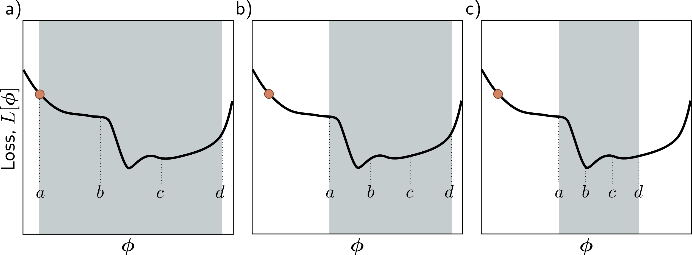

*图 1｜通过比较区间内若干位置的损失，逐步缩小搜索区间。图示的区间排除规则需要搜索区间内函数单峰等条件。[1]*

线搜索利用目标函数值选择步长，但需要额外的损失评估。大规模训练通常采用预设学习率及其调度，以控制单次更新的计算成本。

## 3. 典型模型

### 线性回归模型

一维线性回归模型为

$$
\hat y_i=\theta_0+\theta_1x_i,
\qquad
L(\theta)=\frac1N\sum_{i=1}^{N}(\theta_0+\theta_1x_i-y_i)^2.
$$

$\theta_0$ 是截距，$\theta_1$ 是斜率。记预测误差为 $r_i=\theta_0+\theta_1x_i-y_i$，则单样本损失是 $r_i^2$。

对截距求导时，$\partial r_i/\partial\theta_0=1$，所以 $\partial(r_i^2)/\partial\theta_0=2r_i$。对斜率求导时，多出因子 $x_i$。对全部样本求平均，得到

$$
\frac{\partial L}{\partial\theta_0}=\frac2N\sum_i r_i,
\qquad
\frac{\partial L}{\partial\theta_1}=\frac2N\sum_i x_ir_i.
$$

截距梯度由残差的平均值决定，反映整体预测偏差；斜率梯度由输入与残差乘积的平均值决定，反映拟合斜率的调整方向。

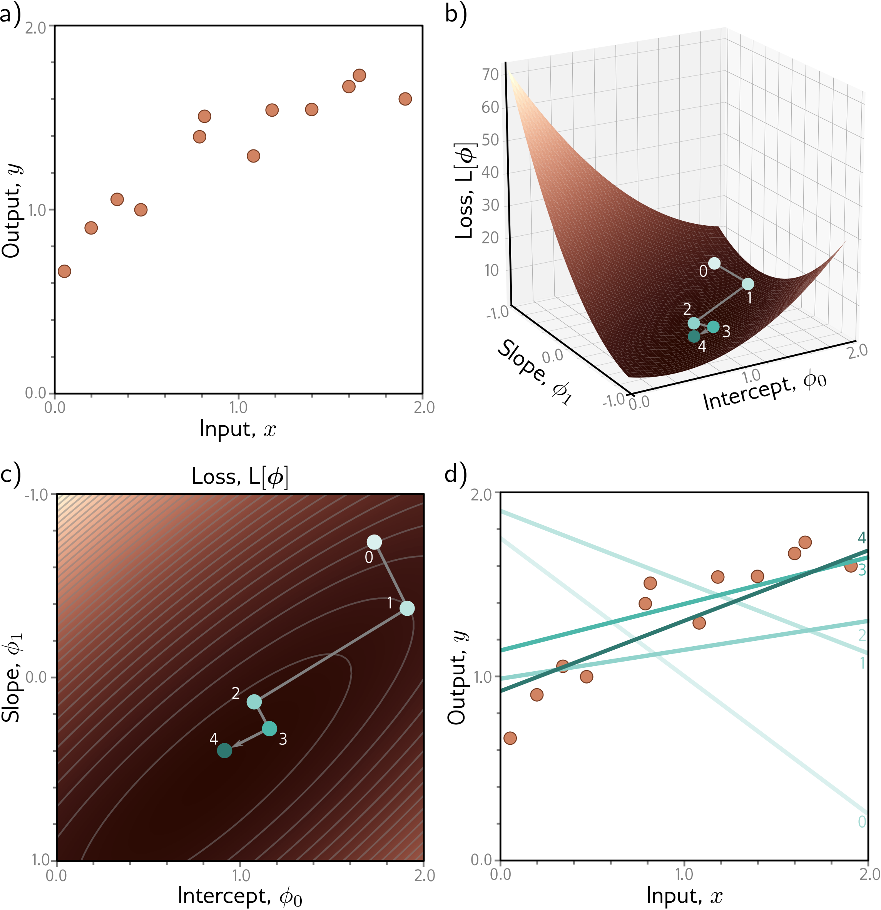

*图 2｜数据空间中的拟合直线与参数空间中的优化轨迹对应同一训练过程。每次参数更新均对应一条新的预测直线。[1]*

该平方损失关于两个参数是凸函数，因此局部最小值也是全局最小值。对于这一带截距的线性模型，当输入 $x_i$ 不全相同时，最优参数唯一。

若所有输入均为常数 $c$，模型预测仅由组合 $\theta_0+c\theta_1$ 决定，多组参数可以产生相同预测。因此，凸性本身不保证最优参数唯一。

### 曲率与 Hessian 矩阵

梯度描述损失的一阶变化，二阶导数描述梯度的局部变化。损失函数关于参数的二阶偏导数组成 Hessian 矩阵：

$$
H_{jk}=\frac{\partial^2L}{\partial\theta_j\partial\theta_k}.
$$

在一维中，$L''>0$ 对应正曲率，$L''<0$ 对应负曲率。在多维中，不同方向可以具有不同符号的曲率；这有助于解释鞍点附近同时存在上升与下降方向的现象。

在线性回归例子中，再对梯度求一次导数可得

$$
H=\frac2N
\begin{bmatrix}
N&\sum_i x_i\\
\sum_i x_i&\sum_i x_i^2
\end{bmatrix}.
$$

该矩阵与参数取值无关，表明二次损失的曲率不随参数位置变化。输入不全相同时，参数在各方向上的曲率均为正；输入完全相同时，则存在不改变预测的平坦参数方向。

牛顿法利用 Hessian 的曲率信息构造更新，但其完整矩阵的存储与处理成本可能较高。一百万个参数对应一个 $10^6\times10^6$ 的矩阵，共有 $10^{12}$ 个元素。后文介绍的 Adam 则仅维护两组与参数等长的历史向量。[1]

一阶梯度方法所需的状态规模通常较小，因而适合高维参数优化。一般非线性问题中的牛顿法仍可能需要步长控制，其更新也不必然收敛至极小点。

### Gabor 模型

非线性模型的损失函数可能具有多个局部最小值。以两参数 Gabor 模型为例：

$$
f(x;\theta)=\sin z\cdot e^{-z^2/32},
\qquad z=\theta_0+0.06\theta_1x,\quad\theta_1>0.
$$

正弦项描述振荡，指数项构成随距离衰减的振幅包络。固定 $\theta_1$ 时，改变 $\theta_0$ 对应波形的水平平移；增大 $\theta_1$ 则压缩横向尺度，并可能改变包络中心的位置。

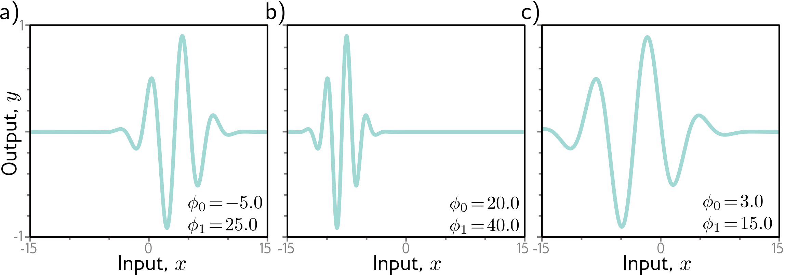

*图 3｜参数变化对 Gabor 波形的位置与横向尺度产生影响。[1]*

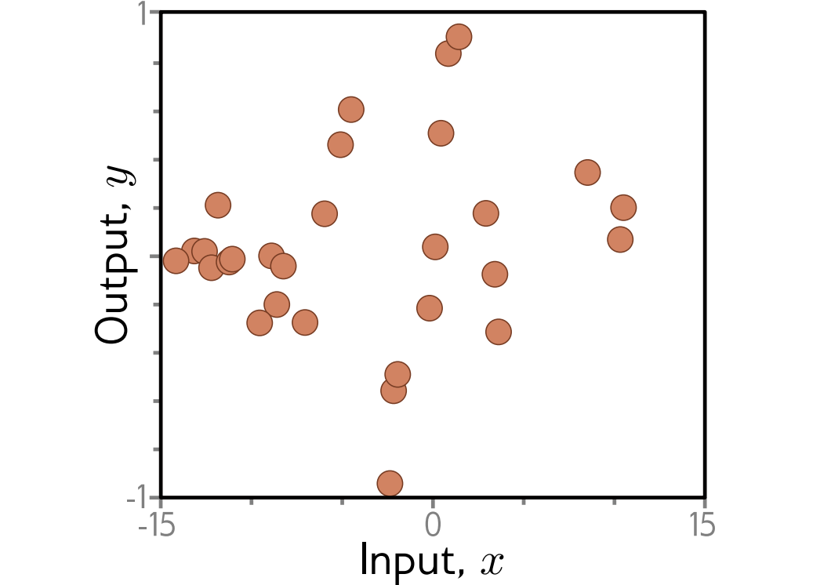

*图 4｜含噪观测分布在生成波形附近，参数估计通过最小化损失改善模型对观测数据的拟合。[1]*

采用平均平方误差时，根据链式法则，损失梯度由预测残差与模型参数导数的乘积构成：

$$
\frac{\partial L}{\partial\theta_j}
=\frac2N\sum_i\bigl(f(x_i;\theta)-y_i\bigr)
\frac{\partial f(x_i;\theta)}{\partial\theta_j}.
$$

对该模型，中间变量 $z$ 对应的导数为

$$
\frac{df}{dz}=e^{-z^2/32}\left(\cos z-\frac z{16}\sin z\right),
$$

结合 $\partial z/\partial\theta_0=1$、$\partial z/\partial\theta_1=0.06x$，即可得到两个参数的损失梯度。其参数更新仍遵循梯度下降规则，但非线性参数依赖使损失曲面更加复杂。

### 局部最小值与鞍点

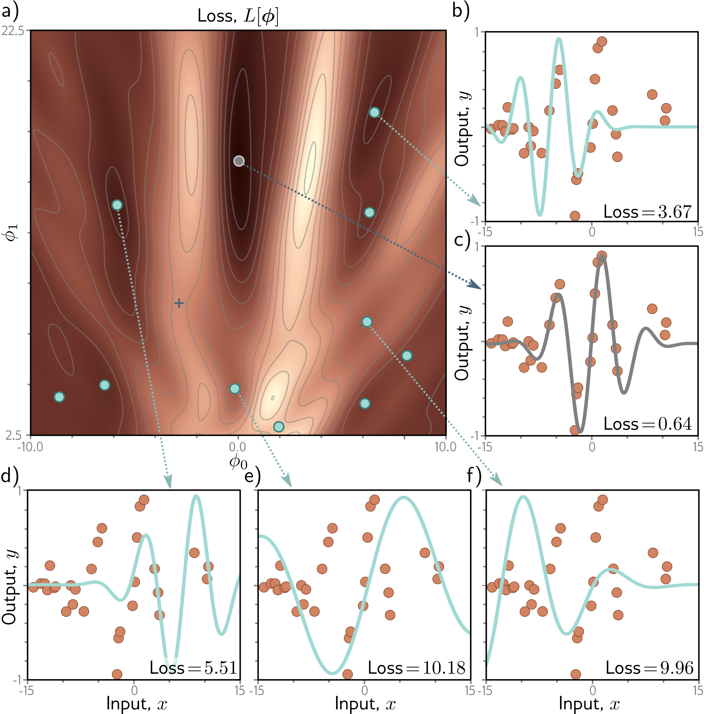

*图 5｜非凸损失具有多个局部极小点，各极小点对应不同的拟合波形；叉号标记鞍点。[1]*

相关概念定义如下：

| 概念 | 含义 |
|---|---|
| 全局最小值 | 损失函数在整个参数定义域内取得的最小值 |
| 局部最小值 | 损失函数在某点的邻域内取得的最小值，未必是全局最小值 |
| 鞍点 | 梯度为零，但沿某些方向损失增大，沿另一些方向损失减小 |

对于光滑损失，内部局部极小点必须满足梯度为零，但梯度为零并非局部极小的充分条件。例如 $L(a,b)=a^2-b^2$ 在原点梯度为零，沿 $a$ 方向上升、沿 $b$ 方向下降，因此原点是鞍点。

若纯 GD 恰好位于梯度为零的驻点，则参数增量为零，后续迭代保持不变。若参数位于局部极小点附近，较大步长可能使其离开该邻域，也可能导致发散。因此，增大学习率不能保证获得更优解。

低维问题可以采用多起点优化或搜索参数组合。随着参数维度增加，穷尽搜索的计算成本迅速增长，高维训练通常依赖迭代方法获得可接受的低损失解。

### 停止准则与模型评价

常用停止准则包括梯度范数低于阈值、损失变化低于阈值，以及达到预定计算预算。由于鞍点附近也可能具有较小梯度，这些准则不能单独构成全局最优性的证明。

训练损失与泛化性能是不同的评价对象。较低训练损失不必然对应更好的未见数据表现，模型选择还应依据验证集评价。

## 4. 随机梯度下降

### 小批量梯度估计

全批 GD 的每次参数更新均依赖全部训练样本。数据规模较大时，单次梯度计算的成本较高。

随机梯度下降（Stochastic Gradient Descent，SGD）使用随机选取的单样本或小批量构造梯度估计：

$$
g_t=\frac1b\sum_{i\in B_t}\nabla\ell_i(\theta_t),
\qquad
\boxed{\theta_{t+1}=\theta_t-\alpha g_t.}
$$

SGD 保留了 GD 的参数更新形式，并以样本子集的梯度估计替代全梯度。[1]

| 使用的数据 | 名称 |
|---|---|
| 全部 $N$ 个样本 | 全批量梯度下降，即这里的常规 GD |
| 一个样本 | 严格意义上的 SGD |
| $b$ 个样本，$1<b<N$ | 小批量梯度下降，通常也简称 SGD |

SGD 的随机性主要来自训练样本的随机选取，无需额外向梯度添加人工噪声。

### 采样噪声与无偏性

不同样本的损失梯度可能在方向和幅值上存在差异。使用样本子集计算梯度时，所得估计因批次组成而变化。

例如，一维参数处有四个样本，它们的梯度分别为 $2,4,-1,3$，全梯度是平均值 $2$。取前两个样本，批次梯度为 $3$；取后两个，批次梯度为 $1$；只取第三个，梯度甚至是 $-1$，方向与全梯度相反。

在固定参数处，如果从完整数据集均匀随机采样，批次平均梯度的期望等于全梯度：

$$
\mathbb E[g_t]=\nabla L(\theta_t).
$$

这一性质称为梯度估计的无偏性：单次估计可以偏离全梯度，但其期望与全梯度一致。每轮随机重排后依次取批次是另一种常见采样方式；由于参数与剩余样本集合在轮内持续变化，不能直接将上述无偏性结论应用于每次条件更新。

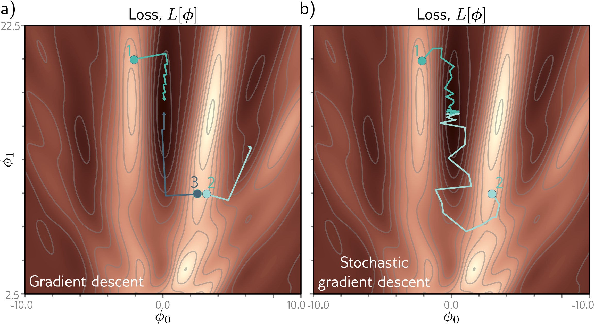

*图 6｜GD 的迭代轨迹依赖初始化；SGD 的采样波动可能使参数在不同局部极小点的吸引区域之间转移。[1]*

### 批次损失

另一种等价描述是：SGD 在每次迭代中，对当前批次定义的损失执行一次梯度更新。

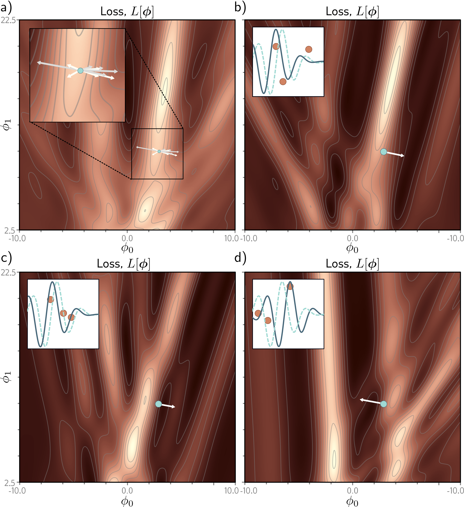

*图 7｜不同批次在同一参数处定义不同的损失与梯度。降低当前批次损失的更新，可能使总体训练损失暂时增加。[1]*

因此，SGD 的总体训练损失可能出现非单调变化，单步损失增加不必然表示计算错误。此外，过大的学习率也可能使当前批次损失增加。

### 批量大小与训练周期

一次参数更新称为一次迭代（iteration）；完整遍历训练数据一次称为一个周期（epoch）。

例如，数据集有 100 个样本，每批 20 个，不重复地使用完所有样本需要 5 次更新。因此 1000 次更新对应 $1000/5=200$ 个 epoch。

较小批量降低单次更新所需的样本量，但梯度估计的波动通常更大；较大批量通常提高估计稳定性，同时增加单次处理的数据量。因此，优化效率的比较应同时考虑迭代次数、样本处理量和实际计算成本。

在固定参数处，若从完整数据集独立、有放回地均匀抽样，且某一坐标的单样本梯度方差为 $\sigma^2$，则根据独立随机变量的方差可加性，$b$ 个样本的平均梯度方差为单样本方差之和除以 $b^2$，即

$$
\operatorname{Var}(g_{t,j})=\frac{\sigma^2}{b}.
$$

因此，梯度标准差按 $1/\sqrt b$ 缩小：批量大小增加为原来的 4 倍，标准差在这些假设下变为原来的二分之一。该关系解释了批量平均的降噪作用，但不直接描述随机重排或样本相关条件下的精确方差。[1]

### 收敛特性

SGD 通过降低单次梯度计算成本提高参数更新频率。采样噪声还可能促进参数离开部分局部极小点或鞍点的邻域。

这些性质不构成全局收敛保证，较大的采样噪声也未必改善优化或泛化性能。

接近低损失解时，全梯度接近零可能来自样本梯度之间的抵消，而非各样本梯度均接近零。例如两个样本的梯度分别为 $+1$ 和 $-1$，全梯度为零，单样本更新却仍在移动。因此，固定学习率下的 SGD 可能在解的邻域内持续波动。

### 学习率调度

学习率衰减通常在训练前期采用较大更新幅度，以较快降低损失；在后期减小更新幅度，以提高局部调整的精度。

常见方式包括每隔若干 epoch 按固定比例降低学习率，以及连续平滑衰减。减小学习率会缩小相同梯度对应的参数增量，从而缓和后期随机波动。

学习率调度通过改变更新尺度影响迭代行为，其收敛效果仍依赖目标函数、梯度估计与其他训练条件。

方差缩减方法进一步改进梯度估计。例如，SVRG 结合参考参数处的全梯度与随机梯度差，减少随机更新的波动；其主要改进对象是梯度估计，而非逐坐标更新尺度。[1]

## 5. 动量法

### 曲率差异与迭代振荡

当损失函数在不同方向上的曲率差异较大时，梯度下降可能在高曲率方向上反复振荡，同时在低曲率方向上缓慢推进。这种现象常见于具有狭长等高线的损失曲面。[2]

例如损失 $L(a,b)=10a^2+b^2$ 的梯度为 $(20a,2b)$。当 $a,b$ 大小接近时，$a$ 方向的梯度明显更大。选择较小学习率有利于高曲率方向的稳定性，却可能使低曲率方向收敛缓慢；增大学习率则可能破坏高曲率方向的稳定性。

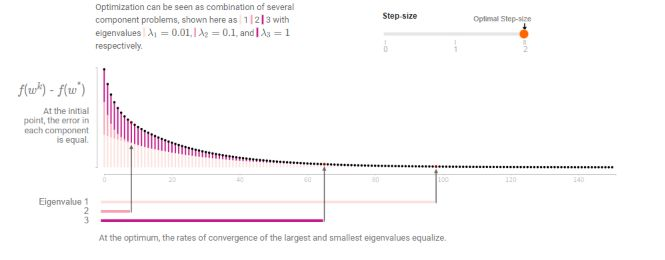

*图 8｜不同方向的曲率差异导致迭代速度不均衡，统一学习率需要在收敛速度与振荡控制之间权衡。[2]*

### 梯度历史的加权平均

动量法（Momentum）将当前梯度与历史梯度信息结合，以降低更新方向对单次梯度变化的敏感性。采用指数加权平均时，其更新规则为：

$$
\boxed{
\begin{aligned}
m_{t+1}&=\beta m_t+(1-\beta)g_t,\\
\theta_{t+1}&=\theta_t-\alpha m_{t+1}.
\end{aligned}}
$$

通常初始化为 $m_0=0$。更新后的 $m_{t+1}$ 由权重为 $\beta$ 的历史平均和权重为 $(1-\beta)$ 的当前梯度组成。[1]

例如，取 $\beta=0.9$，历史平均与当前梯度的权重分别为 90% 和 10%。若历史平均为 $2$、当前梯度为 $4$，则更新后的平均为 $0.9\times2+0.1\times4=2.2$。

动量系数越接近 1，历史信息衰减越慢，平滑作用通常越强，但对梯度方向变化的响应也可能存在更大滞后。$\beta=0$ 时，$m_{t+1}=g_t$，更新退化为 GD 或 SGD。

### 历史权重的递推展开

在零初始化下，展开前几次递推可得：

$$
\begin{aligned}
m_1&=(1-\beta)g_0,\\
m_2&=(1-\beta)(\beta g_0+g_1),\\
m_3&=(1-\beta)(\beta^2g_0+\beta g_1+g_2).
\end{aligned}
$$

一般地，

$$
m_{t+1}=(1-\beta)\sum_{j=0}^{t}\beta^{t-j}g_j.
$$

历史梯度的权重随其距当前迭代的时间间隔按 $\beta$ 的幂次衰减，因此该统计量称为**指数移动平均**。近期梯度具有较高权重，较早梯度的影响逐步减弱。

### 更新效率

在振荡方向上，梯度的正负分量在加权平均中部分抵消；在梯度方向较一致的分量上，历史贡献得到持续保留。由此，更新方向能够更充分地反映多次迭代中的一致信息。

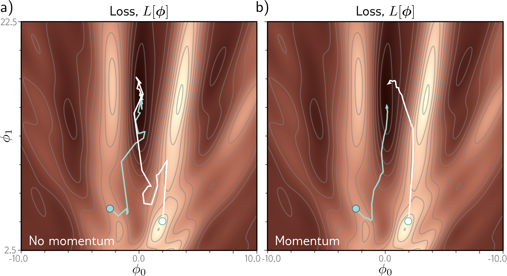

*图 9｜历史梯度的加权平均平滑了更新方向，可减少轨迹中的高频方向变化。[1]*

动量通过利用连续多次迭代的方向信息改善更新效率。当小批量梯度波动较大时，加权平均可减轻单次异常梯度对更新方向的影响。

在上述加权平均形式下，若梯度始终为常量 $g$，则 $m_{t+1}=(1-\beta^{t+1})g$，并逐渐趋近于 $g$。因此，动量的加速作用不能一般地归因于平均梯度幅值超过当前梯度，而应结合方向持续性与参数化方式分析。

### 动量的两种参数化

另一种常见参数化不对当前梯度乘以 $(1-\beta)$：

$$
u_{t+1}=\beta u_t+g_t,
\qquad
\theta_{t+1}=\theta_t-\eta u_{t+1}.
$$

在固定动量系数和零初始化下，两种历史状态满足 $m_t=(1-\beta)u_t$。两种参数化产生相同更新的学习率对应关系为 $\eta=\alpha(1-\beta)$。

### 惯性效应与稳定性

当参数接近极小点时，历史方向可能与当前局部梯度不再一致，惯性项因而可能导致过冲。过大的学习率或动量系数会进一步影响迭代稳定性。

动量更新不保证损失逐步单调下降，其效果依赖目标函数与超参数。Nesterov 方法通过在惯性预测位置计算梯度，对历史方向引起的位移进行修正。

## 6. Nesterov 加速动量

### 前瞻梯度机制

Nesterov 加速梯度（NAG）在保留惯性项的同时，将梯度评估位置由当前参数移至前瞻参数：[3]

- 普通动量：在当前参数处计算梯度，将其与惯性项合成参数增量。
- Nesterov 动量：根据惯性项构造前瞻参数，在该位置计算梯度并修正参数增量。

前瞻参数是用于评估梯度的辅助变量。每次迭代仍产生一次最终参数更新，前瞻与梯度修正共同构成该更新。

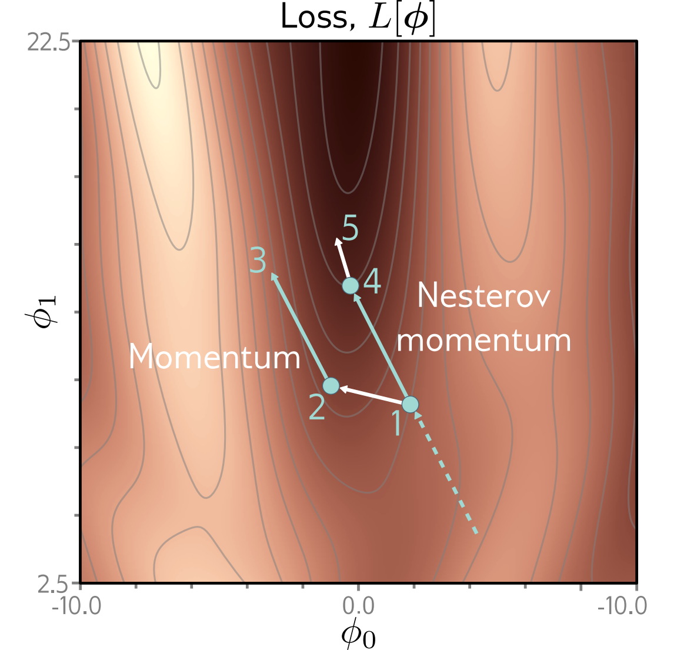

*图 10｜普通动量在当前参数处评估梯度，Nesterov 方法在惯性预测位置评估梯度并修正位移。[1]*

### 参数更新规则

令 $s_t$ 表示上一次参数位移，初始化 $s_0=0$，并以 $\eta$ 表示该参数化下的学习率。NAG 的更新规则为

$$
\boxed{
\begin{aligned}
\widetilde\theta_t&=\theta_t+\beta s_t,\\
s_{t+1}&=\beta s_t-\eta\nabla L(\widetilde\theta_t),\\
\theta_{t+1}&=\theta_t+s_{t+1}.
\end{aligned}}
$$

第一式由惯性项构造前瞻参数，第二式利用前瞻梯度修正位移，第三式完成参数更新。在随机梯度情形下，可将全梯度替换为当前批次在前瞻参数处的梯度估计。

与上一节的加权平均写法对应，取 $s_t=-\alpha m_t$、$\eta=\alpha(1-\beta)$，同一更新也可以写成

$$
\begin{aligned}
\widetilde\theta_t&=\theta_t-\alpha\beta m_t,\\
m_{t+1}&=\beta m_t+(1-\beta)\nabla L(\widetilde\theta_t),\\
\theta_{t+1}&=\theta_t-\alpha m_{t+1}.
\end{aligned}
$$

前瞻位置中的 $\beta$ 与本次迭代保留的历史权重一致。上述两组公式使用不同状态变量表示同一更新机制。

### 一维更新示例

设 $L(\theta)=\theta^2/2$，当前 $\theta_t=1$，上一步位移 $s_t=-0.5$，动量系数 $\beta=0.9$，学习率 $\eta=0.1$。

普通动量在当前位置取梯度 $L'(1)=1$，得到 $s_{t+1}=-0.45-0.1=-0.55$，新位置为 $0.45$。

NAG 先预测位置 $1-0.45=0.55$，在这里取梯度 $0.55$，得到 $s_{t+1}=-0.45-0.055=-0.505$，新位置为 $0.495$。

由于前瞻位置的梯度幅值较小，NAG 在本例中的梯度修正幅度也较小。本次普通动量的结果更接近最优点，因而不能由前瞻机制推出逐步最优性。

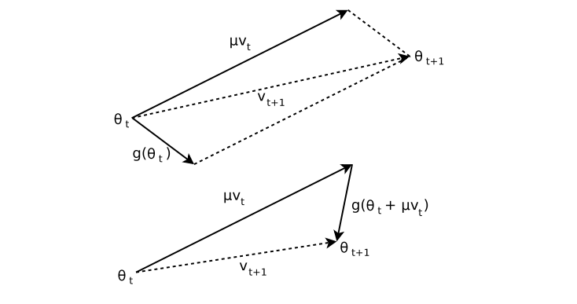

*图 11｜惯性位移与梯度修正的分解展示了普通动量和 Nesterov 方法的梯度评估位置差异。[3]*

### 加速性质与适用范围

在满足相应光滑性、凸性条件并采用适当参数设置时，Nesterov 方法具有优于常规梯度下降的收敛速率保证。其基本机制是利用前瞻位置的梯度修正惯性位移。

对于非凸神经网络，上述理论结果不能直接解释为普遍的训练加速保证。实际表现仍受学习率、采样噪声与初始化等因素影响。

## 7. Adam 自适应优化

### 参数梯度的尺度差异

GD 和普通动量通常对全部参数使用统一学习率。当不同坐标的梯度尺度差异较大时，统一缩放可能使部分坐标更新过大、另一些坐标进展缓慢。

Adam 将梯度的历史平均与逐坐标尺度调整相结合，根据各参数的梯度统计量确定更新幅度。[1][4]

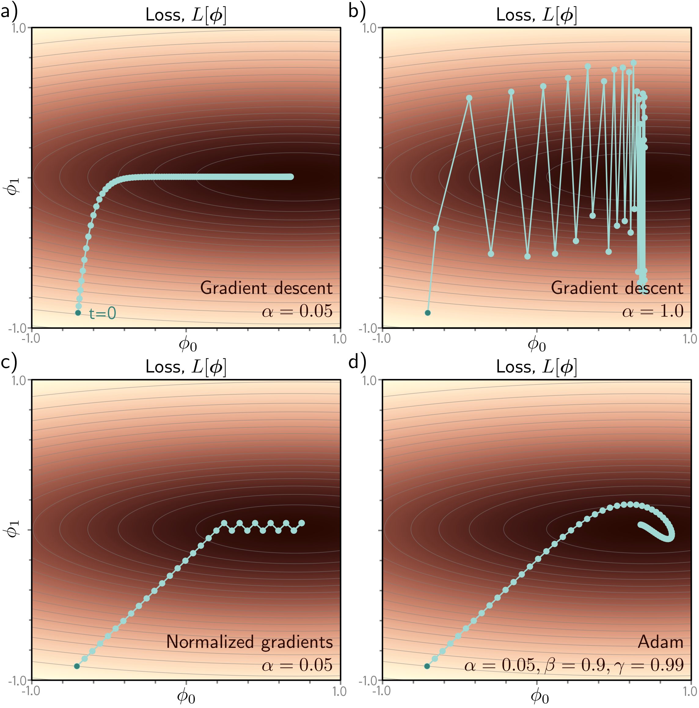

*图 12｜统一学习率在低曲率方向的收敛速度与高曲率方向的稳定性之间存在权衡；逐坐标缩放可缓和这一问题。[1]*

### 逐坐标梯度归一化

一种基本的尺度调整方法是将各坐标梯度除以其绝对值。由 $\sqrt{g_j^2}=|g_j|$，得到

$$
\theta_{t+1,j}=\theta_{t,j}
-\alpha\frac{g_{t,j}}{\sqrt{g_{t,j}^2}+\epsilon}.
$$

其中 $j$ 表示参数坐标，$\epsilon$ 是防止除零的小正数。忽略 $\epsilon$ 时，正梯度变成 $+1$，负梯度变成 $-1$，每个非零梯度方向的移动距离都约为 $\alpha$。

该归一化减轻了大幅值梯度对参数位移的主导作用，同时弱化了梯度的幅值信息。接近极小点时，非零梯度仍可能产生近似固定长度的坐标更新，导致参数在极小点附近振荡。

Adam 进一步对梯度及其平方进行历史平均，以平滑更新方向及其归一化尺度。

### 一阶矩与二阶矩估计

Adam 维护梯度与平方梯度的两组指数移动平均，初始化为 $m_0=v_0=0$：

$$
\begin{aligned}
m_{t+1}&=\beta_1m_t+(1-\beta_1)g_t,\\
v_{t+1}&=\beta_2v_t+(1-\beta_2)g_t^2.
\end{aligned}
$$

其中，$0\leq\beta_1,\beta_2<1$ 为两组平均的衰减系数。平方以及后续的平方根、除法均按坐标执行。[4]

| 统计量 | 统计对象 | 主要作用 |
|---|---|---|
| $m$ | 梯度的历史加权平均 | 保留较持续的方向，减轻方向波动 |
| $v$ | 梯度平方的历史加权平均 | 估计各坐标最近的梯度幅度 |

平方运算保留幅值并消除符号差异。例如，$+2$ 和 $-2$ 对 $m$ 的贡献可能抵消，而对 $v$ 的贡献均来自平方值 $4$。因此，较小的 $m$ 与较大的 $v$ 可以对应幅值较大、方向频繁变化的梯度序列。

$m$ 称为一阶矩估计，$v$ 称为二阶原点矩估计。二阶原点矩基于梯度平方，**不等同于损失函数的二阶导数**，也不直接等于梯度方差。在更新中，$m$ 主要提供方向信息，$v$ 主要提供幅值尺度。

### 零初始化的偏差校正

零初始化使两组指数平均在训练初期包含较大的初值权重。

例如，首个梯度为 $2$、$\beta_1=0.9$ 时，$m_1=0.1\times2=0.2$。该值小于已观测梯度，是因为零初值仍占 90% 的权重。

如果梯度一直等于 $g$，展开后有

$$
m_{t+1}=(1-\beta_1^{t+1})g.
$$

除以 $1-\beta_1^{t+1}$ 可归一化已观测梯度的权重，补偿零初始化的影响。相应的校正统计量为

$$
\hat m_{t+1}=\frac{m_{t+1}}{1-\beta_1^{t+1}},
\qquad
\hat v_{t+1}=\frac{v_{t+1}}{1-\beta_2^{t+1}}.
$$

随着更新次数增加，$\beta_1^{t+1}$ 和 $\beta_2^{t+1}$ 越来越小，校正因子逐渐接近 1。这种校正处理的是零初始化造成的权重不足，并不消除小批量采样噪声。

### 完整更新规则

结合梯度估计、矩估计、偏差校正与参数更新，Adam 的完整迭代为：

$$
\boxed{
\begin{aligned}
g_t&=\frac1b\sum_{i\in B_t}\nabla\ell_i(\theta_t),\\
m_{t+1}&=\beta_1m_t+(1-\beta_1)g_t,\\
v_{t+1}&=\beta_2v_t+(1-\beta_2)g_t^2,\\
\hat m_{t+1}&=\frac{m_{t+1}}{1-\beta_1^{t+1}},\\
\hat v_{t+1}&=\frac{v_{t+1}}{1-\beta_2^{t+1}},\\
\theta_{t+1}&=\theta_t-\alpha
\frac{\hat m_{t+1}}{\sqrt{\hat v_{t+1}}+\epsilon}.
\end{aligned}}
$$

更新式的分子由校正后的一阶矩决定方向，分母利用二阶矩的平方根进行尺度归一化。某坐标长期梯度幅值较大时，其分母通常相应增大，从而降低更新对梯度绝对尺度的敏感性。[4]

常见初始超参数为 $\beta_1=0.9$、$\beta_2=0.999$、$\epsilon=10^{-8}$，学习率可从 $0.001$ 量级开始评估。其适用性仍需依据具体任务与验证结果确定。

### 两步更新示例

考虑单个参数，初始 $m_0=v_0=0$，第一步梯度 $g_0=2$，取 $\beta_1=0.9$、$\beta_2=0.999$：

$$
m_1=0.2,\quad v_1=0.004,
\qquad\hat m_1=2,\quad\hat v_1=4.
$$

忽略 $\epsilon$，更新为 $\theta_1=\theta_0-\alpha\times2/\sqrt4=\theta_0-\alpha$。

若第二步梯度变为 $g_1=-2$，则

$$
m_2=-0.02,\quad v_2=0.007996,
\qquad\hat m_2\approx-0.1053,\quad\hat v_2=4.
$$

第二次参数增量约为 $0.0526\alpha$。当前梯度虽已反向，但历史梯度在一阶矩中部分抵消，使反向更新幅度显著减小。

该示例说明了一阶矩方向平滑与二阶矩尺度归一化在更新中的共同作用。

### 批次梯度的平方运算

在小批量训练中，标准 Adam 的二阶矩以聚合后的批次平均梯度 $g_t$ 的平方为输入。该统计对象区别于单样本梯度平方的批次平均。

例如两个样本的梯度分别为 $+1$ 和 $-1$：平均梯度是 $0$，平方也是 $0$；但先平方再平均，会得到 $1$。两种运算描述不同的统计量，不能交换顺序。[4]

### 超参数与性能评价

Adam 的自适应性体现在逐坐标缩放随梯度统计量变化。全局学习率、批量大小与训练时长仍属于需要设定的超参数。

Adam 可能出现振荡，且不具有一般的全局最优保证。训练中可结合学习率衰减；也可在初期从较小学习率逐渐增加至目标值，即学习率热身（warmup），以缓和初始更新。[5]

当 $\beta_1=\beta_2=0$ 时，Adam 的参数增量为 $-\alpha g_t/(|g_t|+\epsilon)$，仍包含逐坐标归一化。因此，该参数设置下的 Adam 不等价于增量为 $-\alpha g_t$ 的普通 SGD。

SGD 与 Adam 的性能比较应分别考察优化速度、最终训练损失与测试泛化性能。这些指标不必具有相同排序；训练预算、超参数搜索范围及搜索投入也会影响比较结果。[8]

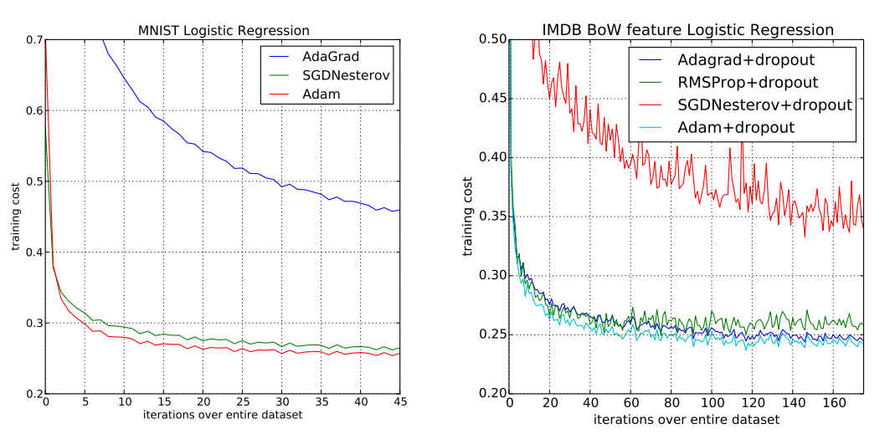

*图 13｜相同任务下不同优化器的训练损失曲线。横轴表示数据遍历次数；训练损失较低不必然对应更优的测试性能。[4]*

### 相关自适应方法

相关自适应方法从梯度统计、尺度调整或参数衰减等方面修改更新机制：

| 方法 | 主要机制 |
|---|---|
| AdaGrad | 累积每个参数过去的平方梯度，调整该坐标的更新幅度；累计量持续增大，后期更新可能过小 |
| RMSProp、AdaDelta | 利用平方梯度的移动统计调整更新尺度，缓和历史累计量持续增长造成的问题 |
| AdamW | 将参数衰减与自适应梯度更新解耦，避免衰减项直接参与梯度矩估计 |
| RAdam | 改善 Adam 早期自适应更新中的方差问题 |
| Nadam | 将 Nesterov 思想与 Adam 结合 |

不同方法的改进对象与适用条件存在差异，其性能需要在明确的任务和训练条件下比较。[1][6][7]

其中，AdamW 主要处理参数衰减与自适应缩放之间的关系。对于普通 SGD，将 $\lambda\|\theta\|^2/2$ 加入损失后，有

$$
\theta_{t+1}=\theta_t-\alpha(g_t+\lambda\theta_t)
=(1-\alpha\lambda)\theta_t-\alpha g_t.
$$

即 $L_2$ 惩罚可表示为参数的乘法收缩。对于 Adam，若将 $\lambda\theta_t$ 加入梯度，该项会同时进入一阶矩、二阶矩及自适应缩放，因此通常不等价于直接收缩参数。AdamW 将衰减与梯度更新分离，其常见形式为

$$
\theta_{t+1}=(1-\alpha\lambda)\theta_t
-\alpha\frac{\hat m_{t+1}}{\sqrt{\hat v_{t+1}}+\epsilon},
$$

其中矩估计仅使用数据损失梯度，$\lambda$ 为衰减系数。这一区别涉及正则化与优化更新的组合方式，不构成普遍的性能优势保证。[6]

SWATS 则采用阶段性切换策略：先使用 Adam 获得初期优化进展，再切换至 SGD。该策略与前述更新公式的修改不同，其效果同样依赖任务与超参数设置。[1]

## 参考资料

**[1] 教材**：《梯度下降算法.pdf》，第 6 章“训练模型”，书内第 73–88 页，PDF 第 1–16 页。章节与 Simon J. D. Prince 的 *Understanding Deep Learning* 第 6 章对应。[原作者教材主页](https://udlbook.github.io/udlbook/)。

**[2] 动量教程**：Gabriel Goh（2017），[Why Momentum Really Works](https://distill.pub/2017/momentum/)，Distill，DOI：10.23915/distill.00006。本文只采用辅助理解梯度下降和动量的直观内容，不展开特征根、收敛下界、图着色和随机噪声方差分析。

**[3] Nesterov 动量**：Ilya Sutskever、James Martens、George Dahl、Geoffrey Hinton（2013），[On the importance of initialization and momentum in deep learning](https://proceedings.mlr.press/v28/sutskever13.html)，ICML。用于核对前瞻位置与位移更新的关系，见 §2。

**[4] Adam**：Diederik P. Kingma、Jimmy Ba，[Adam: A Method for Stochastic Optimization](https://arxiv.org/abs/1412.6980)，预印本 2014，ICLR 2015。公式与常见初始超参数按 Algorithm 1；偏差校正见 §3。

**[5] Adam 的限制**：Sashank J. Reddi、Satyen Kale、Sanjiv Kumar（2018），[On the Convergence of Adam and Beyond](https://openreview.net/pdf?id=ryQu7f-RZ)，ICLR。提供 Adam 在特定凸问题中不收敛的反例。

**[6] AdamW**：Ilya Loshchilov、Frank Hutter，[Decoupled Weight Decay Regularization](https://arxiv.org/abs/1711.05101)，预印本 2017，ICLR 2019。用于参数衰减与自适应更新关系的说明。

**[7] RAdam**：Liyuan Liu 等，[On the Variance of the Adaptive Learning Rate and Beyond](https://arxiv.org/abs/1908.03265)，预印本 2019，ICLR 2020。用于早期自适应更新与方差问题的简要说明。

**[8] 优化器比较**：Dami Choi 等（2020），[On Empirical Comparisons of Optimizers for Deep Learning](https://arxiv.org/abs/1910.05446)。用于说明调参范围和比较条件会影响 SGD、Adam 等优化器的经验排序。

