# NumPy Illustrated

原文链接：[NumPy Illustrated: The Visual Guide to NumPy | by Lev Maximov | Better Programming](https://medium.com/better-programming/numpy-illustrated-the-visual-guide-to-numpy-3b1d4976de1d)

---

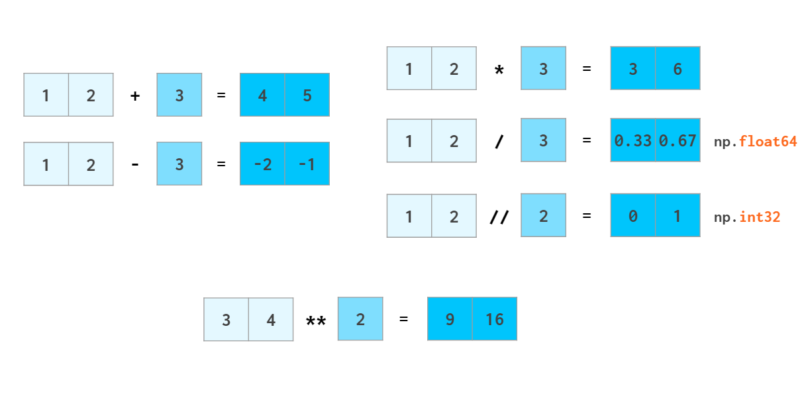

[NumPy](https://numpy.org/) 是 Python 科学计算的基础库，核心是高效的多维数组及其运算。它与 [pandas](https://pandas.pydata.org/)、[OpenCV](https://opencv.org/) 等工具密切配合。理解 NumPy 的形状、索引和广播机制，也有助于使用 [PyTorch](https://pytorch.org/)、[TensorFlow](https://www.tensorflow.org/) 和 [Keras](https://keras.io/) 等深度学习框架。

NumPy 的普通 `ndarray` 在 CPU 上计算。若要在 [GPU](https://stsievert.com/blog/2016/07/01/numpy-gpu) 上运行，可以选择支持 GPU 的数组库或深度学习框架，并处理设备和数据类型转换；相似的数组接口并不意味着 NumPy 数组会自动转到 GPU。不同库之间能否共享内存，取决于设备、布局和互操作接口。[NumPy 互操作说明](https://numpy.org/doc/stable/user/basics.interoperability.html)

n 维数组 `ndarray` 是 NumPy 的核心概念。虽然一维、二维和更高维数组的表现形式不同，创建、索引、逐元素运算和广播等基本规则是统一的。本文依次介绍三个部分：

1. 向量——一维数组
2. 矩阵——二维数组
3. 3维及更高维数组

本文受 Jay Alammar 的文章 “[A Visual Intro to NumPy and Data Representation](http://jalammar.github.io/visual-numpy/)” 启发，结合图示介绍数组操作及其背后的规则。

阅读时可以在 Python 交互环境中运行示例，统一使用以下导入方式：

```python
import numpy as np
```

理解一个数组，先看四个属性：`a.ndim` 是轴的数量，`a.shape` 是各轴长度组成的元组，`a.size` 是元素总数，`a.dtype` 是元素的数据类型。例如，形状为 `(2, 3)` 的数组有 2 个轴、6 个元素。

## NumPy 数组与 Python 列表

乍看之下，NumPy 数组与 Python 列表很相似：都可以按整数索引访问元素。但列表是一种可变长容器，尾部追加通常具有摊还 O(1) 的复杂度；普通 NumPy 数组的缓冲区不会像列表一样为追加预留容量。`np.append` 会创建新数组并复制数据，因此反复追加往往很慢。两者中间位置的插入或删除通常都需要移动或复制数据。

与 Python 列表相比，NumPy 数组可以直接进行逐元素算术运算：

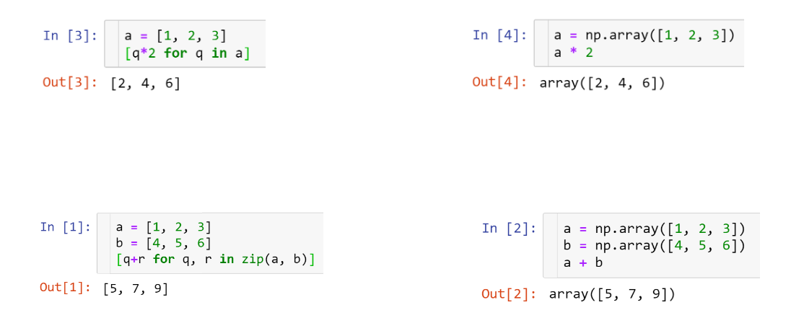

除此之外，numpy数组还具有以下特点：

- 对于常规数值类型，数据存储通常比 Python 数字列表更紧凑；内存占用取决于元素数量与 `dtype`，并不是维数越高就必然越省空间。
- 向量化运算把主要循环交给底层实现，通常比逐元素的 Python 循环更快。
- 在末尾添加元素时不如列表高效
- 一个数组使用统一的 `dtype`；对象数组可以引用不同类型的 Python 对象，但通常不具备普通数值数组的性能优势。

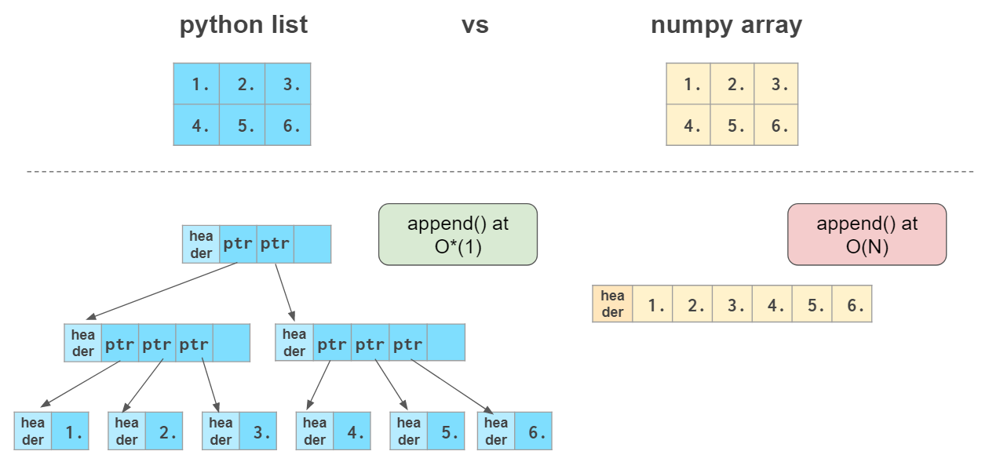

其中，O(N)表示完成操作所需的时间与数组大小成正比（请见[Big-O Cheat Sheet](<https://www.bigocheatsheet.com/>)），O(1)表示操作时间与数组大小无关（详见[Time Complexity](<https://wiki.python.org/moin/TimeComplexity>)）。

## 1. 向量与一维数组

### 向量初始化

通过Python列表可以创建NumPy数组，如下将列表元素转化为一维数组：

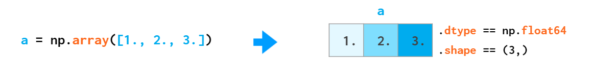

NumPy 会尝试为所有元素推断一个共同的数据类型：整数与浮点数混合时通常得到浮点数组，数字与字符串混合时可能得到字符串数组，并不是一混合就会变成 `object`。长度不一致的嵌套序列通常会报 `ValueError`；确实需要容纳任意 Python 对象时，应明确指定 `dtype=object`。数值计算建议显式选择合适的类型。[数组创建文档](https://numpy.org/doc/stable/reference/generated/numpy.array.html)

```python
import numpy as np

a = np.array([1, 2, 3], dtype=np.float64)
b = np.array([1, 2.5])                 # 浮点数组
c = np.array([1, "2"])                # 字符串数组
objects = np.array([1, None], dtype=object)
```

NumPy 2.x 调整了 Python 标量参与运算时的类型提升规则，不能再依靠标量的数值大小来猜测结果类型。需要跨平台固定精度时，使用 `np.int64`、`np.float32` 或 `np.float64` 等显式类型；转换数组用 `a.astype(...)`。固定宽度整数也可能溢出。[NumPy 2.0 迁移指南](https://numpy.org/doc/stable/numpy_2_0_migration_guide.html)

由于在数组末尾没有预留空间以快速添加新元素，NumPy数组无法像Python列表那样增长，因此，通常的做法是在变长Python列表中准备好数据，然后将其转换为NumPy数组，或是使用np.zeros或np.empty预先分配必要的空间：

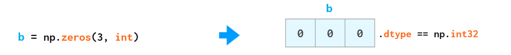

通过 `zeros_like`、`ones_like`、`empty_like` 和 `full_like`，可以创建与另一个数组形状相同、默认数据类型也相同的数组：

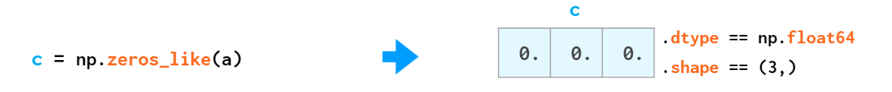

这些函数既可以创建全零或全一数组，也可以填充指定值。`empty` 的含义是“不初始化数值缓冲区”，并不是填零或生成随机数；必须先写入元素，再使用它们。`*_like` 默认继承数据类型，因此对整数数组执行 `np.full_like(a, 0.5)` 可能丢失小数，应指定 `dtype=float`。[empty 文档](https://numpy.org/doc/stable/reference/generated/numpy.empty.html)

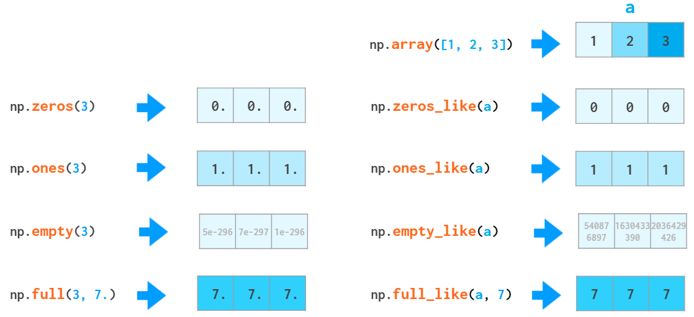

在NumPy中，还可以通过单调序列初始化数组：

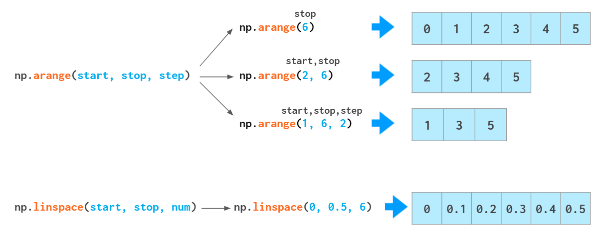

如果需要 `[0., 1., 2.]` 这样的浮点数组，可以写 `np.arange(3, dtype=float)`。`np.arange(3.0)` 也会推断为浮点类型，但显式指定 `dtype` 更能表达意图，且避免先生成整数数组再 `astype` 的额外转换。

`arange` 以步长为核心，通常使用左闭右开区间；浮点步长需要留意舍入误差：

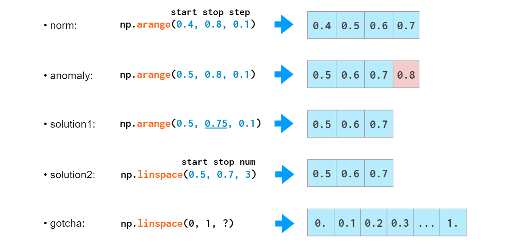

十进制的 `0.1` 无法用有限位二进制浮点数精确表示，因此以小数作为 `arange` 的步长时，实际元素数量或末端值可能与直觉不一致。让停止值避开步长的整数倍有时可以绕过问题，但会降低可读性。已知需要多少个采样点时，通常使用 `linspace`：它保证点数，并可控制是否包含终点，但不会消除浮点数本身的舍入误差。`np.linspace(0, 1, 11)` 表示 11 个点、10 个间隔；不包含终点时设置 `endpoint=False`。[arange 文档](https://numpy.org/doc/stable/reference/generated/numpy.arange.html)

随机数组可以按均匀分布、正态分布等方式生成：

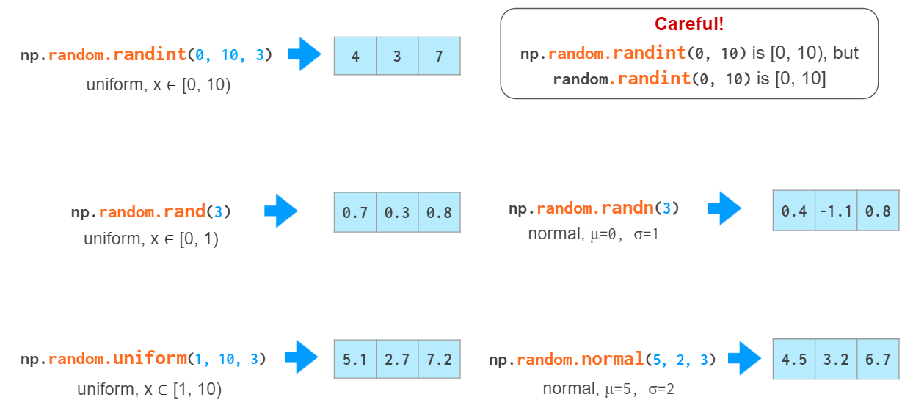

日常代码推荐创建独立的随机数生成器 `Generator`。这样可以明确管理状态，不必依赖模块级全局随机状态。`integers` 的上界默认不包含在内；`normal` 的 `scale` 表示标准差，而不是方差。[随机数生成器文档](https://numpy.org/doc/stable/reference/random/generator.html)

```python
import numpy as np

rng = np.random.default_rng(42)
integers = rng.integers(0, 10, size=3)  # 整数，范围 [0, 10)
uniform = rng.random(3)               # [0, 1) 均匀分布
normal = rng.normal(5, 2, size=3)      # 均值 5，标准差 2
```

固定种子有助于复现实验，但不应把它理解为任意 NumPy 版本、算法和调用顺序下都生成同一序列。需要长期精确复现时，还应记录 NumPy 版本、生成器和采样调用方式。

### 向量索引

对于数组数据的访问，numpy提供了便捷的访问方式：

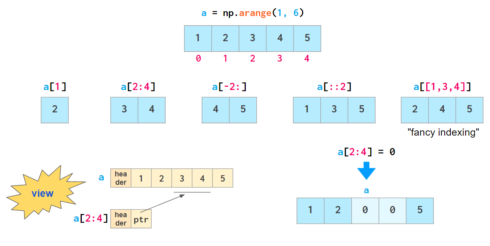

需要区分三种情况：普通数值数组的单个整数索引通常返回 NumPy 标量；基本切片如 `a[1:4]` 返回共享原缓冲区的视图；整数数组索引与布尔索引属于高级索引，读取时会生成副本。视图保存自己的形状和步幅等元数据，但与原数组共享元素数据，因此任一方修改共享位置，另一方都能看到。[副本与视图](https://numpy.org/doc/stable/user/basics.copies.html)

赋值时，`a[1:4] = ...`、`a[[1, 3]] = ...` 和 `a[mask] = ...` 都可以直接修改原数组。但先执行 `b = a[[1, 3]]` 再修改 `b`，修改的是副本。`a[:]` 仍然是视图，需要独立数据时使用 `a.copy()`：

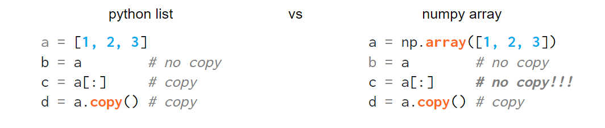

```python
import numpy as np

a = np.array([10, 20, 30, 40])
view = a[1:3]
copied = a[[1, 2]]
view[0] = 99
assert a[1] == 99
assert copied[0] == 20

a[[1, 2]] = 0                        # 直接赋值修改原数组
assert np.array_equal(a, [10, 0, 0, 40])
```

如果索引中含重复位置，`a[idx] += value` 不保证按重复次数累计。需要逐次累加时可用 `np.add.at(a, idx, value)`。

此外，还可以通过布尔索引从NumPy数组中获取数据，这意味着可以使用各种逻辑运算符：

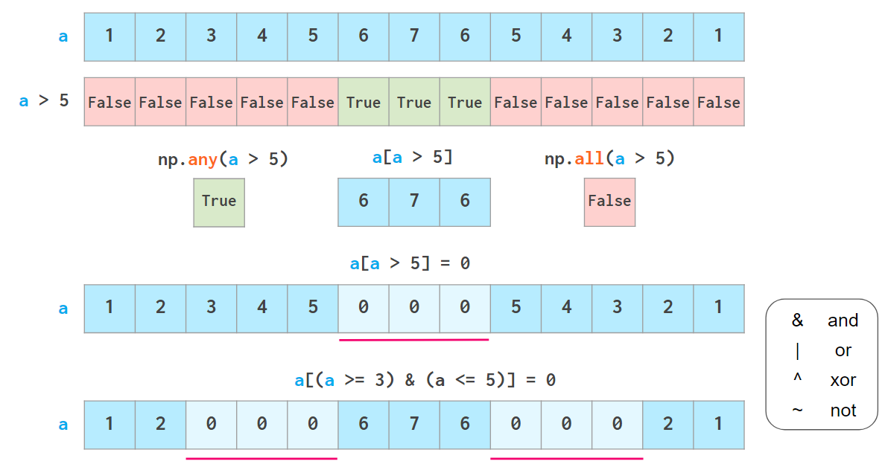

[`any`](https://numpy.org/doc/stable/reference/generated/numpy.any.html) 判断是否至少有一个元素为真，[`all`](https://numpy.org/doc/stable/reference/generated/numpy.all.html) 判断是否全部为真；对数组可指定 `axis`。

逐元素区间判断应写 `(a >= 3) & (a <= 5)`，每个比较表达式都要加括号。不能用 `3 <= a <= 5` 这样的链式比较，也不能用 Python 的 `and`、`or`、`not` 代替数组上的 `&`、`|`、`~`。

布尔索引赋值适合按条件修改元素。`np.where(condition, x, y)` 根据条件选择值并返回结果数组；`np.clip(a, low, high)` 把数值限制在区间内，默认也返回结果。需要原地截断时可用 `np.clip(a, low, high, out=a)`，并确保数据类型合适。

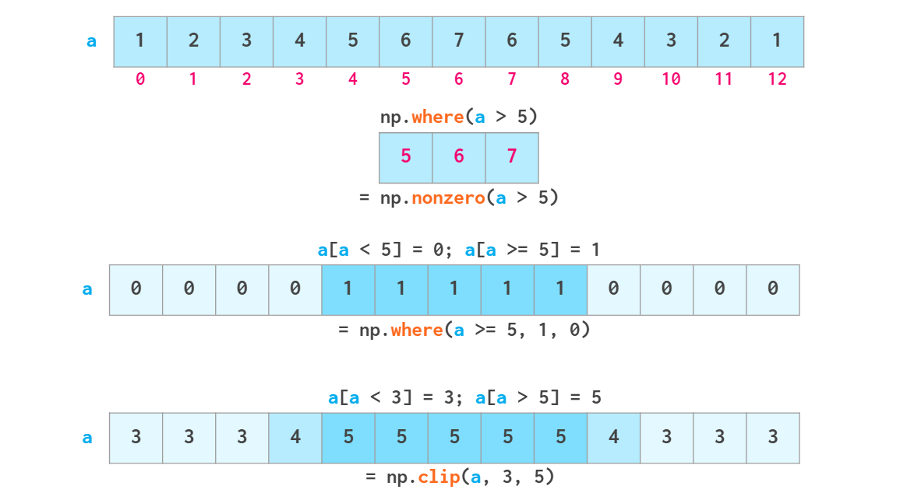

### 向量操作

NumPy 的速度优势主要来自将循环和数值运算交给底层实现，减少 Python 逐元素解释的开销。实际速度还取决于数组大小、数据类型、内存布局和临时数组数量。下面这些运算会逐元素执行：

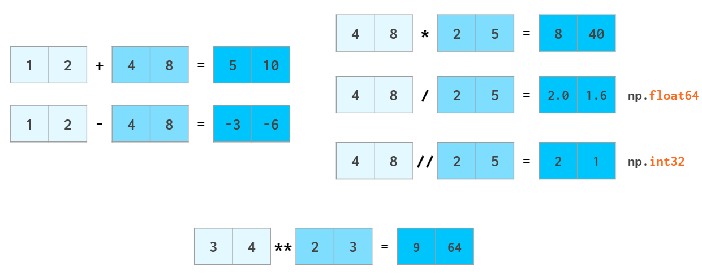

在 Python 中，`a // b` 是向负无穷取整的除法，例如 `-3 // 2 == -2`；`x ** n` 表示幂运算 xⁿ。

浮点数的计算也是如此，numpy能够将标量广播到数组：

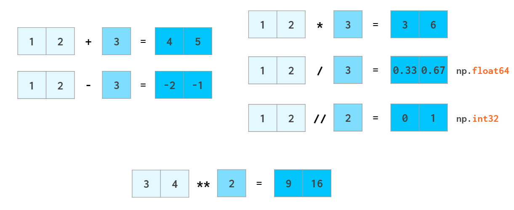

numpy提供了许多数学函数来处理矢量：

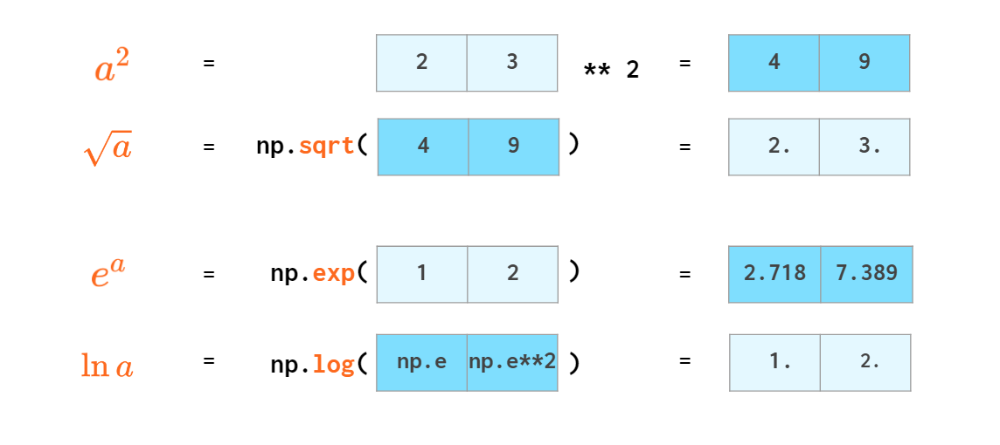

向量点积与叉积如下。实数一维数组的 `a @ b` 或 `np.dot(a, b)` 得到点积；`np.cross` 计算三维向量叉积。不要将叉积与 `np.outer` 的外积混淆：外积会得到一个矩阵。

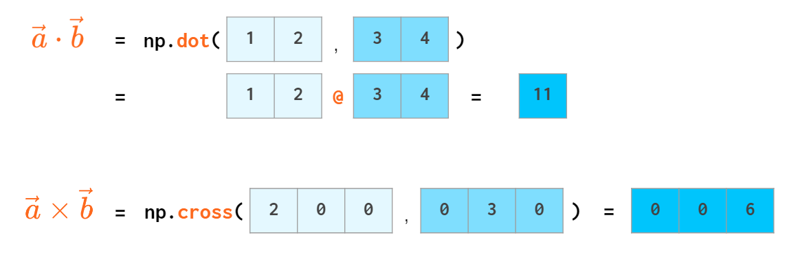

NumPy 2.5 的 `np.cross` 接受长度为 3 的向量。二维向量需要的有向面积可直接写为 `a[..., 0] * b[..., 1] - a[..., 1] * b[..., 0]`，或补零扩展为三维向量后计算。复数向量的 `np.dot` 不会自动对第一个参数取共轭；共轭内积可以用 `np.vdot`，但它会先把输入展平。[cross 文档](https://numpy.org/doc/stable/reference/generated/numpy.cross.html)

NumPy 也提供以下三角函数；角度输入通常使用弧度，可以通过 `np.deg2rad` 和 `np.rad2deg` 转换：

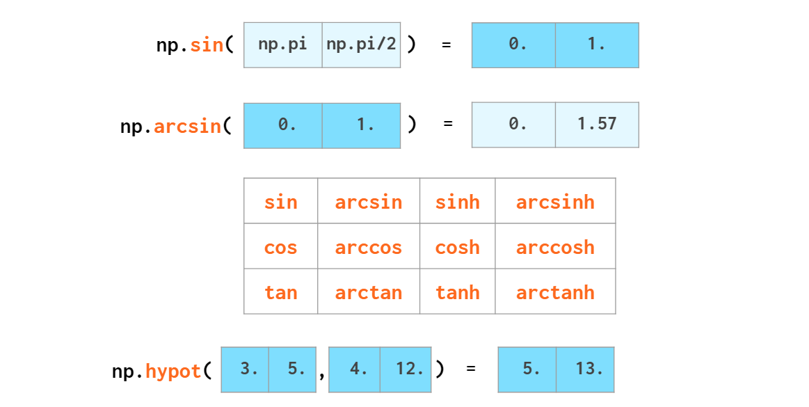

数组还可以整体执行取整与舍入：

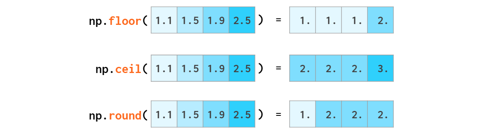

`floor` 向负无穷取整，`ceil` 向正无穷取整，`trunc` 向零截断。`round` 舍入到指定小数位；恰好位于中间值时采用“舍入到最近偶数”，如 `np.round([0.5, 1.5, 2.5])` 得到 `[0., 2., 2.]`，并非通常口语中的一律“四舍五入”。浮点表示也可能影响十进制舍入结果。[round 文档](https://numpy.org/doc/stable/reference/generated/numpy.round.html)

`np.around` 与 `np.round` 等效，也可以调用 `a.round()`。通常采用 `import numpy as np`，这样能清楚区分 NumPy 函数与 Python 内置函数，避免 `from numpy import *` 带来的名称覆盖。NumPy 2.5 已弃用 `np.fix`，向零截断统一使用 `np.trunc`。[NumPy 2.5 发布说明](https://numpy.org/doc/stable/release/2.5.0-notes.html)

numpy还可以实现以下功能：

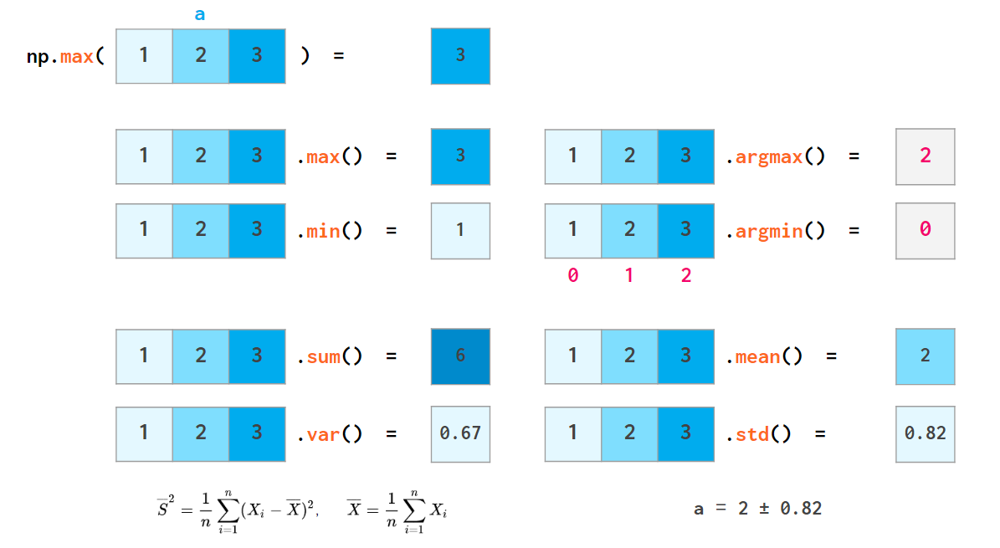

许多统计函数具有忽略 NaN 的版本，例如 [`nansum`](https://numpy.org/doc/stable/reference/generated/numpy.nansum.html)、[`nanmax`](https://numpy.org/doc/stable/reference/generated/numpy.nanmax.html)、`nanmean` 和 `nanstd`。它们并不意味着自动处理一切缺失数据：例如，全为 NaN 的切片调用 `nanmax` 会返回 NaN 并发出警告，而 `nansum` 通常返回 0。应根据数据含义选择函数。

排序时先区分两种行为：`a.sort()` 原地修改数组，`np.sort(a)` 返回排序后的副本。NumPy 不提供 Python 列表那样通用的 `key=` 回调，多字段排序可以用 `argsort`、`lexsort` 或结构化数组：

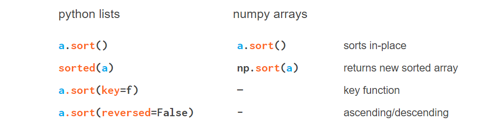

NumPy 2.5 支持 `np.sort(a, descending=True)` 和 `np.argsort(a, descending=True)`，可直接降序排序；NaN 在升序和降序中都放在末尾。`stable=True` 可以保持相等元素原有的相对顺序。反转升序结果仍可写为 `np.sort(a)[::-1]`，但会把 NaN 移到开头，也会反转相等元素对应的顺序，因此与稳定降序排序不完全相同。[sort 文档](https://numpy.org/doc/stable/reference/generated/numpy.sort.html)

```python
import numpy as np

values = np.array([4.0, np.nan, 1.0, 4.0])
descending = np.sort(values, descending=True)
# [4., 4., 1., nan]
indices = np.argsort(values, descending=True, stable=True)
# [0, 3, 2, 1]
```

### 查找向量中的元素

NumPy 数组支持索引操作，但没有 Python 列表的 `list.index` 方法：

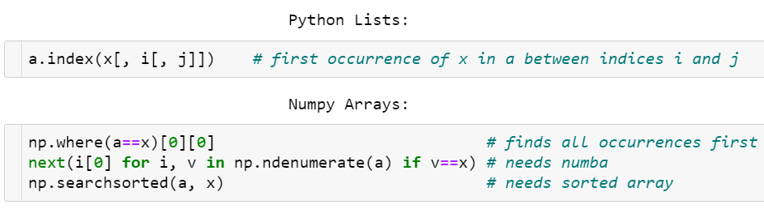

图中 `index` 签名的方括号表示可选参数，并不是调用时要写的实际括号。

- `np.where(a == x)[0]` 可以得到一维数组中全部匹配位置，`np.flatnonzero(a == x)` 也很直接。若只需要第一个结果，必须先检查是否找到元素，不能无条件再取 `[0]`：

  ```python
  import numpy as np
  
  a = np.array([2, 7, 4, 7])
  hits = np.flatnonzero(a == 7)
  first = int(hits[0]) if hits.size else -1
  assert first == 1
  ```

  这类向量化比较需要检查整个数组，即使目标恰好在开头也不会提前退出。
- 需要找到第一个匹配后立即停止时，一维数组可用 `next((i for i, v in enumerate(a) if v == x), -1)`；高维数组可用 `np.ndenumerate` 返回坐标。它们仍是 Python 层迭代，并不会因为写成生成器就自动获得 [Numba](https://numba.pydata.org/) 加速。对性能敏感的大数组，可以把显式循环放进 Numba 编译函数，是否更快应通过实际数据测试。
- 已按升序排列的一维数组适合使用 `searchsorted`。它通过二分搜索返回插入位置，单次查找通常为 O(log N)，但这个位置可能等于数组长度，且不保证目标真的存在，因此要同时检查边界和元素值。[searchsorted 文档](https://numpy.org/doc/stable/reference/generated/numpy.searchsorted.html)

  ```python
  import numpy as np
  
  a = np.array([1, 4, 4, 8])
  x = 10
  pos = int(np.searchsorted(a, x, side="left"))
  found = pos if pos < a.size and a[pos] == x else -1
  assert found == -1
  ```

  若数组尚未排序，还需考虑排序开销，且排序会改变位置含义；需要原始索引时应保留排序索引。

搜索算法之外，还要明确“相等”的定义。整数和离散标签常用精确比较，浮点测量结果则往往需要容差比较。

### 浮点数比较

[`np.isclose(a, b)`](https://numpy.org/doc/stable/reference/generated/numpy.isclose.html) 逐元素判断浮点数是否接近，`np.allclose(a, b)` 判断所有元素是否都在容差范围内：

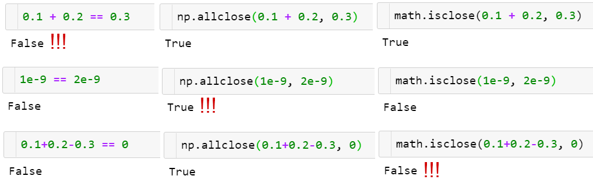

- 对于有限数，NumPy 使用以下判据：

  ```text
  abs(a - b) <= atol + rtol * abs(b)
  ```

  `atol` 是绝对容差，`rtol` 是相对容差。默认绝对容差 `1e-8` 不一定适合接近零的数据。例如比较纳秒量级的值时，应按实际误差预算选择容差，`np.allclose(1e-9, 2e-9, atol=1e-17)` 为 `False`。不能机械地把所有任务的默认容差按单位缩放后直接使用。[allclose 文档](https://numpy.org/doc/stable/reference/generated/numpy.allclose.html)
- Python 的 [`math.isclose(a, b, rel_tol=..., abs_tol=...)`](https://docs.python.org/3/library/math.html#math.isclose) 用于标量，其默认绝对容差为 0。与零比较时通常要明确给出合适的 `abs_tol`，例如：

  ```python
  import math
  
  assert math.isclose(0.1 + 0.2, 0.3, abs_tol=1e-8)
  assert math.isclose(0.1 + 0.2 - 0.3, 0.0, abs_tol=1e-8)
  ```

NumPy 的相对容差以第二个参数 `b` 为参考，因此极少数边界情况下 `np.allclose(a, b)` 与 `np.allclose(b, a)` 可能不同；`math.isclose` 使用对称判据。另需注意，`allclose` 会广播输入，形状不同也可能返回 `True`。需要形状与元素都完全一致时使用 `np.array_equal`；希望对应位置的 NaN 视为相等时，可设置 `equal_nan=True`。参见 [浮点比较指南](https://floating-point-gui.de/errors/comparison/) 和 [NumPy 的相关讨论](https://github.com/numpy/numpy/issues/10161)。

## 2. 矩阵与二维数组

NumPy 仍保留专用的 `matrix` 类供兼容旧代码，但官方不建议在新代码中使用它。下文统一使用普通 `ndarray`，把“矩阵”理解为二维数组；逐元素乘法用 `*`，矩阵乘法用 `@`。[matrix 文档](https://numpy.org/doc/stable/reference/generated/numpy.matrix.html)

矩阵的初始化语法与向量类似：

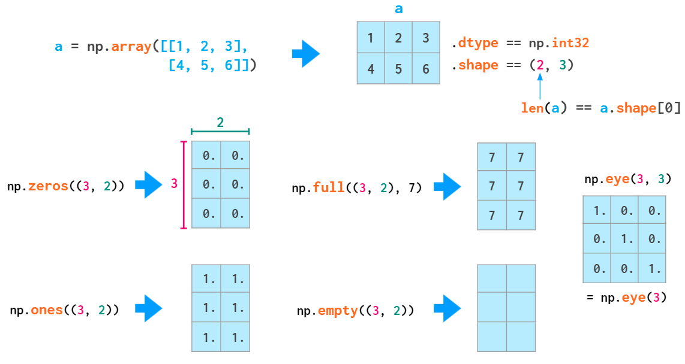

创建二维数组时，写 `np.array([[1, 2], [3, 4]])`：外层列表包含每一行，内层列表包含该行元素。调用 `np.zeros((2, 3))` 时，则把形状作为一个元组传入；`np.zeros(2, 3)` 的第二个位置参数会被当作 `dtype`，并不是第二个轴的长度。

随机矩阵的生成与向量类似，把 `size` 设为形状元组即可：

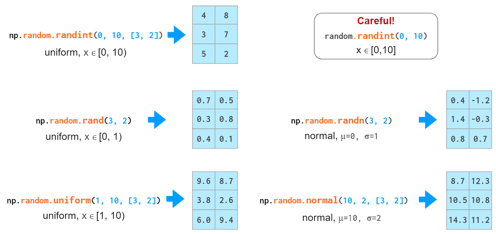

```python
import numpy as np

rng = np.random.default_rng(42)
a = rng.integers(0, 10, size=(2, 3))
b = rng.normal(size=(2, 3))
```

二维数组的索引语法要比嵌套列表更方便：

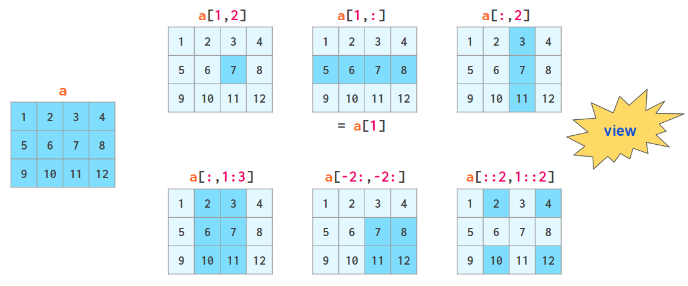

“view”表示基本切片共享原数组的数据；修改共享的元素会反映到对应切片中。`a[i, j]` 访问单个数值，`a[i, :]` 和 `a[:, j]` 通常得到一维数组；若希望保留二维形状，可写 `a[i:i+1, :]` 或 `a[:, j:j+1]`。高级索引读取则会产生副本。

### 轴参数

`axis` 表示轴的编号，而不是维度数量。二维数组的 `axis=0` 是第一个轴，`axis=1` 是第二个轴，`axis=-1` 表示最后一个轴。

对形状为 `(行数, 列数)` 的数组求和，`sum(axis=0)` 沿行的索引变化方向累加，得到每一列的和；`sum(axis=1)` 沿列的索引变化方向累加，得到每一行的和。理解归约操作时，直接看“哪个轴被消去”通常最清楚。

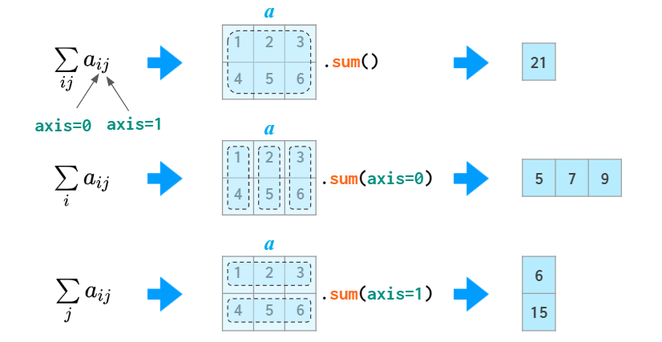

```python
import numpy as np

a = np.arange(1, 7).reshape(2, 3)
assert np.array_equal(a.sum(axis=0), [5, 7, 9])
assert np.array_equal(a.sum(axis=1), [6, 15])
row_sum = a.sum(axis=1, keepdims=True)
assert row_sum.shape == (2, 1)
normalized = a / row_sum
assert np.allclose(normalized.sum(axis=1), 1)
```

`keepdims=True` 保留被归约的轴并将其长度设为 1，使结果能直接广播回原数组。实际做归一化时，还要明确如何处理和为 0 的行。

### 矩阵运算

除了+，-，\*，/，//和\*\*等数组元素的运算符外，numpy提供了@运算符计算矩阵乘积：

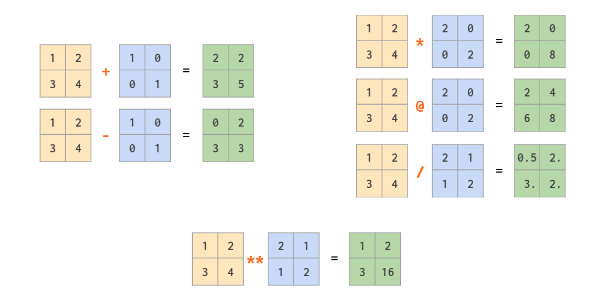

对 `(m, k)` 与 `(k, n)` 两个数组，`@` 的结果是 `(m, n)`。处理线性方程 `A x = b` 时，优先用 `np.linalg.solve(A, b)`，不必先求逆再相乘；它要求 A 为方阵且满秩。非方阵或最小二乘问题可用 `np.linalg.lstsq`。[线性方程求解文档](https://numpy.org/doc/stable/reference/generated/numpy.linalg.solve.html)

类似前文介绍的标量广播机制，numpy同样可以通过广播机制实现向量与矩阵，或两个向量之间的混合运算：

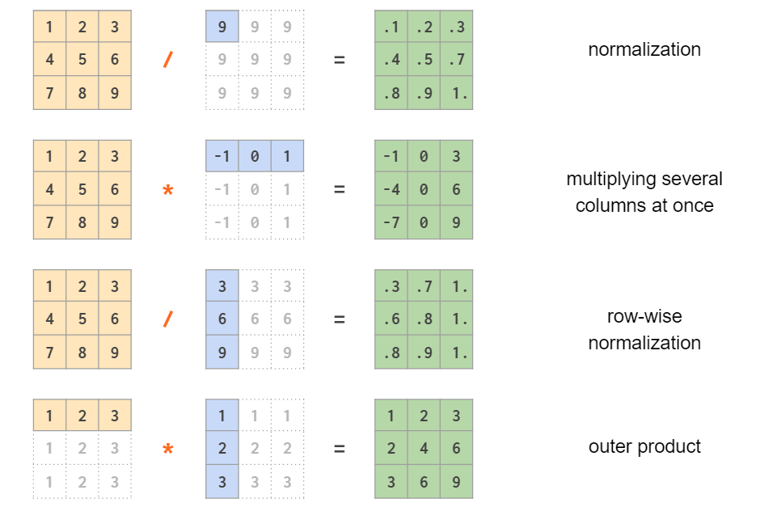

广播从最右侧的轴开始对齐；对应轴的长度相等，或者其中一个为 1，就可以兼容；缺失的前导轴按长度 1 处理。例如 `(3, 1)` 与 `(1, 4)` 得到 `(3, 4)`，而 `(3,)` 与 `(4,)` 不能直接广播。广播本身通常不需要复制输入，但计算结果和中间数组仍可能占用大量内存。[广播规则](https://numpy.org/doc/stable/user/basics.broadcasting.html)

广播可以把列向量 `(m, 1)` 和行向量 `(1, n)` 的逐元素乘法扩展成 `(m, n)`，得到外积。矩阵乘法也可写出相同结果：`column @ row` 得到外积，而长度匹配时 `row @ column` 得到形状为 `(1, 1)` 的内积结果。`*` 满足逐元素乘法的交换性，但 `@` 一般不能交换顺序，输出形状也可能随顺序改变：

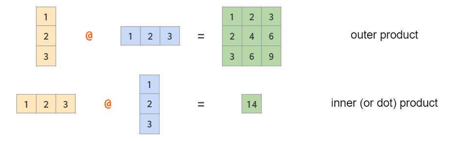

### 行向量与列向量

NumPy 的一维数组形状为 `(n,)`，没有独立的“行”或“列”方向。二维行向量的形状是 `(1, n)`，二维列向量的形状是 `(n, 1)`。

在与二维数组进行逐元素运算时，`(n,)` 会从右侧对齐，通常表现得像 `(1, n)`；但这不能推广到矩阵乘法 `@`，因为 `@` 对一维输入有专门的升维和降维规则。一维数组转置后仍是 `(n,)`，因此 `.T` 不能把它变成列向量：

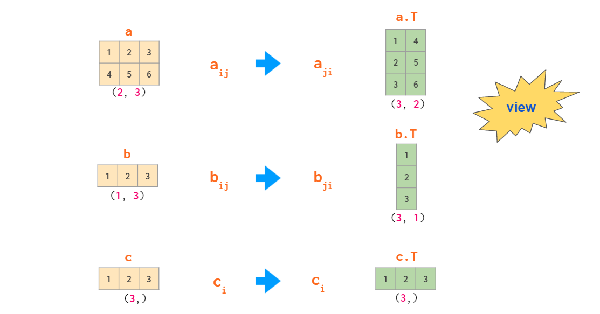

使用newaxis更新数组形状和索引可以将1维数组转化为2维列向量：

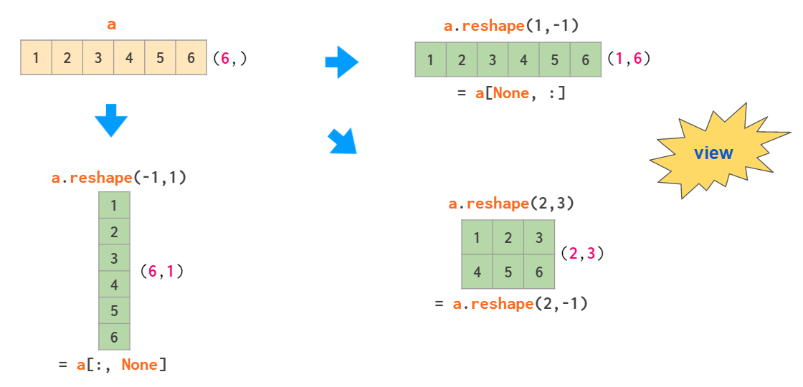

`reshape` 中的 `-1` 表示根据元素总数推断该轴长度，最多只能使用一次。索引中的 `None` 等同于 `np.newaxis`，会在指定位置添加一个长度为 1 的轴，并不是添加长度为 0 的轴。

因此，日常计算中需要区分一维数组、二维行向量和二维列向量三种形状。它们之间的转换如下：

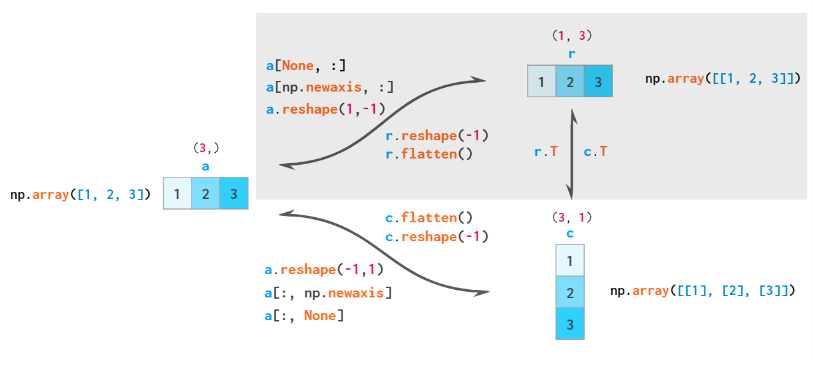

在适用的逐元素广播运算中，`(n,)` 与 `(1, n)` 通常可以产生相同的结果，因此图中阴影区域的转换常可省略；需要明确保留二维形状或进行矩阵乘法时，仍应认真检查输出形状。

一个数组也可以只有一个长度不为 1 的轴，例如 `a.shape == (1, 1, 1, 5, 1, 1)`。`np.reshape` 可构造这种形状，`np.squeeze` 可以移除长度为 1 的轴；指定 `axis` 能避免误删需要保留的轴。

`reshape` 在可行时返回视图，否则可能复制数据；`np.reshape(a, shape, copy=False)` 要求不复制，无法满足时会报错。`squeeze` 返回原数组或共享数据的视图。NumPy 2.5 不推荐再直接赋值 `a.shape = ...`，应使用 `reshape` 返回目标形状的数组。[reshape 文档](https://numpy.org/doc/stable/reference/generated/numpy.reshape.html)、[NumPy 2.5 发布说明](https://numpy.org/doc/stable/release/2.5.0-notes.html)

### 矩阵操作

矩阵的拼接有以下两种方式：

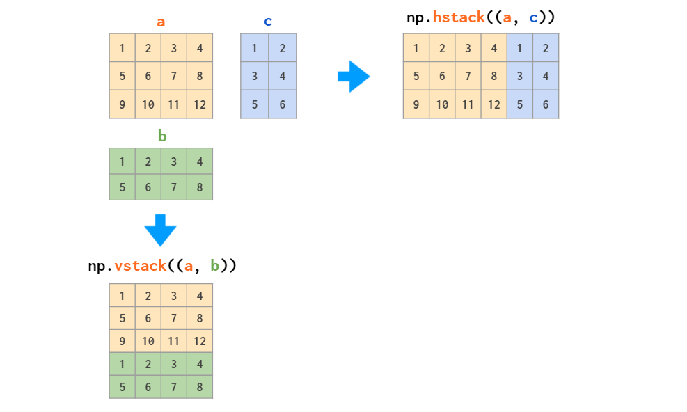

对二维数组，[`vstack`](https://numpy.org/doc/stable/reference/generated/numpy.vstack.html) 沿轴 0 拼接，[`hstack`](https://numpy.org/doc/stable/reference/generated/numpy.hstack.html) 沿轴 1 拼接。一维数组传给 `vstack` 时会按行处理；`hstack` 则会直接拼接多个一维数组，但不能直接混合一维和二维输入。若要把一维数组作为新列拼到矩阵旁边，应先用 `v[:, None]` 转成列向量，或使用 [`column_stack`](https://numpy.org/doc/stable/reference/generated/numpy.column_stack.html)：

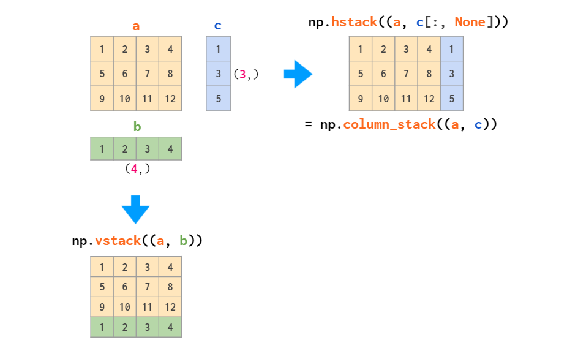

更通用的 `concatenate` 沿已有轴拼接，`stack` 则插入一个新轴。例如两个形状为 `(2, 3)` 的数组沿轴 0 拼接会得到 `(4, 3)`，沿新轴堆叠则可得到 `(2, 2, 3)`。除拼接轴之外的尺寸必须匹配，`stack` 的各输入形状必须一致。

拆分数组可以用 `split`、`hsplit` 和 `vsplit`。按份数平均拆分时，`split` 要求整除；不能整除但希望尽量均分时使用 `array_split`：

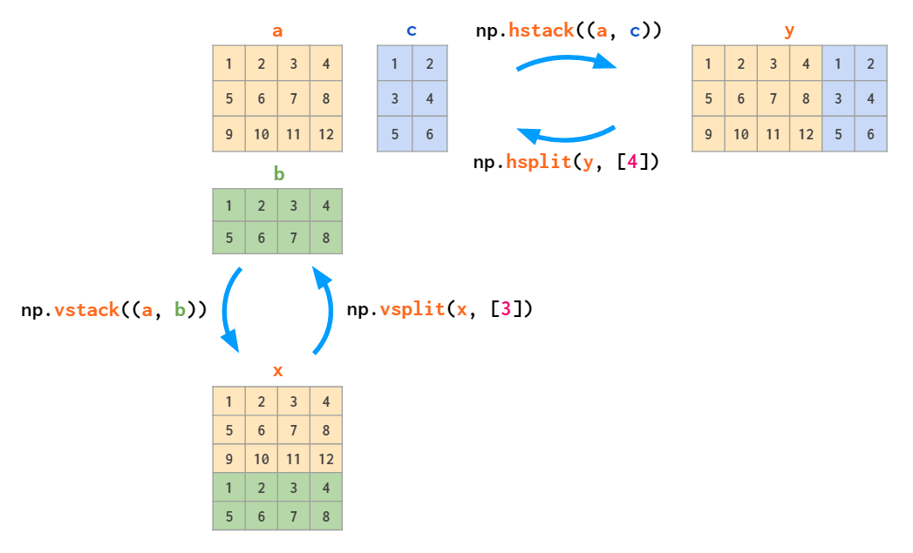

[`tile`](https://numpy.org/doc/stable/reference/generated/numpy.tile.html) 按块重复整个数组，[`repeat`](https://numpy.org/doc/stable/reference/generated/numpy.repeat.html) 按元素重复；指定 `axis` 后，`repeat` 可以重复行或列。二者会实际扩展数据，单纯为运算对齐形状时，应先考虑广播。

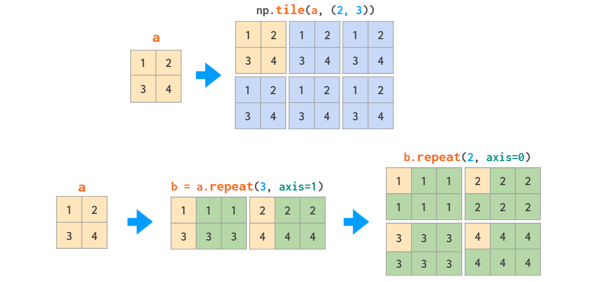

[`np.delete`](https://numpy.org/doc/stable/reference/generated/numpy.delete.html) 返回删除指定行或列后的新数组，并不原地删除：

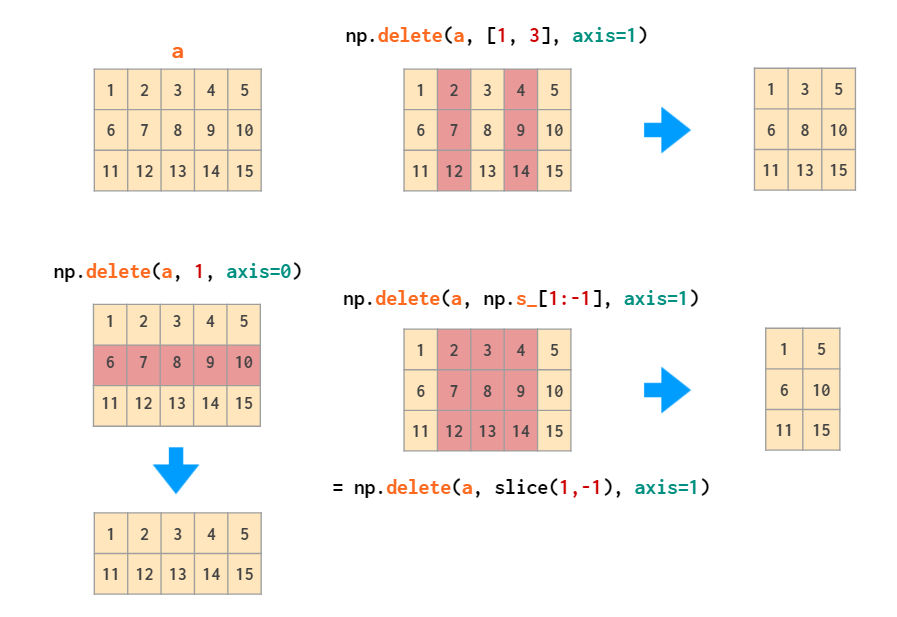

相应的 [`np.insert`](https://numpy.org/doc/stable/reference/generated/numpy.insert.html) 返回插入后的新数组；索引传入标量还是列表，也可能影响插入值的形状解释：

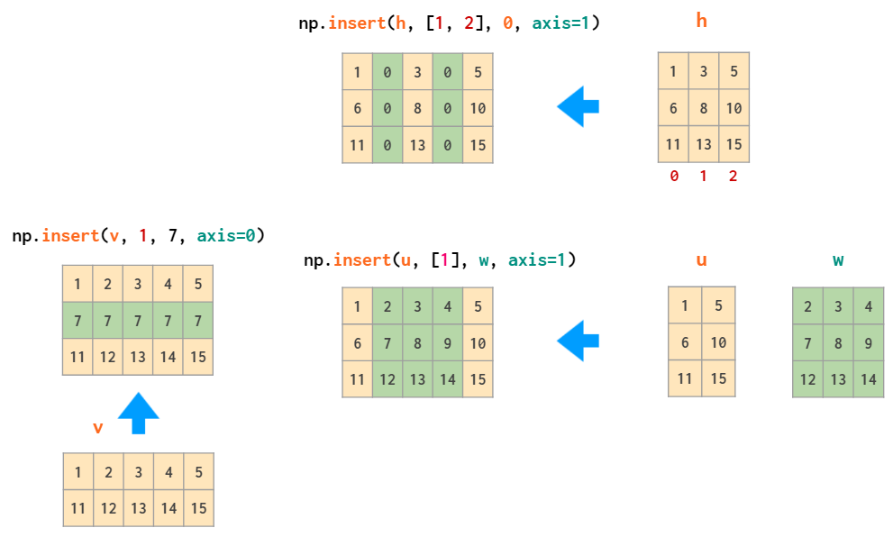

[`np.append`](https://numpy.org/doc/stable/reference/generated/numpy.append.html) 同样返回新数组，省略 `axis` 时会先展平输入。指定轴时，需要满足维数与其他轴长度要求；增加一列通常用 `v[:, None]` 配合 `concatenate`，或直接使用 `column_stack`：

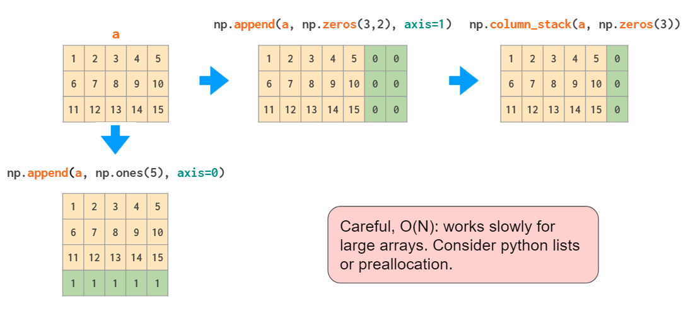

如果仅仅是向数组的边界添加常量值，[pad](<https://numpy.org/doc/stable/reference/generated/numpy.pad.html>)函数是足够的：

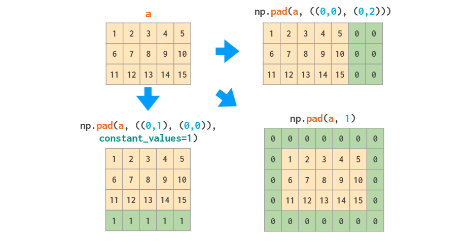

### 网格坐标（Meshgrids）

广播机制使得meshgrids变得容易。例如需要下图所示（但尺寸大得多）的矩阵：

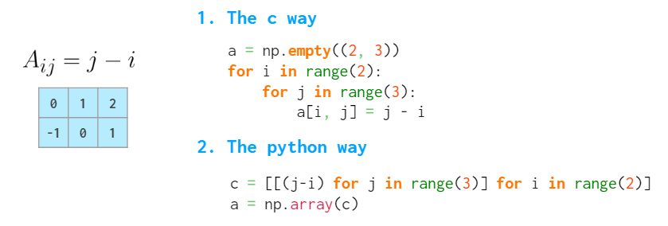

上述两种方法由于使用了循环，因此都比较慢。[MATLAB](<https://www.mathworks.com/products/matlab.html>)通过构建meshgrid处理这种问题。

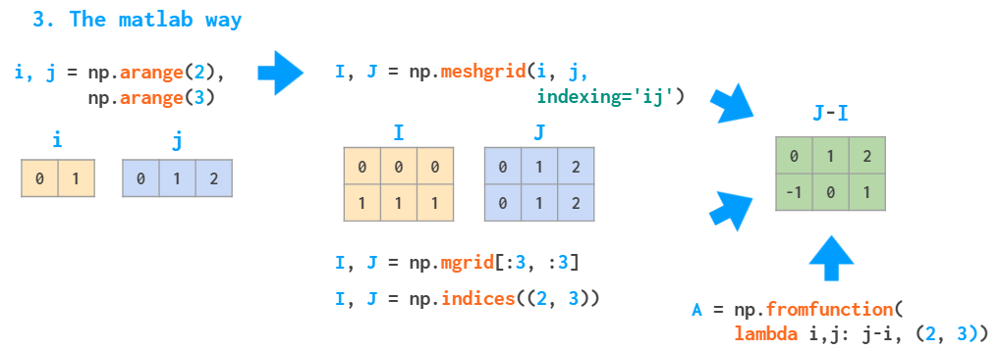

`meshgrid` 可以把多个坐标向量扩展为网格坐标；[`mgrid`](https://numpy.org/doc/stable/reference/generated/numpy.mgrid.html) 用切片语法生成稠密网格，[`indices`](https://numpy.org/doc/stable/reference/generated/numpy.indices.html) 按给定形状生成索引网格。[`fromfunction`](https://numpy.org/doc/stable/reference/generated/numpy.fromfunction.html) 将各轴坐标数组传入函数，函数需要能对数组运算，并不是自动加速任意 Python 标量回调。

也可以只保存形状为 `(m, 1)` 和 `(1, n)` 的坐标，再通过广播计算网格值。`meshgrid` 默认 `copy=True, sparse=False`，会生成稠密坐标数组；设置 `sparse=True`，或使用 `ogrid`，可减少坐标数组的内存占用。`copy=False` 可能得到共享内存的非连续数组，需要谨慎修改。即使坐标是稀疏的，广播后得到的 `(m, n)` 结果通常仍需要完整内存。[meshgrid 文档](https://numpy.org/doc/stable/reference/generated/numpy.meshgrid.html)

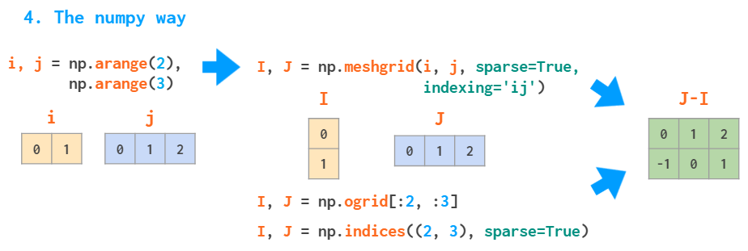

`meshgrid(x, y, indexing="xy")` 默认采用笛卡尔坐标约定，二维输出形状为 `(len(y), len(x))`；使用 `indexing="ij"` 时，输出形状为 `(len(x), len(y))`，与矩阵索引更一致。它改变的是前两个轴的布局，不应简单理解为任意交换参数。

```python
import numpy as np

i = np.arange(3)
j = np.arange(4)
I, J = np.meshgrid(i, j, indexing="ij", sparse=True)
grid = 10 * I + J
assert grid.shape == (3, 4)
assert np.array_equal(grid, i[:, None] * 10 + j[None, :])
```

除了在二维或三维网格上初始化函数外，网格还可以用于索引数组：

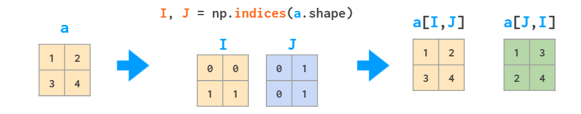

```python
import numpy as np

a = np.arange(20).reshape(4, 5)
rows = [0, 2]
cols = [1, 3]
paired = a[rows, cols]                # [1, 13]
submatrix = a[np.ix_(rows, cols)]     # [[1, 3], [11, 13]]
assert paired.shape == (2,)
assert submatrix.shape == (2, 2)
```

通过 `np.ix_(rows, cols)` 可以选取指定行与指定列的笛卡尔积；直接写 `a[rows, cols]` 则是配对取元素。稀疏网格也能用于广播索引，但这类整数数组索引读取会返回副本。

### 矩阵统计

就像sum函数，numpy提供了矩阵不同轴上的[min](<https://numpy.org/doc/stable/reference/generated/numpy.ndarray.min.html>)/[max](<https://numpy.org/doc/stable/reference/generated/numpy.ndarray.max.html>), [argmin](<https://numpy.org/doc/stable/reference/generated/numpy.argmin.html>)/[argmax](<https://numpy.org/doc/stable/reference/generated/numpy.argmax.html>), [mean](<https://numpy.org/doc/stable/reference/generated/numpy.mean.html>)/[median](<https://numpy.org/doc/stable/reference/generated/numpy.median.html>)/[percentile](<https://numpy.org/doc/stable/reference/generated/numpy.percentile.html>), [std](<https://numpy.org/doc/stable/reference/generated/numpy.std.html>)/[var](<https://numpy.org/doc/stable/reference/generated/numpy.var.html>)等函数。

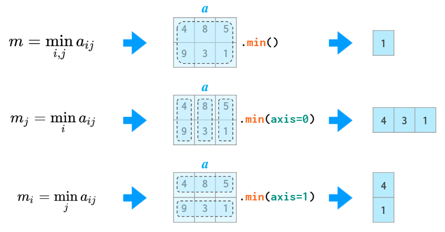

[`np.amin`](https://numpy.org/doc/stable/reference/generated/numpy.amin.html) 与 `np.min` 等效，`np.amax` 与 `np.max` 等效。采用 `np.` 前缀即可避免与 Python 内置名称混淆。`std` 和 `var` 默认 `ddof=0`，除数为 N；需要通常的样本方差估计时用 `ddof=1`，除数为 N−1，并确保有效样本数大于 1。[std 文档](https://numpy.org/doc/stable/reference/generated/numpy.std.html)

对二维或更高维数组，不指定 `axis` 的 `argmin`、`argmax` 返回展平后的索引，可用 `np.unravel_index(index, a.shape)` 转回坐标。指定 `axis` 时，返回的是沿该轴的局部位置，而不是全数组的扁平索引：

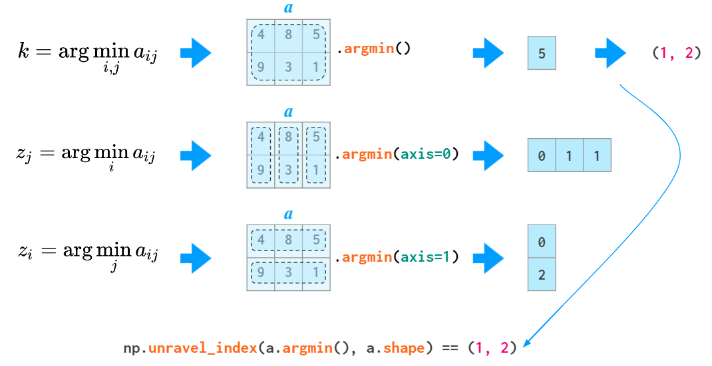

[all](<https://numpy.org/doc/stable/reference/generated/numpy.all.html>)和[any](<https://numpy.org/doc/stable/reference/generated/numpy.any.html>)同样也可作用于特定维度：

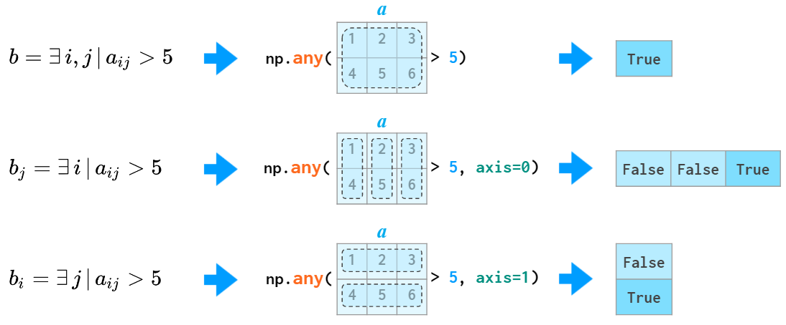

### 矩阵排序

排序中的 `axis` 决定沿哪一个轴独立排列元素：二维数组按 `axis=0` 排序会分别重排各列，按 `axis=1` 排序会分别重排各行；这通常会破坏一整行作为一条记录时的字段对应关系。`axis=None` 则展平后排序：

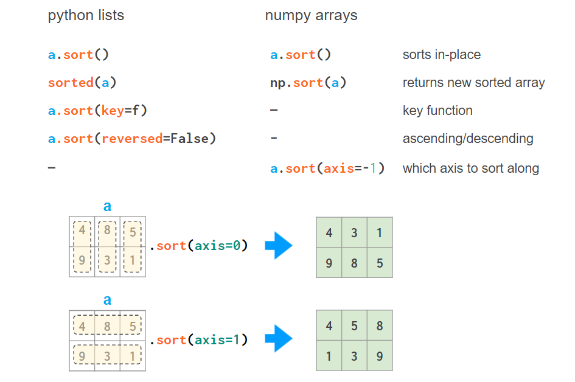

若每一行代表一条记录，需要根据某些列生成行索引，再用这些索引移动整行。`axis` 并不能替代排序键，但以下方法可以实现：

第一种方法：`a[np.argsort(a[:, 0], stable=True)]` 按索引为 0 的列排列整行：

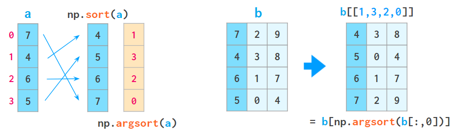

其中，argsort返回排序后的原始数组的索引数组。

多轮稳定排序必须从最低优先级的键开始，逐步排到最高优先级的键。例如先按第 2 列，再按第 1 列，最后按第 0 列，使第 0 列成为主键（列编号从 0 开始）：

```python
import numpy as np

a = np.array([[2, 1, 0], [1, 2, 1], [1, 1, 3], [1, 1, 2]])
a = a[np.argsort(a[:, 2], stable=True)]
a = a[np.argsort(a[:, 1], stable=True)]
a = a[np.argsort(a[:, 0], stable=True)]
```

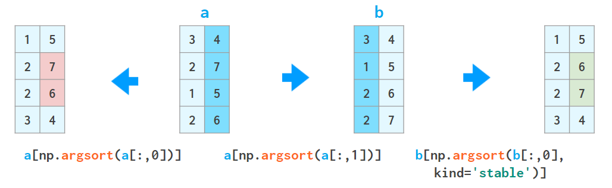

第二种方法：`lexsort` 直接执行多键稳定排序，传入的最后一个键优先级最高。它按键数组工作，而不是固定“按行”理解；为了排列二维表的整行，可以把所需列作为多个一维键传入。[lexsort 文档](https://numpy.org/doc/stable/reference/generated/numpy.lexsort.html)

例如，先按索引为 2 的列、再按索引为 5 的列排序，写作 `a[np.lexsort((a[:, 5], a[:, 2]))]`，或 `a[np.lexsort(a[:, [2, 5]].T[::-1])]`。注意 `a[:, [2, 5]]` 才是选取两列，`a[2, 5]` 只选取一个元素。按从左到右的所有列排序，可写 `a[np.lexsort(a.T[::-1])]`：

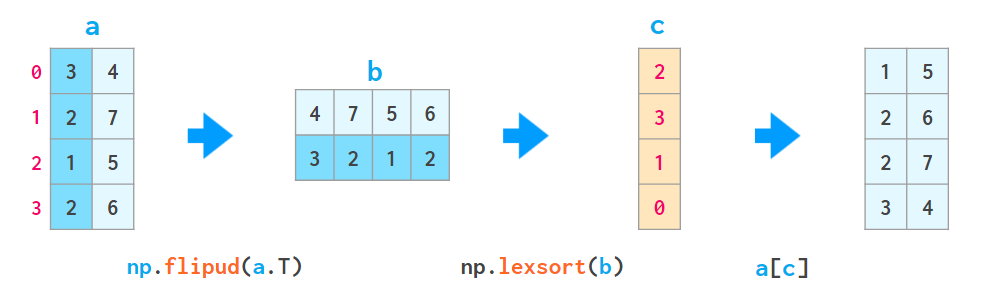

```python
import numpy as np

a = np.array([[2, 0, 1], [1, 9, 2], [1, 4, 1], [1, 4, 0]])
order = np.lexsort((a[:, 1], a[:, 0]))  # 第 0 列为主键，第 1 列为次键
sorted_rows = a[order]
assert np.array_equal(sorted_rows[:, 0], [1, 1, 1, 2])
```

[`flipud(a)`](https://numpy.org/doc/stable/reference/generated/numpy.flipud.html) 沿轴 0 翻转，相当于 `a[::-1, ...]`；`fliplr(a)` 沿轴 1 翻转，要求输入至少是二维数组。对一维数组直接使用 `a[::-1]` 或 `np.flip(a)`。[fliplr 文档](https://numpy.org/doc/stable/reference/generated/numpy.fliplr.html)

第三种方法：结构化数组可以通过 `np.sort(a, order=["字段名1", "字段名2"])` 按命名字段排序。普通二维数值数组没有这些字段，通常使用 [`argsort`](https://numpy.org/doc/stable/reference/generated/numpy.argsort.html) 或 `lexsort` 更直观。

第四种方法：若数据本身是表格，pandas 的 `DataFrame.sort_values` 可以明确指定排序列：

- `pd.DataFrame(a).sort_values(by=[2, 5]).to_numpy()`：先按索引为 2 的列排序，再按索引为 5 的列排序。

- `pd.DataFrame(a).sort_values(by=list(range(a.shape[1]))).to_numpy()`：依次按从左到右的所有列排序。`DataFrame.sort_values` 需要提供 `by`，不能无参数调用。

使用前先执行 `import pandas as pd`；pandas 是单独的依赖。[pandas 排序文档](https://pandas.pydata.org/docs/reference/api/pandas.DataFrame.sort_values.html)

## 3. 三维及更高维数组

三维数组可以由一维数据 `reshape` 得到，也可以从规则的嵌套列表创建。若把形状理解为 `(平面数, 行数, 列数)`，索引就可记为 `(z, y, x)`：`z` 选择平面，`(y, x)` 在平面内定位。这是应用中的一种约定，NumPy 本身并不会给各轴赋予空间含义：

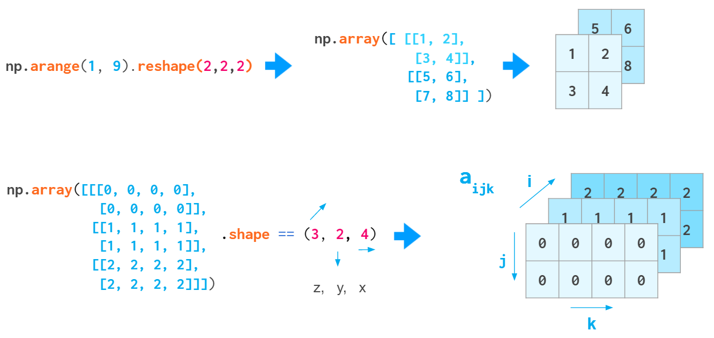

这种布局适合保存一组灰度图像：形状为 `(张数, 高度, 宽度)` 时，`a[i]` 就是第 i 张图像。

处理一张彩色图像时，常见布局则是 `(高度, 宽度, 通道数)`，也就是 `(y, x, channel)`。通道不是几何深度：[Matplotlib](https://matplotlib.org/) 常用 RGB 顺序，OpenCV 的常见彩色读图接口使用 BGR 顺序：

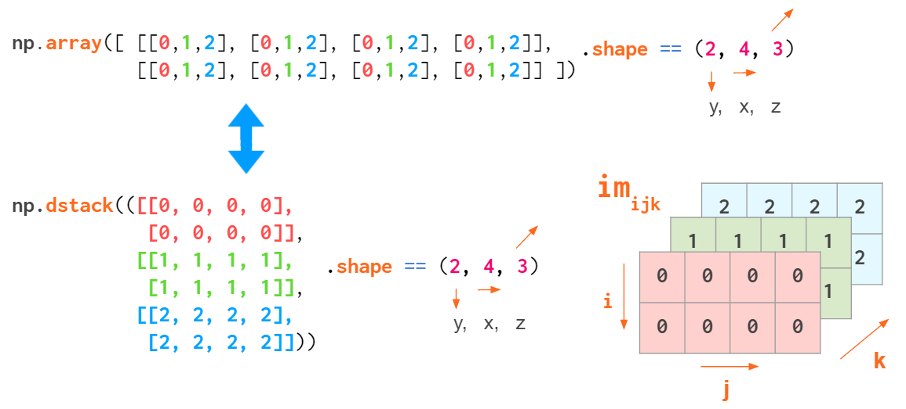

在这种布局中，`a[i, j]` 给出像素 `(i, j)` 的通道值向量；若为 RGB 图像且有三个通道，它的形状就是 `(3,)`。

因此，几何形状的创建实际取决于你对域的约定：

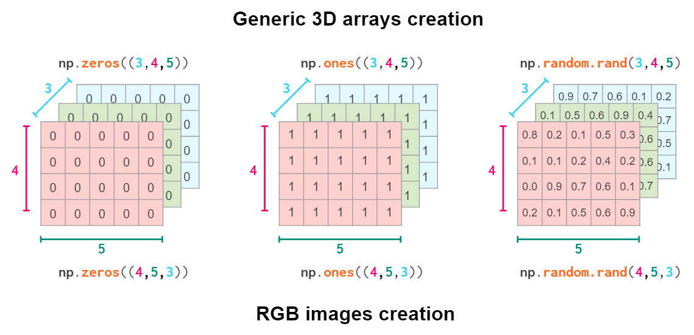

`hstack`、`vstack`、`dstack` 只按固定的轴规则工作，并不识别图像的空间或颜色语义。对三维数组，它们分别沿轴 1、轴 0、轴 2 拼接；恰好在 `(高度, 宽度, 通道数)` 布局下对应横向、纵向和通道方向：

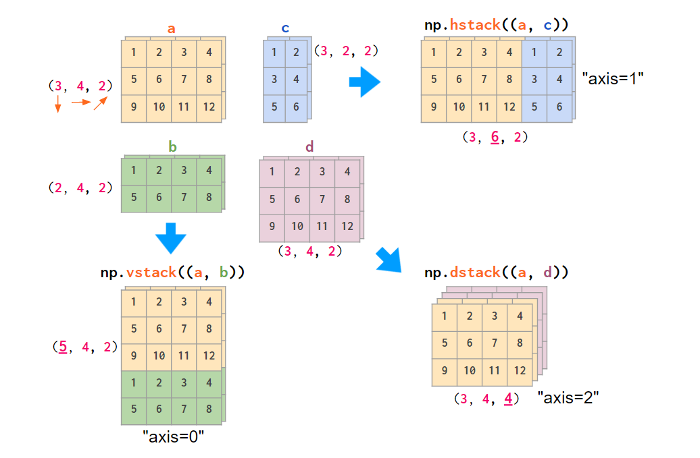

如果数据不是这样的布局，使用concatenate命令可以方便的堆叠图像，并通过axis参数提供索引号：

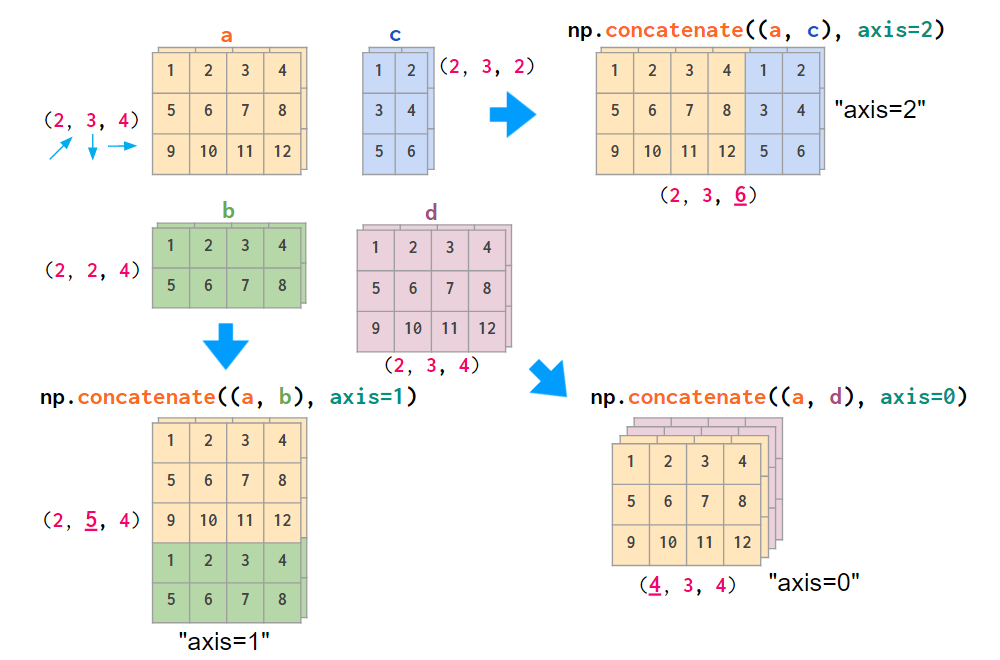

也可以先用 `np.moveaxis` 把目标轴移动到适当位置，完成堆叠后再移回：

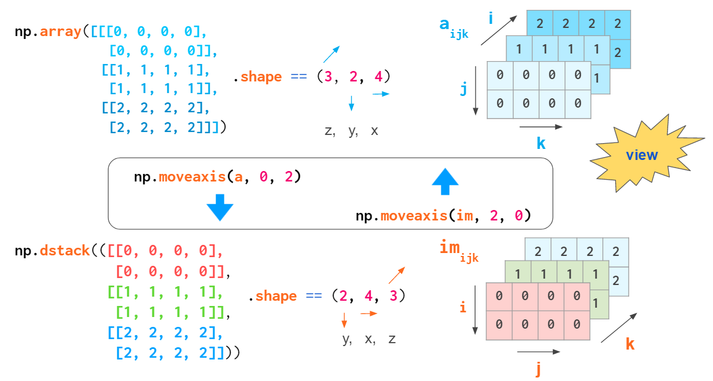

对普通 `ndarray`，`moveaxis`、`swapaxes` 和 `transpose` 主要通过重排形状与步幅返回共享数据的视图，不必复制整块元素；不过，随后的拼接会分配输出数组，转成连续内存布局时也可能发生复制。

交换图像的高宽轴时，先检查数据布局。对 `(平面数, 高度, 宽度)`，使用 `a.swapaxes(1, 2)`；对 `(高度, 宽度, 通道数)`，使用 `a.swapaxes(0, 1)`：

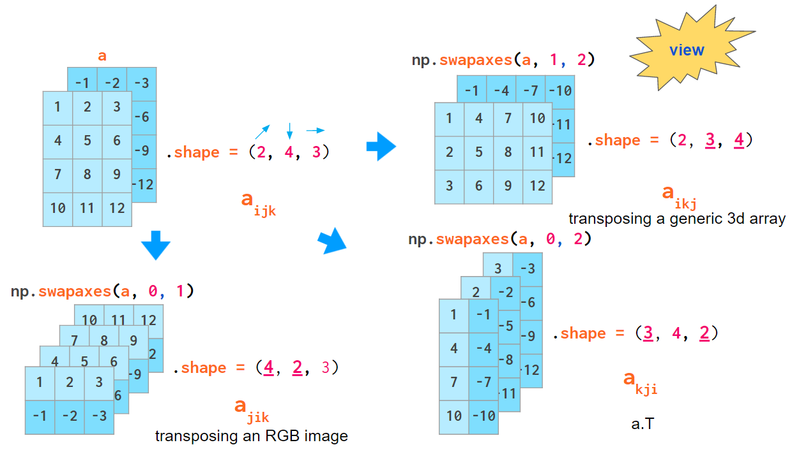

[`transpose`](https://numpy.org/doc/stable/reference/generated/numpy.transpose.html) 不指定轴时会逆转全部轴顺序，`.T` 也是如此。对形状 `(2, 3, 4)` 的数组，`.T` 得到 `(4, 3, 2)`，并不等同于只交换两个空间轴。处理一批矩阵时，`np.swapaxes(a, -1, -2)` 可以只交换最后两个轴。

广播机制同样适用于更高维数组。例如形状 `(batch, height, width, channels)` 的图像批次，可以直接减去形状为 `(channels,)` 的通道均值。始终从最后一个轴向左检查形状，必要时用 `None` 显式插入长度为 1 的轴。更多示例可参阅“[NumPy 中的广播](https://towardsdatascience.com/broadcasting-in-numpy-58856f926d73?sk=d3f8527b160fba2ad87e201369279e52)”。

最后介绍[einsum](<https://numpy.org/doc/stable/reference/generated/numpy.einsum.html>)(Einstein summation)函数，这将使你在处理多维数组时避免很多Python循环，代码更为简洁：

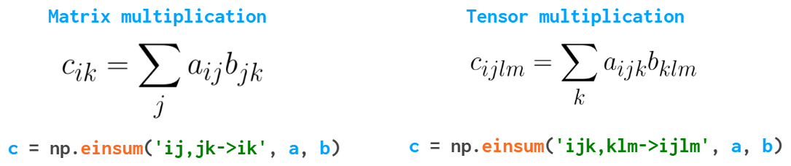

`einsum` 用下标表达逐元素乘法、轴排列与求和收缩。在显式形式中，`->` 左侧描述输入轴，右侧指定保留的输出轴；未出现在输出中的标签会被求和，同一输入中的重复标签可以取对角线。例如 `np.einsum("ij,jk->ik", a, b)` 对 j 求和，就是矩阵乘法。[einsum 文档](https://numpy.org/doc/stable/reference/generated/numpy.einsum.html)

```python
import numpy as np

a = np.arange(6).reshape(2, 3)
b = np.arange(12).reshape(3, 4)
product = np.einsum("ij,jk->ik", a, b, optimize=True)
assert np.array_equal(product, a @ b)

u = np.arange(24).reshape(2, 3, 4)
v = np.arange(40).reshape(4, 2, 5)
contracted = np.einsum("ijk,klm->ijlm", u, v, optimize=True)
assert np.array_equal(contracted, np.tensordot(u, v, axes=1))
```

`np.tensordot(a, b, axes=1)` 收缩第一个数组的最后一轴与第二个数组的第一轴，参数名是 `axes`。更复杂的对应关系可以显式传入轴列表。`einsum` 并不保证比 `@` 或 `tensordot` 更快；收缩顺序、内存布局与中间数组都会影响性能，可用 `optimize=True` 或 `np.einsum_path` 优化并实测。[tensordot 文档](https://numpy.org/doc/stable/reference/generated/numpy.tensordot.html)

## 参考

1. Scott Sievert, [NumPy GPU acceleration](<https://stsievert.com/blog/2016/07/01/numpy-gpu>)
2. Jay Alammar, [A Visual Intro to NumPy and Data Representation](<http://jalammar.github.io/visual-numpy/>)
3. [Big-O Cheat Sheet site](<https://www.bigocheatsheet.com/>)
4. [Python Time Complexity wiki page](<https://wiki.python.org/moin/TimeComplexity>)
5. NumPy Issue #14989, [Reverse param in ordering functions](<https://github.com/numpy/numpy/pull/14989>)
6. NumPy Issue #2269, [First nonzero element](<https://github.com/numpy/numpy/issues/2269>)
7. [Numba library homepage](<https://numba.pydata.org/>)
8. [The Floating-Point Guide, Comparison](<https://floating-point-gui.de/errors/comparison/>)
9. NumPy Issue #10161, [numpy.isclose vs math.isclose](<https://github.com/numpy/numpy/issues/10161>)
10. [100 NumPy exercises on GitHub](<https://github.com/rougier/numpy-100>)
