# Pandas Illustrated

原文链接：[Pandas Illustrated: The Definitive Visual Guide to Pandas | by Lev Maximov | Better Programming](https://medium.com/better-programming/pandas-illustrated-the-definitive-visual-guide-to-pandas-c31fa921a43)

## 第一部分：Pandas 常用操作与 NumPy 对照

下面是一家在线商店的产品表，共有四种产品。

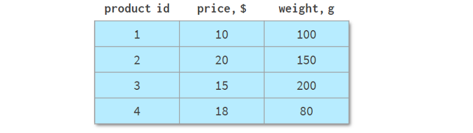

这张表可以用二维 NumPy 数组表示，也可以用 Pandas DataFrame 表示。NumPy 擅长同质数组的数值计算；DataFrame 则允许各列使用不同的数据类型，并用列名和行标签表达数据的含义。下面用一组常见操作比较两者。

### 1. 排序

按某列排序时，Pandas 的表达方式很直接。

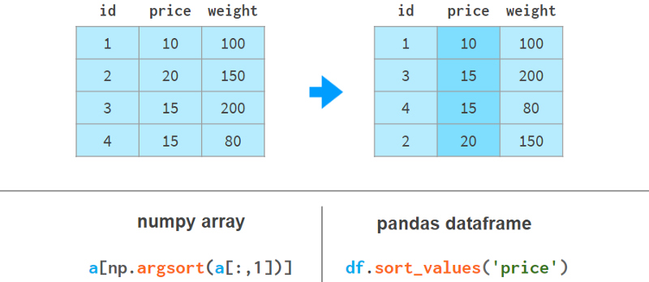

NumPy 的 `np.argsort(a[:, 1])` 返回一个位置数组，表示第二列从小到大排列时，各元素应处于什么顺序。再用这个位置数组重排行，就能保持同一行的数据相互对应。

```python
order = np.argsort(a[:, 1], stable=True)
sorted_array = a[order]

sorted_df = df.sort_values("price", kind="stable")
```

`stable=True` 表示相等的键保留原来的相对顺序，适合需要稳定处理并列值的情况。NumPy 的高级索引 `a[order]` 会生成新数组；Pandas 的 `sort_values` 默认返回新对象。[NumPy argsort](https://numpy.org/doc/stable/reference/generated/numpy.argsort.html)

### 2. 按多列排序

如果先按价格排序，再用重量打破价格相同的情况，Pandas 可以直接列出排序键。

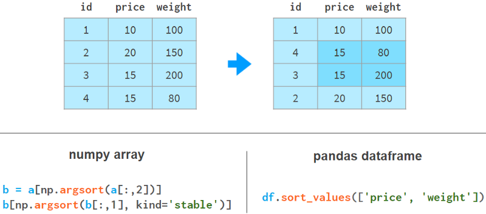

```python
sorted_df = df.sort_values(["price", "weight"], ascending=[True, True])
```

图中的 NumPy 方案先按次要键“重量”排序，再稳定地按主要键“价格”排序。稳定性使第二次排序不会打乱相同价格内部的重量顺序。

NumPy 也提供了专门的多键稳定排序函数 `lexsort`，无需手动执行两次排序。注意，传入的**最后一个键是主要键**：

```python
price_col, weight_col = 1, 2  # 对应数组中的价格、重量列
order = np.lexsort((a[:, weight_col], a[:, price_col]))
sorted_array = a[order]
```

这适合已有 NumPy 数组的场景；按字段名操作表格时，`sort_values` 更容易读懂。[NumPy lexsort](https://numpy.org/doc/stable/reference/generated/numpy.lexsort.html)

### 3. 添加一列

Pandas 可以根据已有列计算新列，也可以直接赋入外部数据。

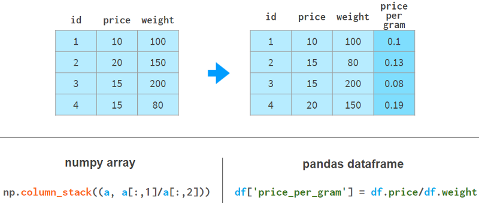

```python
df["total"] = df["price"] * df["quantity"]
```

NumPy 普通二维数组具有固定形状和统一的 `dtype`，拼接一列通常需要分配新的数组。DataFrame 按列管理数据，增加一列通常不必复制整张表，但新列计算、类型转换和内部存储调整仍可能分配内存，不能把它理解为完全没有成本。

赋入 Series 时，Pandas 会按行标签对齐；赋入列表或一维 NumPy 数组时，按位置对应，长度需要与行数一致。

### 4. 快速元素搜索

使用 `a[:, k] == value` 在 NumPy 中搜索，会计算整列的布尔结果，工作量随数据量增长。对于频繁按某一字段查询的表，可以把该字段设为索引。

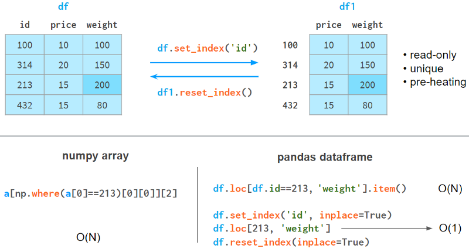

```python
products = df.set_index("product")
```

索引把“根据标签找位置”的机制与数据本身分离。它可能使用范围计算、哈希表或有序查找；性能取决于索引类型、唯一性、排序状态及内部缓存，不能保证所有查询都是常数时间。

- 创建、维护索引需要时间和内存。
- Index 的标签不能逐项原地修改；追加、删除或更换标签可能生成新索引。
- 标签可以重复，重复标签查询可能返回多行，查找方式和成本也会变化。
- 某些索引会延迟建立查找缓存，首次查询和后续查询的耗时可能不同。

是否建立索引，应根据查询习惯和数据含义决定。一次性筛选通常直接使用布尔条件即可。

### 5. 按列连接（join）

要根据相同的产品编号，从另一张表补充信息，可以使用数据库式连接。

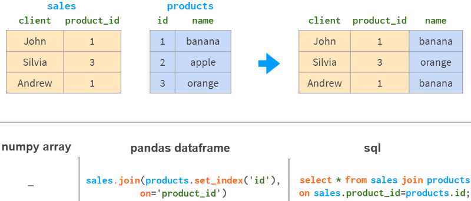

NumPy 可以通过排序、搜索和位置映射实现类似操作，但 Pandas 的 `merge`、`join` 已经处理了键匹配、重复值、缺失匹配和列名冲突等细节。

常见连接模式包括内连接 `inner`、左连接 `left`、右连接 `right`、全外连接 `outer`，也有笛卡尔积连接 `cross`。Pandas 3.0 还提供 `left_anti` 和 `right_anti`，用于寻找另一张表中没有对应键的记录。第三部分会详细讨论连接关系。

### 6. 按列分组

如果要统计每种产品的总销量，可以先按产品分组，再对数量求和。

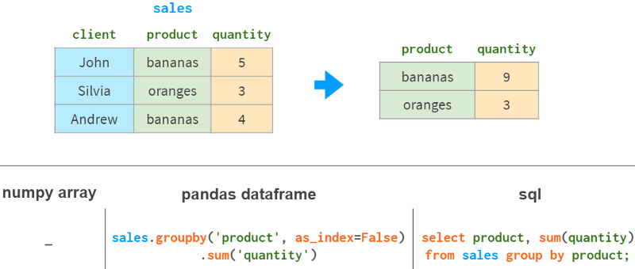

```python
sales_by_product = df.groupby("product", as_index=False)["quantity"].sum()
```

除了 `sum`，还可以使用 `mean`、`max`、`min`、`count` 等聚合方法。`count` 统计非缺失值数量，`size` 统计组内行数，两者遇到缺失值时可能不同。

### 7. 数据透视表

数据透视表把几个字段分别映射到行、列和值，适合从不同角度汇总数据。

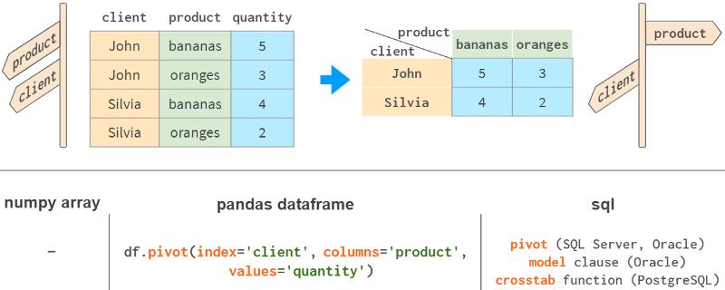

`df.pivot_table` 把分组聚合和长宽表转换结合起来，功能与电子表格中的透视表相近。NumPy 也能通过数组运算实现这种过程，但没有相同层次的表格接口。

```python
table = df.pivot_table(
    index="customer", columns="product", values="quantity", aggfunc="sum"
)
```

把两种工具放在一起看，区别主要是：NumPy 提供按位置计算的同质数组；Pandas 提供带标签、可按列使用不同类型的表格，并围绕这些标签完成对齐、连接与聚合。

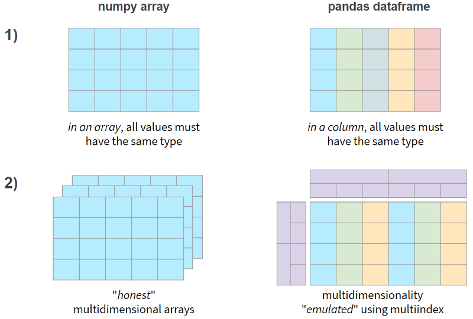

这些便利是否会带来性能开销？需要先明确比较的操作是否具有相同语义。

### Pandas 的速度

下列基准图比较了整数、浮点数数据上的典型计算，涉及不同列数和从小数据到上亿行的数据规模。图中的数值属于特定实验环境，可以帮助理解趋势，不宜直接用作当前机器的性能承诺。

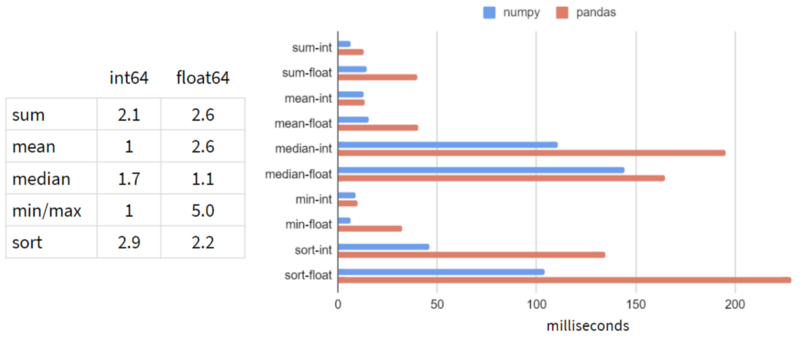

这些直接比较中，Pandas 的用时高于 NumPy。随着数据规模变化，固定调用开销与遍历数据的成本所占比例也会改变。

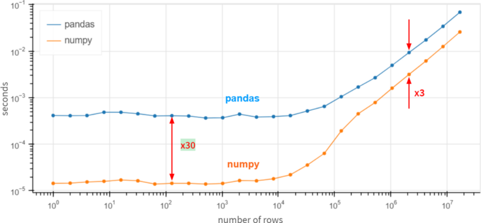

图中小数组的差距可达约 30 倍，大数组约为 3 倍。这并不意味着把 `df["column"].sum()` 全部替换为底层数组求和就一定更好。两者的缺失值规则可能不同：

```python
values = np.array([1.0, np.nan, 2.0])
s = pd.Series(values)

np.sum(values)       # nan
np.nansum(values)    # 3.0
s.sum()             # 3.0
s.sum(skipna=False)  # nan
```

浮点 `NaN` 在普通加法中传播，而 Pandas 的许多归约默认跳过缺失值。Pandas 还有类型分派、标签处理、可空类型等开销，不能把全部性能差异归结为缺失值。

若要比较“跳过 NaN 的求和”，应比较 `np.nansum` 和 `Series.sum`；比较均值时同样要统一 `nanmean`、`skipna` 和输入类型。

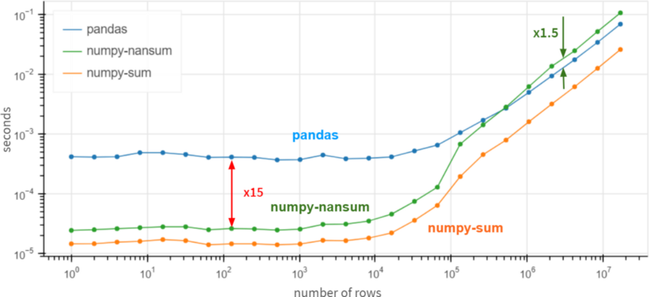

图中的这组实验在超过约百万个元素时，Pandas 曾表现出约 1.5 倍的优势；小数组上仍有约 15 倍的调用开销差距。这些比例会随版本、数据类型、缺失比例、内存布局和硬件改变。单次 0.05 毫秒与 0.5 毫秒的差异可能无关紧要，但在高频循环中就值得测量。

需要纯 NumPy 运算时，优先通过 `to_numpy()` 明确转换，而不是把 `.values` 当作总能获得零成本数组的接口。尤其是可空整数、字符串和 Arrow 列，转换可能复制或改变表示方式。

```python
a = s.to_numpy(dtype=np.float64, na_value=np.nan)
total = np.nansum(a)
```

NumPy 2.x 中，`np.asarray(x)` 表示尽量复用、必要时复制；显式使用 `copy=False` 则要求不能复制，无法满足时会报错。类型混合运算也应注意精度：`float32` 数组与 Python 浮点标量运算通常仍保留 `float32`；需要更高精度时，应明确转换类型。[NumPy 2.x 迁移指南](https://numpy.org/doc/stable/numpy_2_0_migration_guide.html)

最终应在真实数据上比较完整处理过程，同时检查结果是否一致。已有 NumPy 数组上的纯数值计算适合继续使用 NumPy；依赖标签、缺失值和表格关系的操作，Pandas 往往能省去大量手动处理。

## 第二部分：Series 和 Index

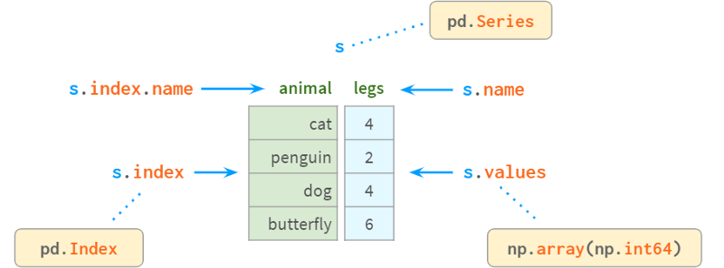

Series 是带标签的一维数据结构，也是理解 DataFrame 单列行为的基础。它不是 NumPy 的类，而是 Pandas 自己的对象。一个 Series 由数据、索引和名称等元信息组成。

普通数值 Series 可以使用 NumPy 数组存储；可空整数、分类、带时区时间、字符串等也可能使用 Pandas 或 Arrow 扩展数组。每个 Series 有自己的 `dtype`，但 `object` 类型可以容纳不同种类的 Python 对象，因此“一个 dtype”不等于“所有 Python 对象完全同类”。

数组式存储使批量计算和随机访问高效，而插入、删除等改变长度的操作通常更昂贵。Index 则为数据增加标签访问能力：常见标签包括字符串、整数、时间戳和元组；标签必须能用作相应索引的键，可以重复。

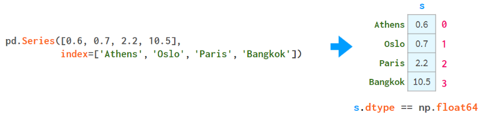

每个元素都有两个需要区分的身份：**标签（label）**与**位置（position）**。

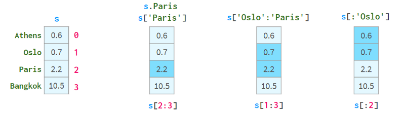

位置从 0 开始，标签由数据定义。`s[2:3]` 取出的是一个切片，通常仍是 Series；它与“取一个标量”不是一回事。整数标签又可能与位置看起来相同，所以应明确选择索引方式。

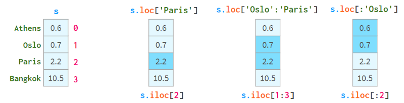

- `s.loc[label]` 按标签取值，标签切片通常包含左右端点。
- `s.iloc[position]` 按位置取值，切片遵守 Python 左闭右开的规则。
- Pandas 3.0 中，`s[整数]` 将整数解释为标签，不能用它表达“第几个元素”。

```python
s = pd.Series([0.6, 0.7, 2.2, 10.5],
              index=["Athens", "Oslo", "Paris", "Bangkok"])

s.loc["Paris"]             # 2.2
s.iloc[2]                  # 2.2
s.loc["Oslo":"Paris"]      # 包含 Oslo 和 Paris
s.iloc[1:3]                # 位置 1、2
s.iloc[::2]                # 位置 0、2
s.loc["Paris":"Oslo":-1]   # 按反方向切片
```

方括号让索引器可以使用 `start:stop:step` 语法。省略起点或终点表示沿相应方向取到边界。标签切片能否解析还取决于标签是否存在、索引是否有序及端点是否重复；需要范围查询时，先整理索引通常更清楚。[Pandas 索引指南](https://pandas.pydata.org/docs/user_guide/indexing.html)

Series 也支持布尔筛选。

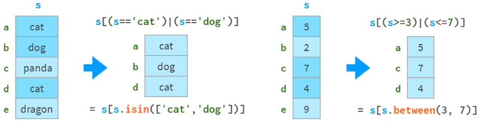

`.loc` 接受按标签对齐的布尔 Series；`.iloc` 需要按位置对应的布尔数组，不能直接接收带索引的布尔 Series。可空布尔掩码中的缺失值在筛选时通常当作 `False`，必要时先显式 `fillna(False)`。

还可以一次选择不连续的标签或位置。NumPy 中常把使用整数数组选择位置称为高级索引或花式索引；Pandas 要同时区分标签列表和位置列表。

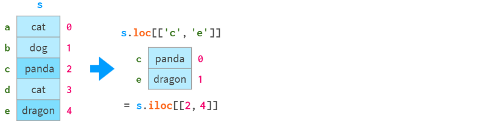

```python
s.loc[["Paris", "Athens"]]
s.iloc[[2, 0]]
```

在 Jupyter 中，Series 通常显示为紧凑的文本，而 DataFrame 提供表格外观。

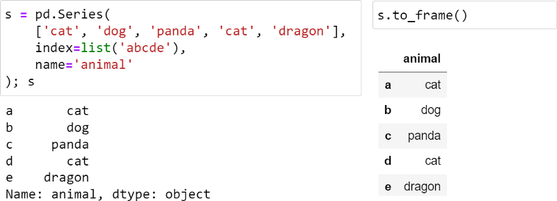

图解配套的 `pandas-illustrated` 包使用导入名 `pdi`，提供 Series 显示补丁，让它呈现类似表格的外观。

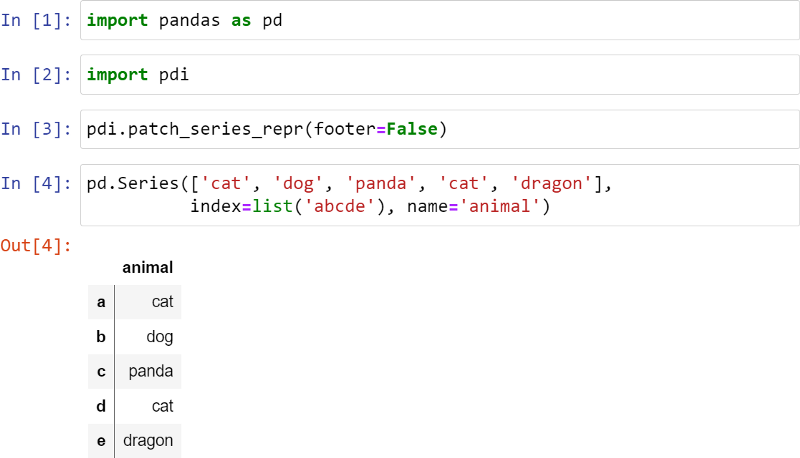

图中的竖线用于区分 Series 和 DataFrame。页脚可显示 dtype 等信息，也可以关闭。`pdi.sidebyside(obj1, obj2, ...)` 可以并排展示多个对象。

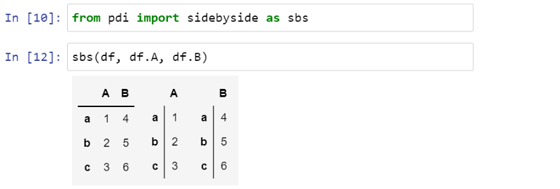

配套工具的安装与导入方式为：

```bash
python -m pip install pandas-illustrated
```

```python
import pdi

pdi.patch_series_repr(footer=False)
pdi.sidebyside(s, s * 2)
```

`pdi` 属于独立第三方辅助库，其显示补丁和扩展索引器不是 Pandas 标准接口，使用时需要确认它与所用 Pandas 版本的兼容性。只需要标准表格展示时，`s.to_frame()` 就能生成单列 DataFrame；在 Notebook 中执行 `display(s.to_frame())` 即可。[配套工具仓库](https://github.com/axil/pandas-illustrated)

### 索引（Index）

Index 管理轴上的标签，并帮助 Pandas 查找、对齐和组合数据。唯一标签常能利用哈希查找，单调索引也可能使用有序查找；具体复杂度取决于索引类型，不能把所有情况都概括为常数时间。

创建未指定索引的 Series 或 DataFrame 时，通常得到 `RangeIndex`。它以起点、终点和步长表示整数序列，类似 Python 的 `range`，不需要为每个标签单独分配空间。

```python
s = pd.Series(np.zeros(10**6))
print(s.index)
# RangeIndex(start=0, stop=1000000, step=1)

print(s.index.memory_usage())  # 少量固定开销，具体字节数随环境而异
```

删除中间的一个标签后，剩余序列无法再用一个等差范围表达，于是转换为普通整数 Index。

```python
s = s.drop(1)
print(type(s.index).__name__)  # Index
print(s.index.dtype)          # int64
print(len(s.index))           # 999999
```

此时仅整数标签的数据缓冲区就约为 `999999 × 8 = 7,999,992` 字节，即约 8 MB；查找缓存还可能占用额外空间。Pandas 目前使用统一的 `Index` 表示这类整数索引，类型名称不再是 `Int64Index`。

如果原标签没有意义，可以重新编号，恢复轻量的范围索引。

```python
s = s.reset_index(drop=True)
# RangeIndex(start=0, stop=999999, step=1)
```

Pandas 不会在删除后自动重排所有标签，因为标签代表数据身份。即使标签是数字，也可能是订单编号。需要“删除后第 5 行”时，直接用 `.iloc[4]` 即可。

保留标签还有追溯作用：在一张具有百万行、上百列的表上逐步筛选时，可以只查看少数列，等找到目标记录后，再用结果的索引返回原表查看完整信息。标签把筛选结果与来源连接起来。

通常应让用于唯一标识记录的索引保持唯一。可以用 `df.index.is_unique` 检查，用 `df.index.duplicated()` 找出重复标签。`df.set_flags(allows_duplicate_labels=False)` 可以限制重复轴标签，但其传播支持仍有边界；在关键步骤显式检查也很有用。单个字段不够时，可用“城市、州”这样的组合，形成 MultiIndex。

Index 的不可变性针对标签内容，不能写 `df.index[0] = ...`。替换标签、重命名列与设置索引名称是不同的事情：

```python
df = df.rename(columns={"City": "city"})
df.index.name = "row_id"
```

给选出的 Series 设置 `.name` 不等于重命名原 DataFrame 的列。索引名称本身可以作为元数据修改。

把 `city` 设为索引后，它通常不再是普通列，不能再通过 `df["city"]` 读取；可以使用 `df.index` 或 `df.index.get_level_values("city")`。`.loc` 按标签访问，`reset_index()` 可以把索引转回列。某些接口，如 `merge` 和 `query`，也可以识别有名称的索引级别。

DataFrame 的行标签和列标签都使用 Index 机制，Series 也一样。

### 按值查找元素

Index 提供“标签 → 数据位置”的访问方式。反过来，根据数据值寻找标签，需要比较或扫描数据。

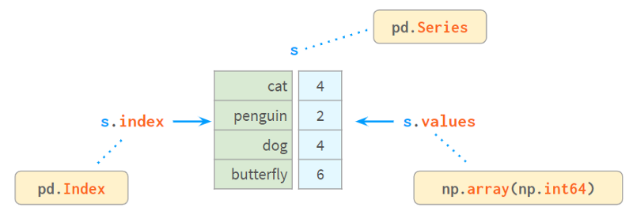

对于普通值，Python 列表可以通过 `.index(x)` 查找第一次出现的位置；NumPy 可以使用布尔比较和 `flatnonzero`。列表没有 `.find()` 方法。

```python
s = pd.Series([4, 2, 4, 6], index=["cat", "penguin", "dog", "butterfly"])
x = 4

first_label = s.index[s.tolist().index(x)]
positions = np.flatnonzero(s.eq(x).fillna(False).to_numpy(dtype=bool))
all_labels = s.index[positions]
```

列表方法在没有匹配时抛出 `ValueError`；位置数组可能为空，所以取 `positions[0]` 前需要确认至少有一个匹配。要找缺失值，应使用 `s.isna()`，不能用 `s == np.nan`。

更直接的标签筛选写法是：

```python
labels = s.index[s.eq(x).fillna(False)]
first = labels[0] if len(labels) else None
```

配套工具将这类操作封装为 `pdi.find(s, x)` 与 `pdi.findall(s, x)`；前者返回第一个标签，后者返回所有匹配标签，`pos=True` 可改为返回位置。图解中的性能思路是为小序列与大序列选择不同的扫描方式；具体分界应通过本地测量确定，不能把某个长度阈值当作普遍规律。

```python
pdi.find(s, 2)     # 'penguin'
pdi.findall(s, 4) # 包含 'cat' 和 'dog' 的 Index
```

### 缺失值

读取文件时，`read_csv` 会识别常见缺失标记，也可以通过 `na_values`、`keep_default_na` 控制识别规则。构造 Series 时可以传入 `None`、`np.nan` 或 `pd.NA`，最终表示取决于 dtype。

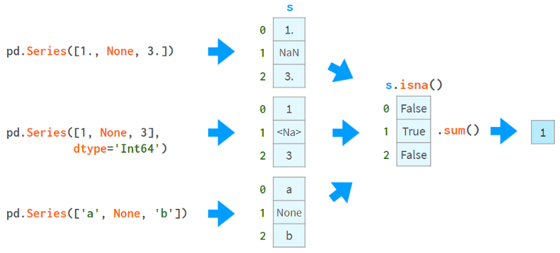

常见情况包括浮点列的 `np.nan`、日期时间的 `NaT`，以及可空整数和布尔类型中的 `pd.NA`。统一检测接口是 `isna()`、`notna()`，而不是与某个缺失标记直接比较。

```python
s = pd.Series([1, None, 3], dtype="Int64")
s.isna()       # 每个位置是否缺失
s.isna().sum() # 1
s.count()      # 2：非缺失值数量
```

`Int64` 与 NumPy 的 `int64` 不同，前者允许缺失值；还可以使用 `Float64`、`boolean` 等可空类型。Pandas 3.0 默认推断文本数据为专门的 `str` dtype，通常使用 `np.nan` 表示缺失；显式 `dtype="string"` 通常采用 `pd.NA`。不要再把所有文本列都假定为 `object`。[Pandas 字符串类型指南](https://pandas.pydata.org/docs/user_guide/migration-3-strings.html)

知道哪里缺失后，可以填充、删除，或者在数值上插值。这些是不同的数据处理决定：插值是估计缺失值，不是删除记录。

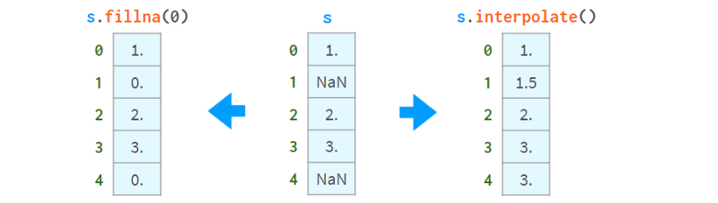

```python
s.fillna(0)
s.dropna()
s.ffill()  # 用前一个有效值向后填充
s.bfill()  # 用后一个有效值向前填充

pd.Series([1.0, np.nan, 3.0]).interpolate()
```

填充值必须与列类型相容。对于整数列，不应随意填入字符串；如果插值会产生小数，应选择合适的浮点表示。

也可以保留缺失值继续分析。许多统计方法默认跳过缺失值。

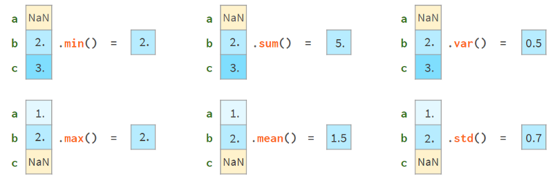

`median`、`rank`、`quantile` 等也有相应的缺失值处理语义。各函数规则并不完全相同：例如全缺失 Series 的 `sum()` 默认返回 0，若希望没有有效观测时仍返回缺失，应使用 `sum(min_count=1)`。[Pandas 缺失数据指南](https://pandas.pydata.org/docs/user_guide/missing_data.html)

Series 之间的算术按索引标签对齐，不按屏幕上显示的位置配对。

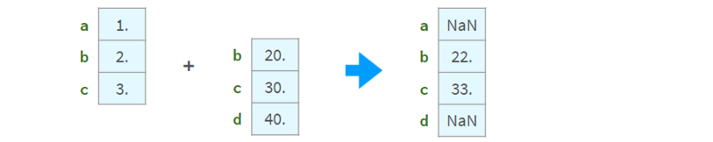

一个标签只存在于一侧时，普通加减乘除会在对应结果中产生缺失。`s1.add(s2, fill_value=0)` 可为一侧缺失的项指定替代值；如果两侧均缺失，结果仍是缺失。

重复标签有明确的匹配规则，但可能导致一对多或多对多对齐，扩大结果规模。若业务要求逐条配对，应先建立唯一标签；若确实要求按位置计算，则明确转成数组，并检查顺序和长度。

### 比较

缺失值使“逐元素比较”与“两个对象是否相等”成为不同问题。

```python
left = pd.Series([1.0, np.nan, 3.0])
right = pd.Series([1.0, np.nan, 3.0])

(left == right).tolist() # [True, False, True]
left.equals(right)      # True
```

浮点 `NaN` 不等于自身；可空整数的比较可能生成含 `pd.NA` 的布尔结果。布尔归约默认跳过缺失时，`all()` 可能返回 `True`，因此不能把 `np.all(s1 == s2)` 当作所有 dtype 通用的相等检查。

把缺失值替换成 `-1` 或 `np.inf` 也不是通用解决方案：这些值可能本来就存在，而且字符串、日期、可空整数等类型未必接受该填充值。

```python
s = pd.Series([1.0, np.nan, 3.0])

s.equals(s)  # 比较形状、标签与数据，数据 dtype 也参与判断
s.compare(s).empty  # True；compare 用于定位差异

a = s.to_numpy()
np.array_equal(a, a, equal_nan=True)  # True：适用于这里的数值数组
```

`compare` 返回差异表，通常要求两边标签一致；`equals` 直接返回布尔结果。测试中需要更具体的差异信息，可以使用 `pd.testing.assert_series_equal` 或 `assert_frame_equal`，并按需要设置浮点容差。

对于包含数值和文本的 DataFrame，转成 NumPy 后往往是 `object` 数组，`equal_nan=True` 可能因不能执行缺失值检测而报错。

```python
df = pd.DataFrame({"a": [1.0, None, 3.0], "b": ["x", None, "z"]})
df.equals(df)        # True
df.compare(df).empty # True
```

保留 Pandas 对象进行比较，能保留标签和各列类型的信息。

### 追加、插入、删除

Series 可以改变长度，但没有 Python 列表那样的尾部预留容量。追加、插入和删除常涉及重新分配数据或索引，反复逐条执行会比较慢。

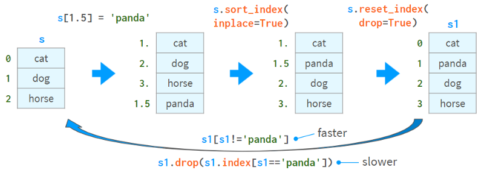

标签不存在时，`s.loc[new_label] = value` 可以追加；标签已经存在时，它会更新匹配的记录。`s.drop(label)` 按标签删除，标签重复时会删除该标签的所有出现位置。

DataFrame 的 `insert` 只插入列，Series 没有相应的标准方法。按位置插入 Series 元素，可以切分后一次拼接。

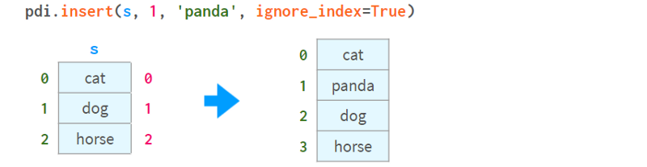

```python
pos = 2
new_value = pd.Series([9], index=["fox"])
result = pd.concat([s.iloc[:pos], new_value, s.iloc[pos:]])
```

插入点由位置决定，范围是 `0 <= pos <= len(s)`，不是标签。

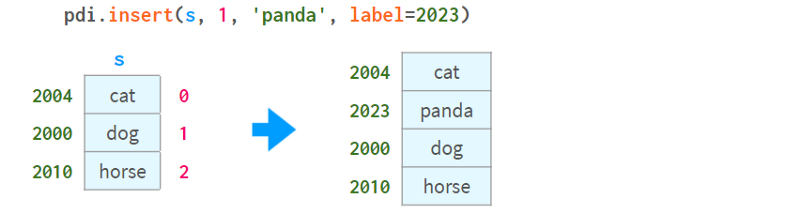

配套工具 `pdi.insert` 封装了这种切分、拼接过程。若要插到某个元素之前，可以先查到它的位置，再传给插入函数。

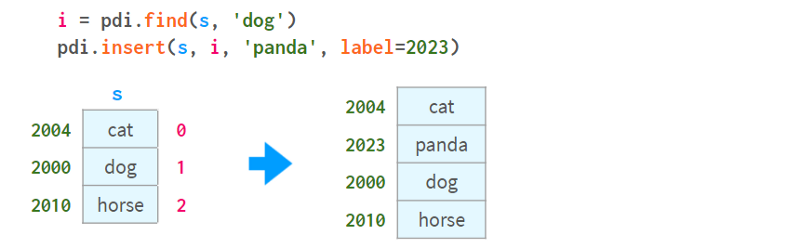

`pdi.insert` 默认返回新对象；DataFrame 的 `df.insert` 则修改该 DataFrame，并返回 `None`，两者调用习惯不同。Series 和 DataFrame 的 `.append()` 已移除，批量拼接应使用 `pd.concat`。收集大量新记录时，先放入 Python 列表，最后统一构建对象，通常更合适。

### 统计数据

Pandas 提供统计函数，帮助快速了解上百万条记录的分布，而不必逐行查看。

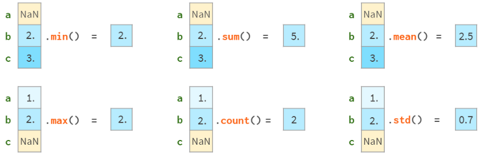

许多数值统计默认跳过缺失值，但应查看具体方法的参数。例如 `count` 只计非缺失值，`size` 则包含缺失位置。

标准差有一个常见差异：

```python
s = pd.Series([1, 2])
s.std()                   # 约 0.7071067811865476
np.std(s.to_numpy())       # 0.5
s.std(ddof=0)             # 0.5
np.std(s.to_numpy(), ddof=1) # 约 0.7071067811865476
```

方差计算中的分母是 `N - ddof`。NumPy 默认 `ddof=0`，Pandas 默认 `ddof=1`。后者采用贝塞尔校正，用于在通常的独立同分布假设下无偏估计总体方差；开平方得到的样本标准差本身并不因此严格无偏。采用哪一种取决于是在描述完整总体，还是根据样本估计总体。

最值也有标签与位置的区别：`argmin`、`argmax` 返回位置，`idxmin`、`idxmax` 返回标签。


常用统计与序列计算包括：

| 方法 | 含义 |
| --- | --- |
| `std`、`var` | 标准差、方差，可指定 `ddof` |
| `sem` | 均值的标准误差估计 |
| `quantile`、`median` | 分位数、中位数；`quantile(0.5)` 通常对应中位数 |
| `mode` | 众数，可能返回多个值 |
| `nlargest`、`nsmallest` | 最大或最小的若干值；`keep` 控制并列值处理 |
| `diff` | 相邻元素的离散差分 |
| `cumsum`、`cumprod` | 累积和、累积积 |
| `cummin`、`cummax` | 累积最小值、最大值 |
| `pct_change` | 相对变化率，如 0.1 表示增长 10%，不是直接返回 10 |
| `skew`、`kurt` / `kurtosis` | 偏度、峰度；Pandas 峰度采用正态分布为 0 的超额峰度约定 |
| `cov`、`corr`、`autocorr` | 协方差、相关系数、自相关 |
| `rolling`、`expanding`、`ewm` | 滚动、扩展与指数加权窗口 |

窗口对象之后仍需调用聚合方法，如 `s.rolling(3).mean()`。`pct_change` 的缺失处理应显式表达：只有业务上允许沿用前值时，才使用 `s.ffill().pct_change()`。

### 重复数据

检测重复值、删除重复值和检查标签唯一性是不同的操作。

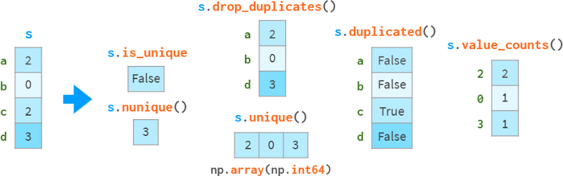

`s.duplicated()` 标记重复的数据值，`s.drop_duplicates()` 去除重复的数据值。`keep="first"` 保留第一次，`keep="last"` 保留最后一次，`keep=False` 不保留任何重复成员。它们不等于对 `s.index` 去重。

`s.unique()` 保留值第一次出现的顺序，常用哈希方式去重。NumPy 的 `np.unique` 默认返回排序后的唯一值；NumPy 2.x 虽提供 `sorted=False`，但这**不保证保留首次出现顺序**，也不应再把所有实现都简单归为固定的排序复杂度。[NumPy unique](https://numpy.org/doc/stable/reference/generated/numpy.unique.html)

缺失值通常也参与唯一性判断。

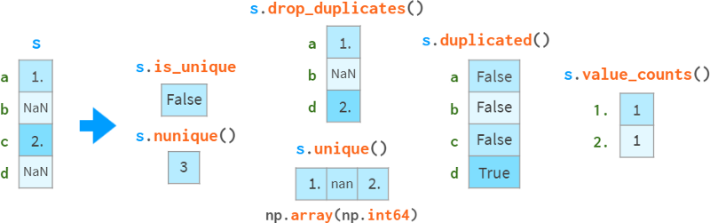

例如多个缺失值可能使 `s.is_unique` 为 `False`。若只关心有效值，使用 `s.dropna().is_unique`；`s.nunique()` 默认不把缺失算作一种值，`s.nunique(dropna=False)` 则会把它纳入统计。

单调性检查使用属性，不加圆括号：

```python
s.is_monotonic_increasing
s.is_monotonic_decreasing
```

它们允许相邻值相等。对于不存在缺失且可比较的序列，可用 `s.is_monotonic_increasing and s.is_unique` 判断严格递增，用对应的递减属性判断严格递减。不要调用私有的严格单调接口，也不要使用已移除的 `is_monotonic` 别名。

### 分组

分组把“对整个序列计算”变为“对每一组分别计算”。`groupby` 创建一个 GroupBy 对象，保存分组规则；之后可以聚合、变换或筛选。

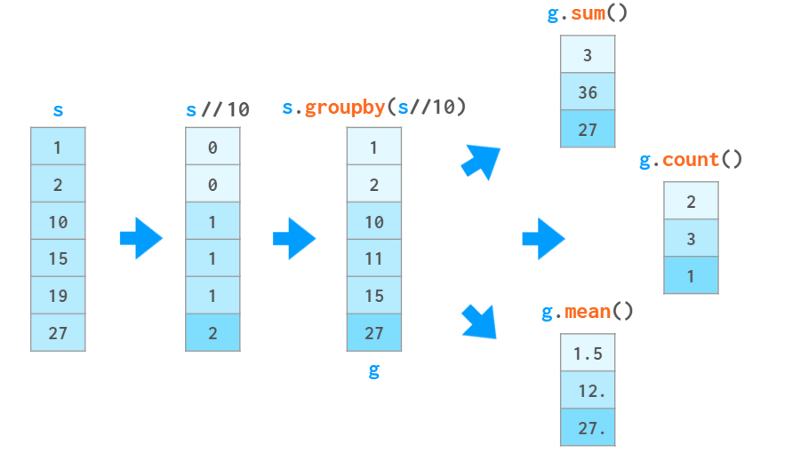

例如根据数值除以 10 的整数部分分组：

```python
s = pd.Series([12, 15, 21, 24, 35])
g = s.groupby(s // 10)
g.sum()
g.size()
g.mean()
```

除了整体统计，也可以根据组内位置或相对大小选取成员。

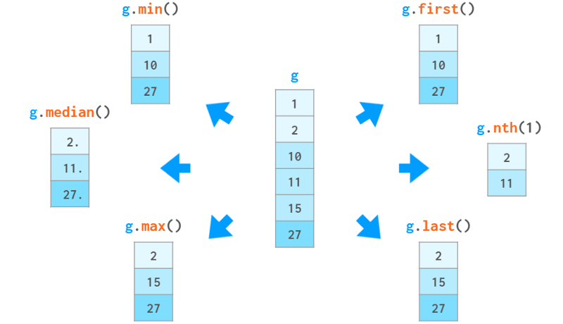

`g.head(2)` 取每组前两项，`g.nth(0)` 按组内位置取项，`g.nlargest(2)` 取每组最大的两项。`first()` 通常取首个非缺失值，而 `nth(0)` 表达第一条观测，二者不要混淆。

使用 `g.agg(["min", "max"])` 可以一次计算多个统计量，`g.describe()` 可以得到一组描述性统计。

自定义函数有三种常见用途：`agg` 将每组归约成统计结果；`transform` 返回可广播到组内各位置的结果，并与输入索引对应；`apply` 支持更灵活的输出结构。

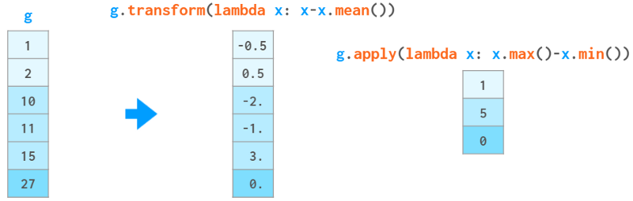

```python
g.agg(lambda x: x.max() - x.min())
g.transform("mean")  # 每项对应其所在组的均值
g.transform(lambda x: x - x.mean())
```

同一组的元素无需相邻。Pandas 会把整个数据中属于相同键的成员放在一起，更接近根据键收集元素的字典，而不是只合并连续相同键的 `itertools.groupby`。

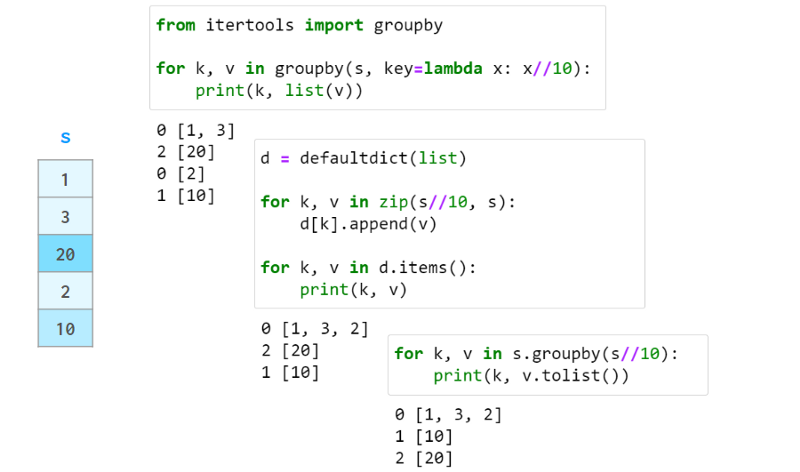

`groupby` 默认对组键排序，`sort=False` 可以按组键首次出现的顺序输出；组内成员通常保持输入顺序。聚合结果一般每组一行，而 `transform`、`head`、`apply` 的索引规则各不相同，不能笼统认为所有分组结果都没有重复标签。

`apply` 可以返回标量、Series 或 DataFrame，组合结果时可能增加组键层级；用 `group_keys` 控制这一行为。能使用内置聚合或 `transform` 表达的计算，通常优先使用这些更专门的接口。[Pandas groupby](https://pandas.pydata.org/docs/reference/api/pandas.DataFrame.groupby.html)

## 第三部分：DataFrame

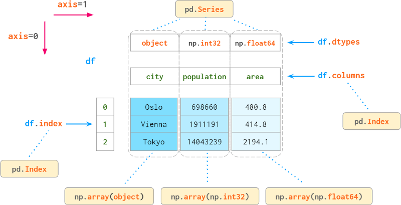

DataFrame 是 Pandas 的主要表格结构，拥有行索引、列索引以及每列的数据。可以把它理解为一组共享行索引的 Series，但这是一种使用层面的理解，并不要求底层真的分别存储为独立 Series。不同列可以有不同 dtype。

### 读写 CSV 文件

从 CSV 文件读取数据，是构造 DataFrame 最常见的方式之一。

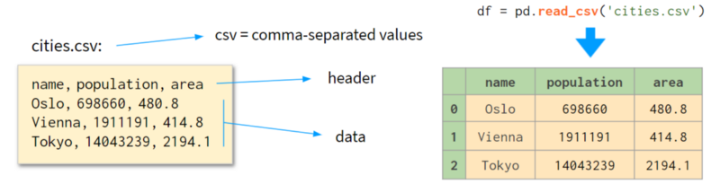

```python
df = pd.read_csv("data.csv")
df.to_csv("output.csv", index=False, encoding="utf-8")
```

`read_csv` 可以自动推断很多信息，也提供丰富参数处理现实文件中的差异。下面是非标准分隔文件的解析示例与参数说明。

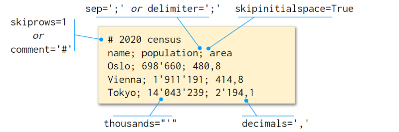

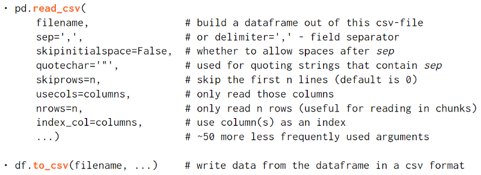

CSV 有公开格式约定，但现实文件经常在分隔符、引号、编码、表头和缺失标记上存在差异。常用参数包括：

| 参数 | 用途 |
| --- | --- |
| `sep` | 字段分隔符，如 `","`、`";"`、`"\t"` |
| `header`、`names` | 表头所在行与自定义列名 |
| `skiprows`、`comment` | 跳过说明行或处理注释 |
| `usecols` | 只读取需要的列 |
| `index_col` | 将一列或多列用作索引 |
| `dtype` | 明确各列类型，避免把编号误读为数值 |
| `na_values`、`keep_default_na` | 定义缺失值规则 |
| `true_values`、`false_values` | 指定布尔值的文本表示 |
| `parse_dates`、`date_format` | 日期列与格式 |
| `encoding` | 文件编码 |
| `decimal`、`thousands` | 小数点与千位分隔符 |
| `nrows`、`chunksize` | 读取部分行或分块处理 |

自动推断不代表业务解释一定正确。例如邮政编码、商品编号可能需要保留前导零，应显式指定字符串类型。默认类型推断也不会把所有可能像日期的列都转换成日期。

读取后先检查：

```python
df.head(5)
df.dtypes
df.shape
df.info()
```

`head` 查看前几行，`dtypes` 查看列类型，`shape` 返回行数与列数，`info` 汇总非缺失计数、类型和内存信息。大文件可配合 `usecols`、`dtype` 与 `chunksize` 降低峰值内存。

可以在读取时设置索引，也可以读取后再设置。

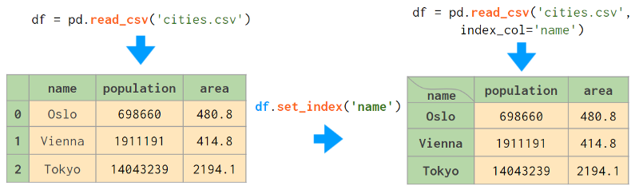

索引用于标签查询、算术对齐和连接。它会占用额外空间，也改变访问方式，所以应选择具有稳定含义的字段；如果数据只是待处理记录，保留默认 `RangeIndex` 也完全合理。

### 构建 DataFrame

内存中已经存在的数据，可以直接交给构造函数。

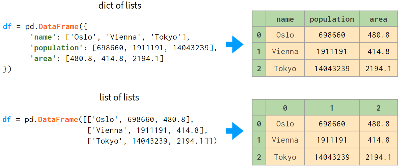

按列组织的字典以键作为列名；二维列表或数组在未提供名称时，对行和列使用整数标签。建议用 `columns` 明确列含义，用 `index` 提供需要保留的行身份。

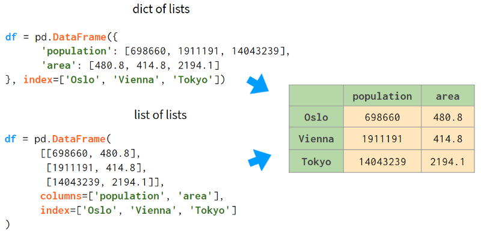

索引名称可以在构造时通过带名称的 Index 传入，也可以随后设置。

```python
df = pd.DataFrame(
    {"population": [698660, 1911191], "area": [480.8, 414.8]},
    index=pd.Index(["Oslo", "Vienna"], name="city"),
)
# 也可以在构造后使用 df.rename_axis("city") 或 df.index.name = "city"
```

NumPy 向量组成的字典与二维 NumPy 数组都能构造 DataFrame，但有不同的类型与内存特征。

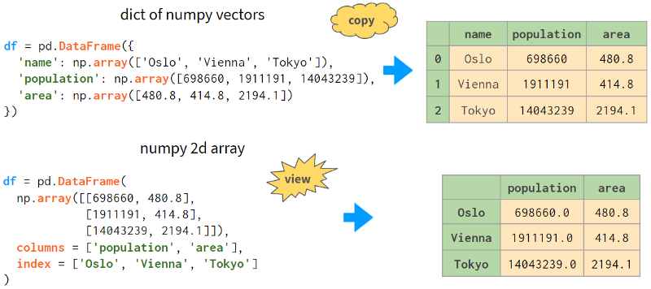

二维普通 NumPy 数组只能使用一种 dtype。把人口整数和面积浮点数放在同一个数组时，通常在构造数组阶段就统一成浮点数。按列传入字典则更容易保留每列类型。

图中的内存共享关系需要结合构造参数理解。希望 DataFrame 与外部数组明确独立时，使用 `pd.DataFrame(a, copy=True)`；显式 `copy=False` 可以请求共享，但类型转换等条件仍可能要求复制。对外部共享 NumPy 数组的直接写入不会自动受 Pandas 的写时复制机制保护，因此不要把共享数组当作稳定的双向同步接口。

Pandas 3.0 的写时复制（Copy-on-Write，CoW）使从一个 Pandas 对象派生出的另一个对象在修改时具有独立行为，实际复制可以延迟到写入。底层是否共享与“修改子对象会不会修改父对象”是两个不同问题。[Pandas Copy-on-Write](https://pandas.pydata.org/docs/user_guide/copy_on_write.html)

其他实用输入形式包括：

- 字典列表：每个字典是一条记录，适合记录流、JSON 式数据。
- Series 字典：每个 Series 是一列，构造时按各自索引对齐。
- 列表字典或二维列表：适合先收集数据，再一次性构造。

对于不断到来的记录，先向 Python 列表追加，再批量生成 DataFrame，通常比逐行扩展更高效。已知最终大小时，可以先分配合适 dtype 的 NumPy 数组，再填入数据。全零浮点矩阵只适合同质数值，不适合作为任意混合表格的通用预分配方案。

### DataFrame 的基本操作

列可以像变量一样参与计算。`df.area` 在列名合法且不与属性冲突时可用；更通用的写法是 `df["area"]`。

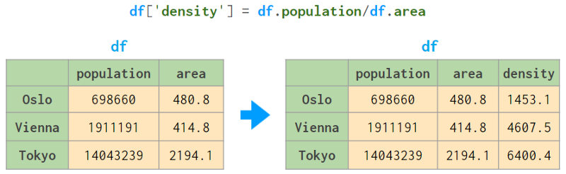

```python
df["population"] = df["population"] / 10**6
df["density"] = df["population"] / df["area"]
```

计算前要统一单位：如果人口已改成“百万人”，上述密度也是“百万人/面积单位”；要得到“人/平方千米”，应使用未缩放的人口，或把结果乘回 `10**6`。有些就地数值操作不能把整数列自动变成浮点列，完整计算后再赋回整列更清楚。

创建新列应使用方括号或 `assign`，不要通过新增对象属性创建列。

不同 DataFrame 的列也可以直接运算，只要行标签表达相同的实体。

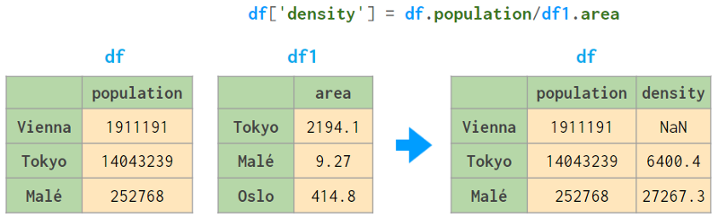

这种对齐让数据顺序不同时仍能正确配对；但标签错误或重复时，也可能产生缺失或多重匹配，所以需要检查索引含义。

### 索引 DataFrame

`df["A"]` 选择一列，`df[["A", "B"]]` 选择多列，布尔掩码和切片还可以选择行。普通方括号不能统一表达所有“行、列”的组合。

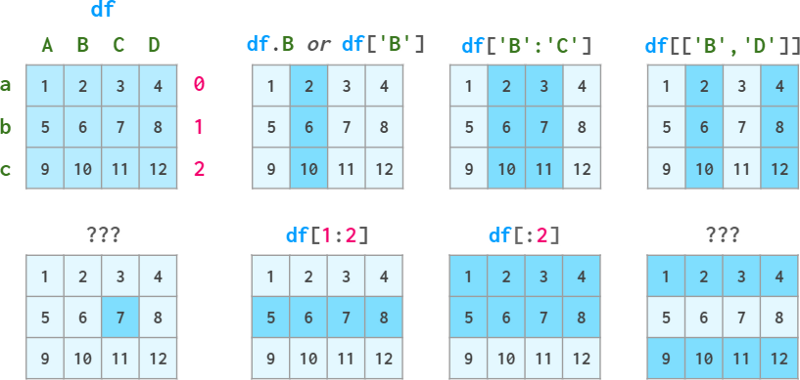

`df["x", "y"]` 是一个元组键，通常用于 MultiIndex 列，并不表示行 `x`、列 `y` 的单元格。

使用 `.loc` 按标签选择，使用 `.iloc` 按位置选择。

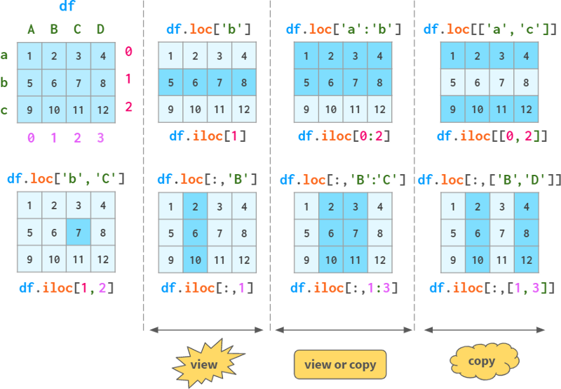

```python
df.loc["a", "A"]
df.loc["a":"b", ["A", "B"]]
df.iloc[0, 1]
df.iloc[[0, 2], :2]
```

单个标签或位置通常会降低维度；使用列表可保留对应轴。例如 `df.loc[["a"], ["A"]]` 返回 DataFrame。

修改原表时，把行与列放在同一次赋值中：

```python
df.loc["a", "A"] = 10
df.loc["a":"b", "A"] = 10
df.loc["a"] = 10
```

不要使用 `df.loc["a"]["A"] = 10`、`df["A"][mask] = 10` 等链式赋值。Pandas 3.0 的 CoW 下，这类写法无法更新原表。若本来就要处理一个独立子表，可以先赋给变量：

```python
subset = df.loc["a":"b"]
subset["A"] = 10  # 修改 subset，不修改 df
```

需要主动取得独立副本时仍可调用 `.copy()`，但无需为了遵循旧式 `SettingWithCopyWarning` 规则，在每次筛选后都机械地复制。[CoW 的赋值规则](https://pandas.pydata.org/docs/user_guide/copy_on_write.html)

布尔索引可以表达数值或文本条件。

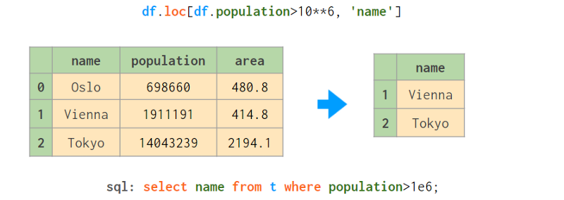

组合多个条件时，每个比较应加括号，用 `&`、`|`、`~` 表达逐元素与、或、非，不能用 Python 的 `and`、`or` 替代。

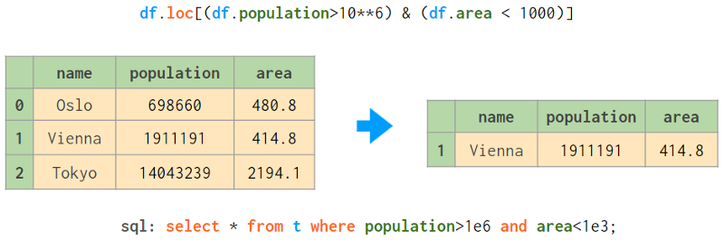

```python
mask = (df["population"] > 1_000_000) & (df["area"] < 1000)
selected = df.loc[mask]
```

筛选结果即使只有一行，也可能仍是 Series 或 DataFrame。

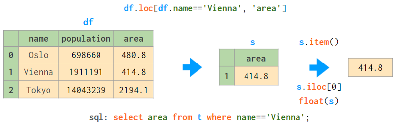

```python
matches = df.loc[df["name"].eq("Vienna"), "area"]
area = matches.item()  # 必须恰好有一个值，否则抛出 ValueError
```

如果允许多个匹配并只取第一个，可以使用 `matches.iloc[0]`，无匹配时会报错。不要依赖 `float(series)` 这种隐式转换。标签唯一且已知时，`.at[row_label, column_label]` 和 `.iat[row_pos, column_pos]` 适合标量访问。

要修改全部匹配项，直接使用 `df.loc[mask, "area"] = value`；若只修改第一条匹配且标签可能重复，可以先用 `np.flatnonzero(mask.to_numpy())` 得到行位置，再用 `.iloc` 或 `.iat` 在原对象上赋值。

`query` 提供另一种行筛选语法：

```python
df.query('name == "Vienna"')
df.query("population > 1e6 and area < 1000")
```

它支持普通列名和有名称的索引级别，表达多个条件时较简洁。含空格的列名可以用反引号，引用外部变量可用 `@变量名`。`query` 返回筛选结果，对结果的赋值不会更新原表；更新原表仍应使用 `.loc`。

需要 SQL 表达式时，DuckDB 可以直接查询可见的 Pandas DataFrame；`pandasql` 则采用 SQLite 路径。两者的数据交换和执行方式不同，性能要根据实际查询比较。[DuckDB 查询 Pandas](https://duckdb.org/docs/stable/guides/python/sql_on_pandas.html)

### DataFrame 算术

加、减、乘、除、求模和幂运算都可以应用于 DataFrame。两个 DataFrame 之间会同时按行标签和列标签对齐。

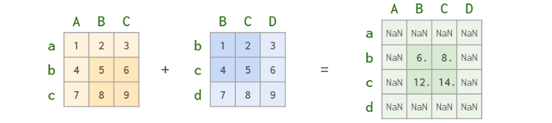

DataFrame 与 Series 运算时，默认用 Series 的索引对齐 DataFrame 的列，然后沿行方向广播。

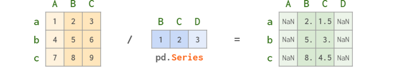

一维列表和 NumPy 数组没有标签，默认按列位置对应，并按广播规则扩展。

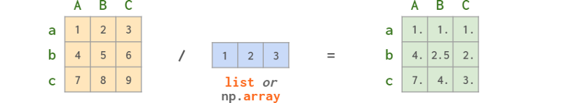

若一个 Series 的索引对应的是 DataFrame 的行，需要通过方法的 `axis` 参数说明对齐方向。

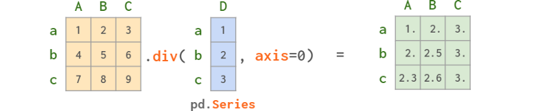

```python
normalized = df.div(row_totals, axis="index")
```

这里 `row_totals` 的标签与 `df.index` 对齐。`axis="columns"` 则与列对齐，也是 DataFrame 与 Series 运算的常见默认方向。

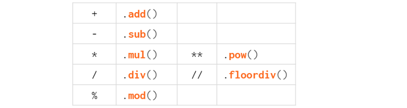

常用方法包括 `add`、`sub`、`mul`、`div` / `truediv`、`floordiv`、`mod`、`pow`；反向运算有 `rsub`、`rdiv` 等。选择方法调用，主要是为了明确对齐轴、级别和缺失值处理，而不必依赖默认广播直觉。

### 组合 DataFrame

`concat`、`merge` 和 `join` 都能组合表格，但解决的问题不同：`concat` 沿某个轴拼接对象，`merge` 根据键匹配记录，`join` 提供方便的索引连接接口。

#### 垂直叠加

把第二张表的行放在第一张表之后，使用 `concat` 的默认 `axis=0`。

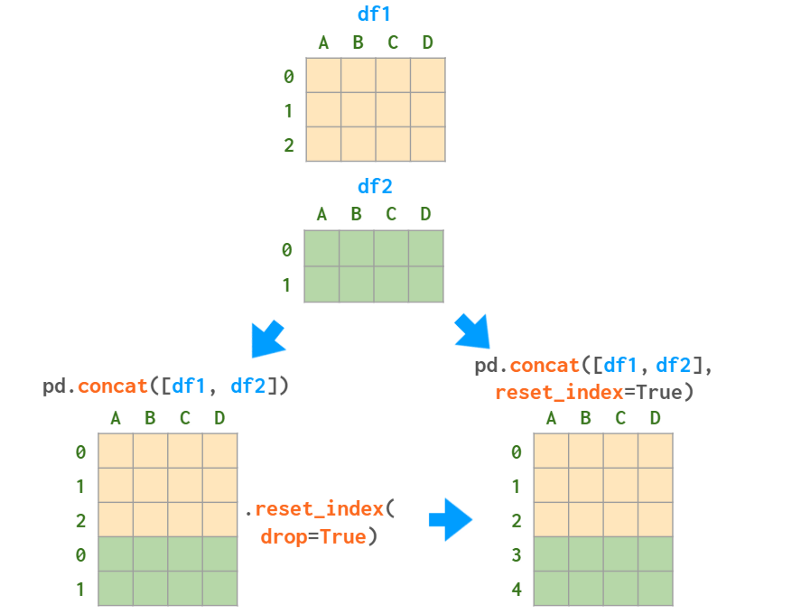

```python
combined = pd.concat([df1, df2], ignore_index=True)
```

如果原行索引没有业务意义，`ignore_index=True` 会重新编号。保留索引时，可以检查是否重复；也可以之后使用 `reset_index(drop=True)`。若需要区分来源，用 `keys` 增加一个来源级别，而不是丢掉来源信息。

两张表的列不必完全一致。`join="outer"` 是默认值，取列的并集，缺少的部分填为缺失；`join="inner"` 取列的交集。控制该行为的参数是 `join`，不是 `kind`。

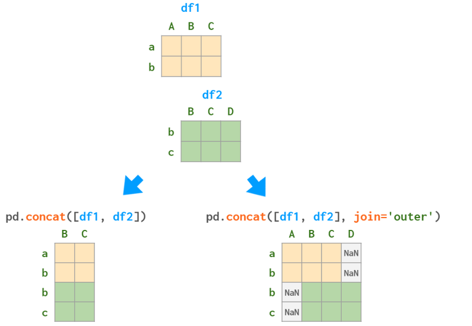

```python
common_columns = pd.concat([df1, df2], join="inner", ignore_index=True)
```

列顺序不同并不意味着同一行会错位，Pandas 会按列名对齐。`verify_integrity=True` 可检查拼接轴是否产生重复标签，但它本身也有检查成本。[Pandas concat](https://pandas.pydata.org/docs/reference/api/pandas.concat.html)

#### 水平叠加

`axis=1` 将多个对象按列排在一起，并沿行索引对齐。

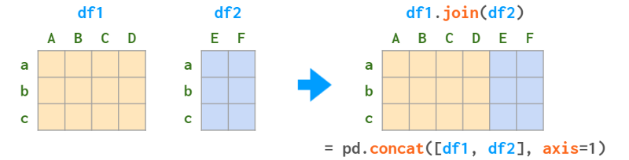

```python
combined = pd.concat([df1, df2], axis=1, join="outer")
```

`concat` 的 `join` 在非拼接轴上提供交集与并集选择。需要按某个业务字段执行左连接、右连接或一对多匹配时，使用 `merge` 或 `join` 更明确。

#### 基于多重索引的数据叠加

`keys` 可以在拼接结果上增加一层来源标签。

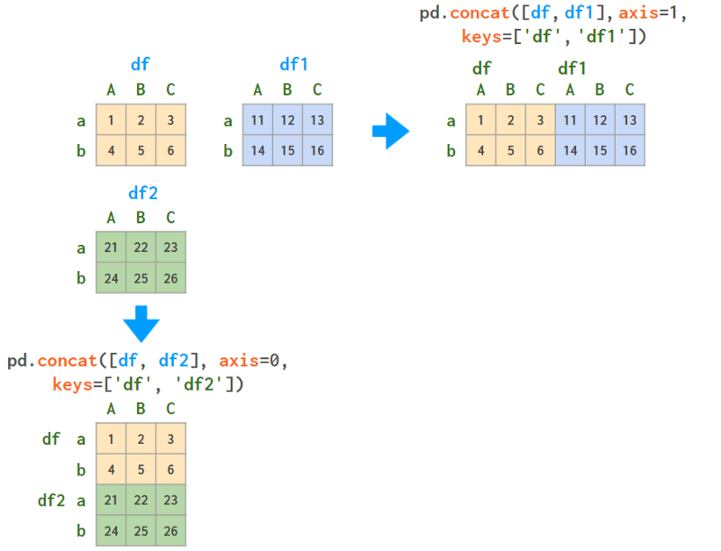

```python
combined = pd.concat([df1, df2], keys=["source_1", "source_2"], names=["source"])
```

这提供了类似“增加维度”的观察方式，但 DataFrame 本身仍是二维表；额外维度通过 MultiIndex 表达，不能直接等同于 NumPy 的三维 `dstack`。

当标签部分重叠时，Pandas 仍按标签对齐，产生的空缺需要按业务理解。

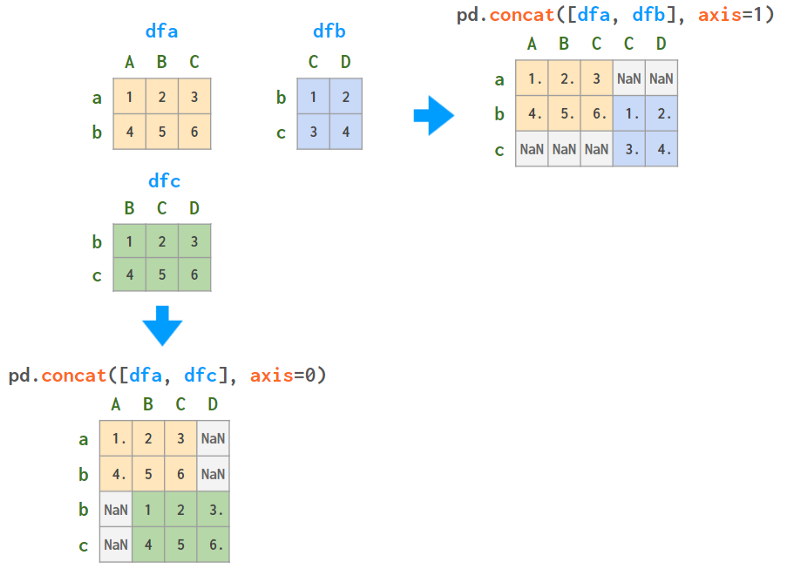

如果几张表描述的是相互关联的实体，更适合从一对一、一对多、多对多关系理解它们的组合。

#### 1:1 连接关系


当同一批对象的不同属性存放在不同表中，且每个连接键在两边都唯一时，形成一对一关系。

按普通列连接通常使用 `merge`。

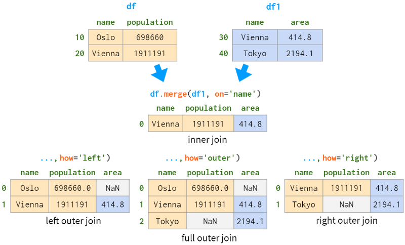

```python
result = left.merge(right, on="name", how="left", validate="one_to_one")
```

纯粹以普通列对普通列连接时，原有行索引不参与匹配，结果通常获得新的整数索引。若连接显式使用一侧或两侧索引，索引的处理规则就不同，不能说 `merge` 总是丢弃所有索引。

连接键位于索引中时，可以使用 `join`。

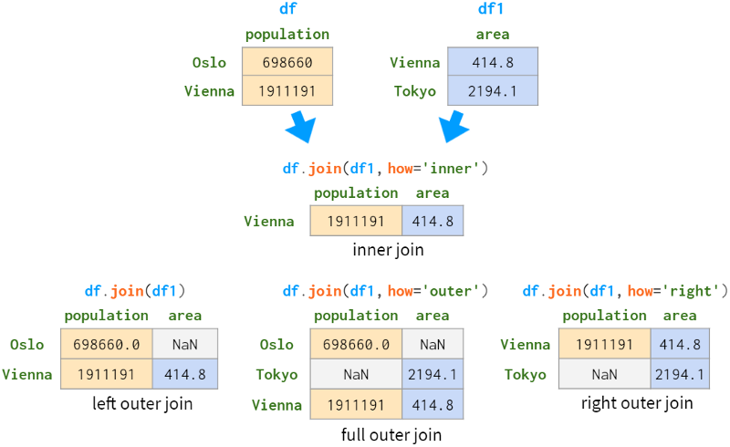

`join` 使用了与 `merge` 相关的连接机制，但它不是所有参数和模式都相同的简单别名。默认 `merge` 使用内连接，默认 `join` 使用左连接。

`sort=False` 时，左连接保留左键顺序，右连接保留右键顺序，内连接保留左侧匹配键的顺序；全外连接按键的字典序排列。重复键会扩展行，若需要完整、明确的结果顺序，应显式指定排序字段。SQL 查询在没有 `ORDER BY` 时同样不保证展示顺序。[Pandas merge](https://pandas.pydata.org/docs/reference/api/pandas.merge.html)

#### 1:n 连接关系

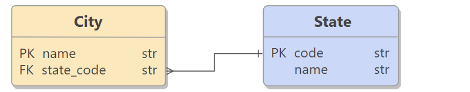

一个州可以对应多个城市，一个城市在这张业务表中对应一个州，这是一对多关系。连接方向不同，验证规则也不同：州表连接城市表是 `one_to_many`，城市表连接州表是 `many_to_one`。

连接键是普通列时，可以使用 `merge`。

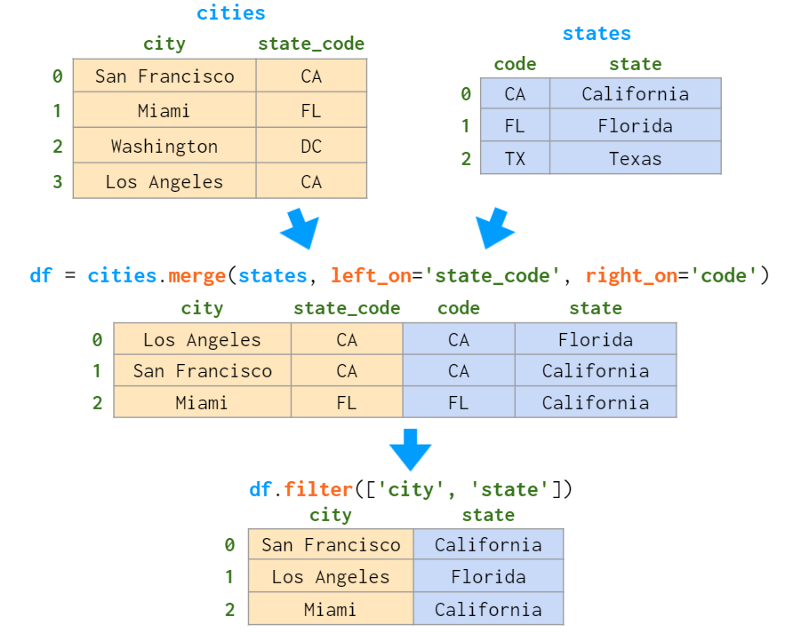

```python
result = cities.merge(states, on="state", how="left", validate="many_to_one")
```

`validate` 能发现本应唯一的一侧意外出现重复键。两侧键都重复时，匹配会形成多对多组合，例如同一个键左侧 2 行、右侧 3 行，会产生 6 行。

如果右表已把连接键设为索引，`join(on=...)` 可以用左表的列匹配右表索引。

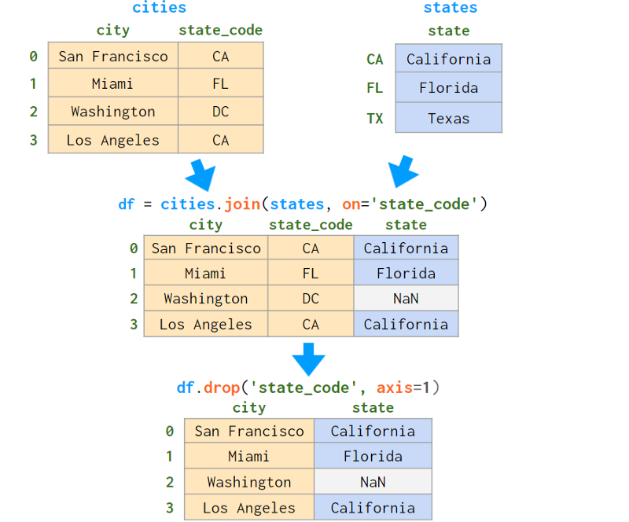

```python
result = cities.join(states.set_index("state"), on="state", validate="many_to_one")
```

这种方式通常保留左表的索引。右侧同一键匹配多行时，左侧记录及其索引也会重复，这属于关系匹配的结果。

两表有同名非键列时，需要解决列名冲突。

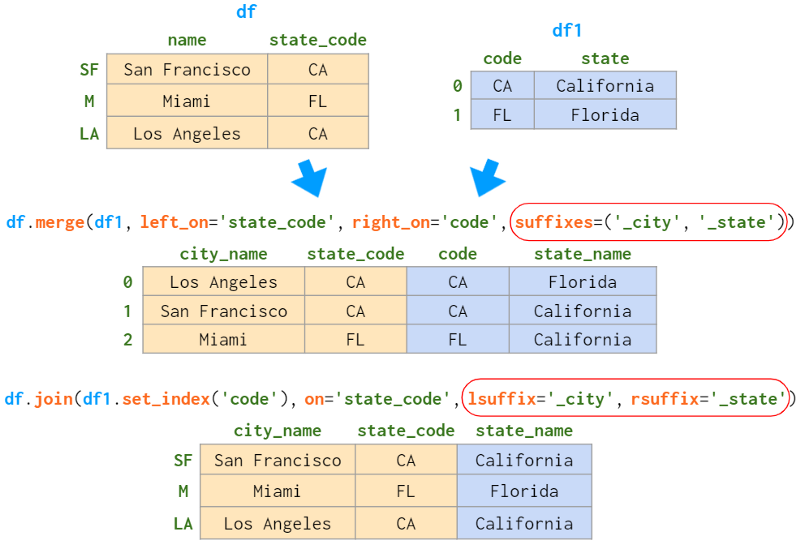

`merge` 默认增加 `_x`、`_y` 后缀，可以用 `suffixes=("_city", "_state")` 自定义；`join` 使用 `lsuffix`、`rsuffix`，没有指定后缀且列重叠时通常报错。

| 场景 | 常用写法 |
| --- | --- |
| 普通列对普通列 | `left.merge(right, on="key")` |
| 索引对索引 | `left.join(right)`，或 `merge` 显式指定两侧索引 |
| 左列对右索引 | `left.join(right, on="key")` |
| 需要默认内连接 | `merge` |
| 需要默认左连接 | `join` |

空连接键还有一个重要语义：Pandas 可以把两侧的空键相互匹配，这与常见 SQL 的 NULL 连接规则不同。需要排除空键匹配时，应先处理键列；想检查记录来源，可以为 `merge` 设置 `indicator=True`。

#### 多个连接

`df.join([df1, df2])` 可以一次连接多张以索引关联的表。

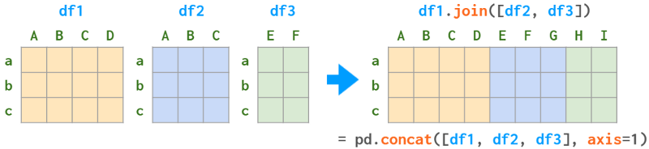

它适合按同一组行标签汇集多个属性表。传入列表时，不支持 `on`、`lsuffix`、`rsuffix`，因此应预先处理重叠列名。它也不等同于无条件执行 `concat(axis=1)`；重复索引仍可能产生关系扩展。[Pandas join](https://pandas.pydata.org/docs/reference/api/pandas.DataFrame.join.html)

多个一对多关系通常逐次连接更清楚，尤其需要分别指定键和后缀时。

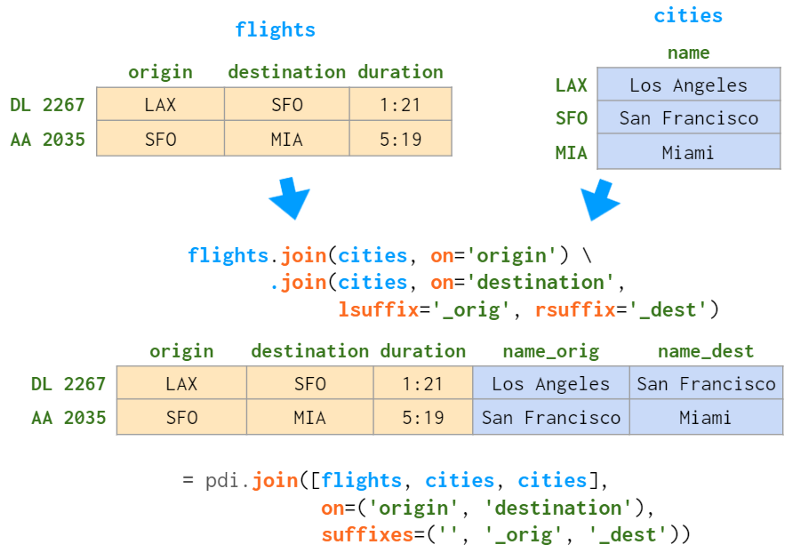

`pdi.join` 是配套工具中的多表连接封装，接受 `on`、`how` 和后缀等参数，图中表达的是以首表字段匹配其他表索引的过程。标准 Pandas 可以按同样顺序逐次 `join` 或 `merge`，并在每一步检查基数与行数。

### 插入和删除

DataFrame 按列组织，插入一列通常比在中间插入一行更自然。`df.insert(pos, name, values)` 在指定列位置修改当前对象；在指定行位置插入数据，常采用切片与 `concat`。

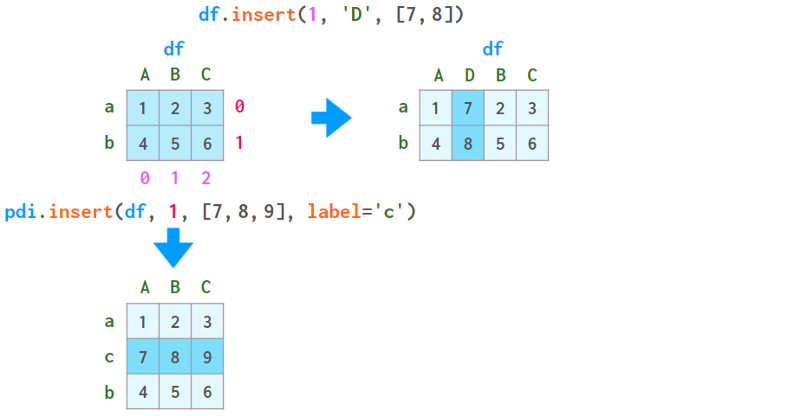

```python
df.insert(1, "new_column", 0)
# 行插入示意：new_rows 应具有与 df 对应的列
result = pd.concat([df.iloc[:pos], new_rows, df.iloc[pos:]])
```

不能据此推断所有行新增操作都必须返回新对象；例如 `.loc[new_label] = ...` 也能扩展当前 DataFrame，只是未必适合大量循环追加。

删除列可以使用 `del`、`drop(columns=...)`，或用 `pop` 删除并取出该列。

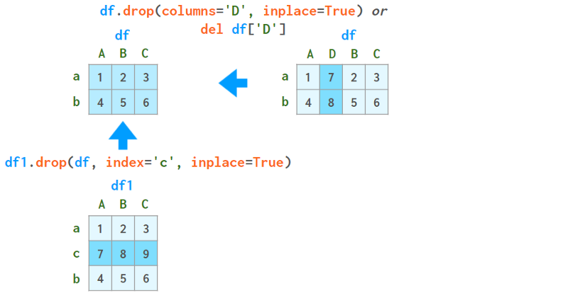

```python
del df["new_column"]
# removed = df.pop("A")
# result = df.drop(columns=["A", "B"])
```

`del df.A` 不是通用的列删除写法。按标签删除行时，要注意重复标签。

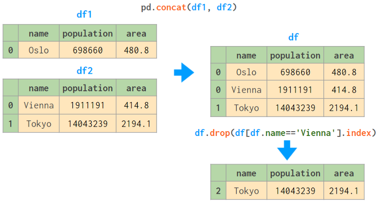

如果先筛选出某些行，再把它们的标签传给 `drop`，而原表还有其他行共享这些标签，就可能连带删除本来不想删除的记录。

拼接时重置无意义的索引，可以减少这种歧义。

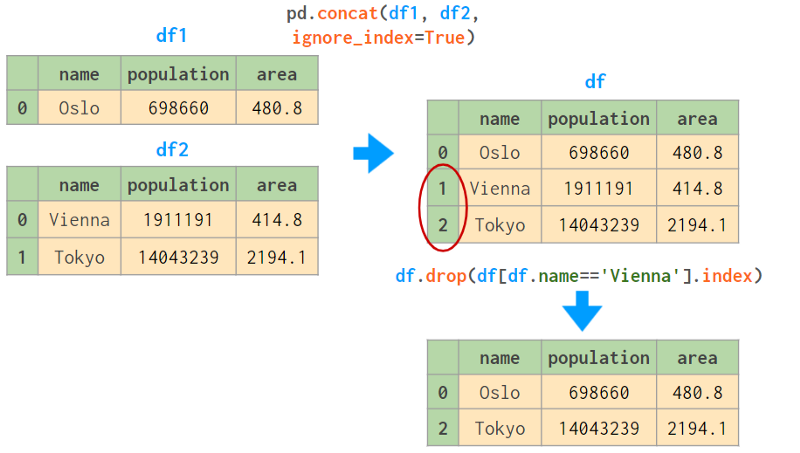

把唯一的业务字段设为索引也有帮助，但复杂筛选更直接的方式通常是保留条件的反面。

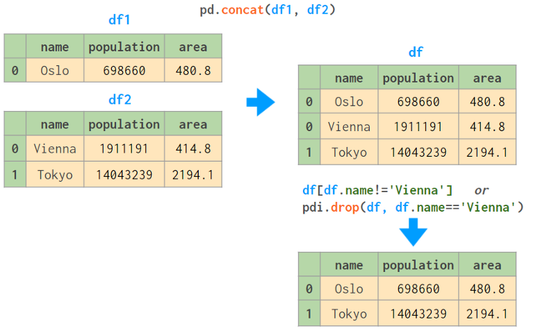

```python
remove_mask = df["quantity"].eq(0).fillna(False)
result = df.loc[~remove_mask]
```

这样根据每条记录的条件决定去留，而不是把条件转成可能重复的标签。图中的 `pdi.drop` 封装了类似筛选思路。

### 分组

Series 的分组概念同样适用于 DataFrame，还可以直接按列名指定分组键。

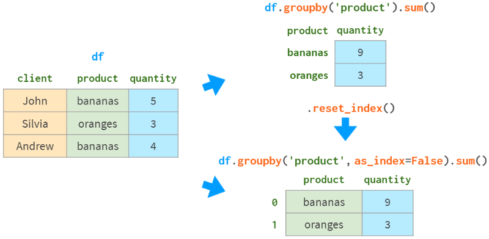

聚合时，默认把组键放进结果索引。希望组键仍是普通列时，使用 `as_index=False`，或对聚合结果执行 `reset_index()`。

表中往往有不应求和的列，所以应明确选择要统计的字段。

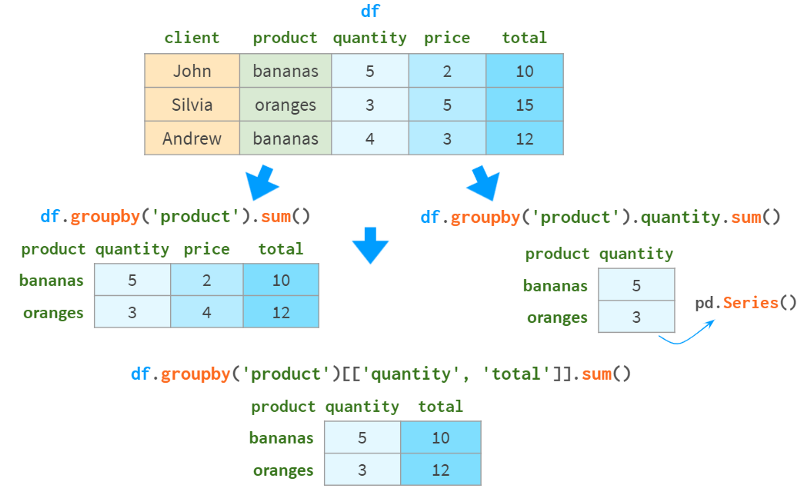

```python
df.groupby("product")["quantity"].sum()                 # Series
df.groupby("product")[["quantity"]].sum()               # DataFrame
df.groupby("product")["quantity"].sum().to_frame()       # DataFrame
df.groupby("product", as_index=False)["quantity"].sum()  # 产品仍是列
df.groupby("product")["quantity"].sum().reset_index()    # 同类结构
```

默认聚合不等于“只处理数值列”：字符串求和可能连接文本，其他类型可能不支持所选操作。选择具体列通常比依赖隐式类型过滤更可靠。Series 的数据意义并不低于 DataFrame；如果只是为了展示，可使用 `to_frame()` 或配套显示工具。

不同列常需要不同聚合规则，例如数量求和、价格求平均。

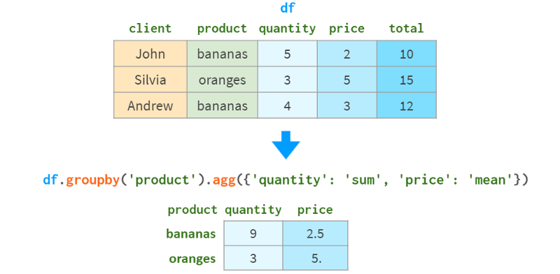

```python
summary = df.groupby("product").agg({"quantity": "sum", "price": "mean"})
```

同一列也可以计算多个统计量。

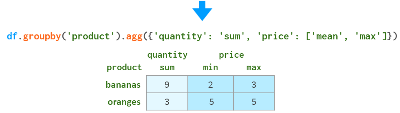

命名聚合把输出列名与计算规则放在同一个位置，避免事后再处理多层列名。

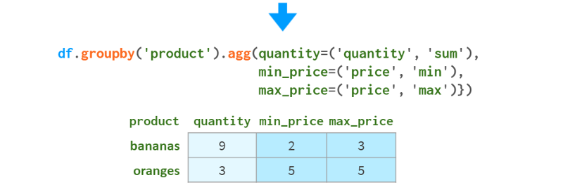

```python
summary = df.groupby("product", as_index=False).agg(
    total_quantity=("quantity", "sum"),
    mean_price=("price", "mean"),
    highest_price=("price", "max"),
)
```

平均成交价格可能需要数量加权，这涉及同一组的多列。

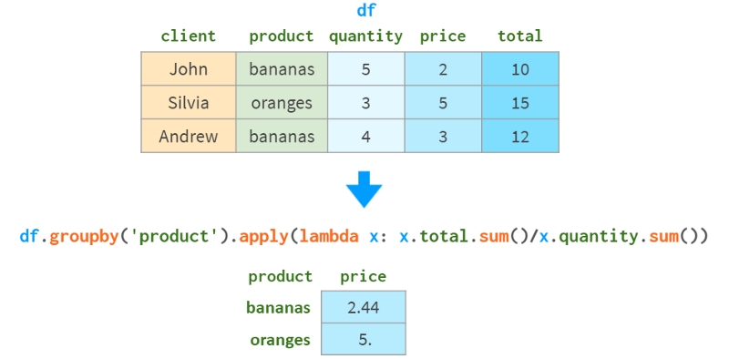

自定义 `apply` 可以获得组内子表，执行多列计算。Pandas 3.0 不再允许 `include_groups=True`；分组列不应被假定为函数收到的数据列，需要组名时可读取组对象的 `.name`，或把相关信息明确放入索引与所选数据。

很多跨列计算也可以先构造中间列，再用内置聚合完成。例如，在价格、数量都有效且权重定义合理的记录上：

```python
valid = df.dropna(subset=["price", "quantity"])
weighted = (
    valid.assign(amount=valid["price"] * valid["quantity"])
    .groupby("product")
    .agg(amount=("amount", "sum"), quantity=("quantity", "sum"))
)
weighted["weighted_price"] = weighted["amount"].div(
    weighted["quantity"].where(weighted["quantity"].ne(0))
)
```

分子和分母使用相同有效记录，权重总和为零时结果保留为缺失，避免把没有定义的均价当作正常数字。

单列 `agg` 的自定义函数收到的是该列的 Series，但仍可以利用其索引表达条件。下面的图示通过索引中的商品信息处理香蕉折扣。

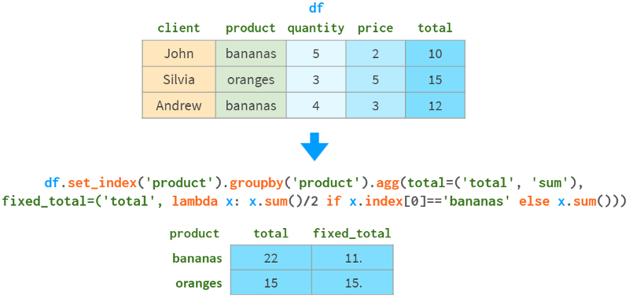

实际处理这类规则时，也可以先用布尔条件构造折后价格，再参与聚合，让折扣逻辑与汇总逻辑分别清楚可见。

通常优先考虑向量化中间列和内置聚合，其次是单列自定义 `agg`，需要任意形状或多列操作时再用 `apply`。字符串名称如 `"sum"` 明确请求 Pandas 聚合；传入 NumPy 函数或任意可调用对象时，不要假设它一定走相同优化路径或有相同缺失值规则。部分接口支持 `engine="numba"`，但不是任何 Python 函数都能自动使用 Cython 或 Numba 加速。[Pandas 分组用户指南](https://pandas.pydata.org/docs/user_guide/groupby.html)

还要显式考虑分组键中的缺失和分类值：`dropna=False` 把缺失键纳入组；Pandas 3.0 的 `observed=True` 默认只输出实际观察到的分类组合，需要未观察组合时指定 `observed=False`。

### 透视与逆透视

设变量 `a` 依赖两个参数 `i`、`j`。可以把每个 `(i, j, a)` 组合放在一行，形成长表；也可以让 `i` 对应行、`j` 对应列，形成宽表。

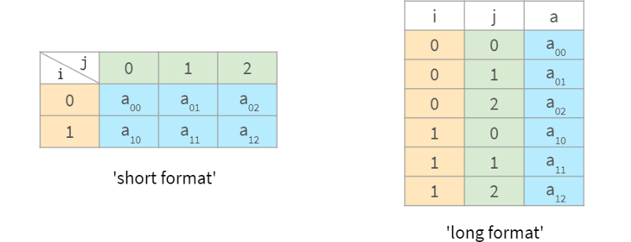

宽表适合矩阵式比较和展示，长表适合继续筛选、分组、绘图与表示多维记录。密集数据常适合宽表，稀疏观测常适合长表，但不能把未记录的组合自动当作零：零、缺失和不存在是不同含义。

以客户购买产品的记录为例，`pivot` 将长表转换为宽表。

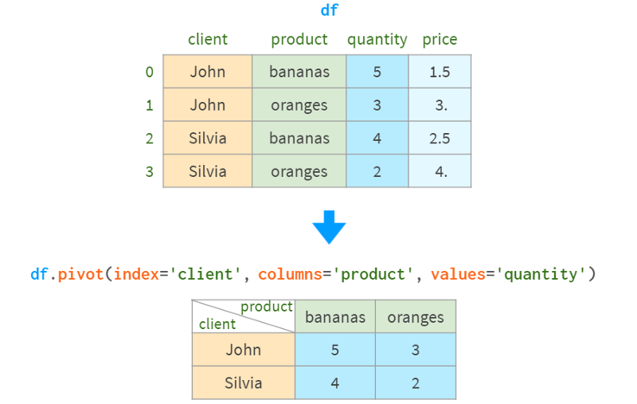

```python
wide = df.pivot(index="customer", columns="product", values="quantity")
```

客户成为行标签，产品成为列标签，数量进入单元格。未被选择的价格等字段不会自动保留；原有行索引也不再承担原来的记录身份。每个“客户、产品”组合必须唯一，否则 `pivot` 无法决定一个单元格应填哪个值。

相反方向可以使用 `stack`，把列标签压入行索引。

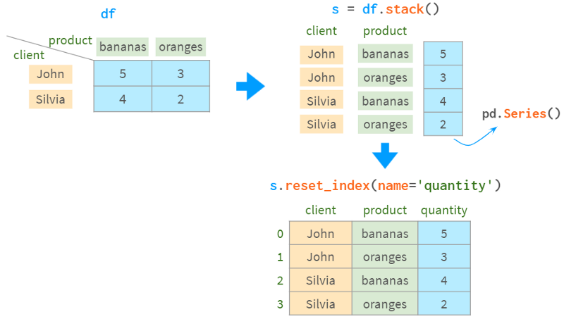

```python
long = wide.stack().rename("quantity").reset_index()
```

也可以使用 `melt`，直接得到变量名和值两列。

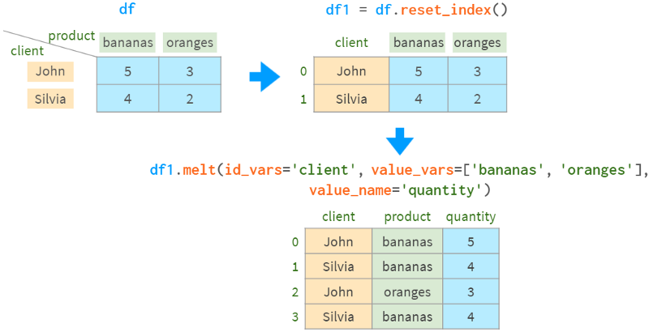

```python
long = wide.reset_index().melt(
    id_vars="customer", var_name="product", value_name="quantity"
)
```

两种方法的输出行顺序可能不同；如果需要固定顺序，应随后排序。宽表单元格中的数量不再是单独的名为 `quantity` 的列，因此逆变换时通过 `rename` 或 `value_name` 明确恢复名称。

客户不必购买所有产品，缺少的组合会产生缺失值。

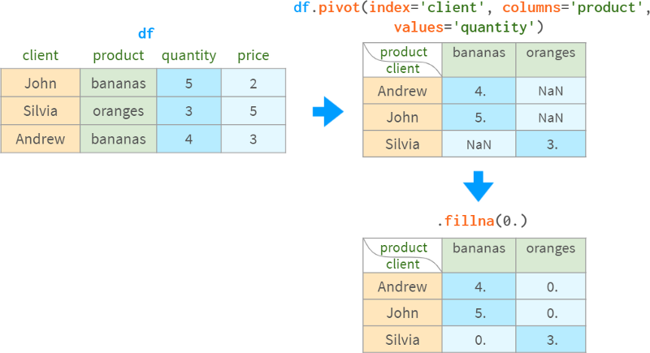

Pandas 3.0 的 `stack()` 会保留输入中的缺失值；若长表只应包含有效数量，应明确使用 `wide.stack().dropna()`。不要在默认的新实现中传入 `dropna` 或 `sort` 参数，它们应保持未指定。[Pandas stack](https://pandas.pydata.org/docs/reference/api/pandas.DataFrame.stack.html)

如果一个客户可以多次购买相同产品，就要先聚合，再透视。`pivot_table` 把两步放到一个接口中。

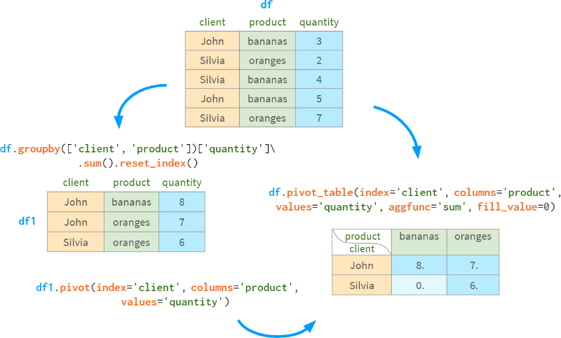

```python
table = df.pivot_table(
    index="customer", columns="product", values="quantity",
    aggfunc="sum", observed=True
)
```

`aggfunc` 默认是均值，销量汇总通常应明确指定 `"sum"`。不指定 `columns` 时，它主要表现为按行键聚合；键组合唯一时，它与 `pivot` 的结果可能接近，但类型、缺失值和排序细节不必完全相同。

透视表还可以通过 `margins=True` 计算行列汇总，用 `margins_name` 指定汇总标签。

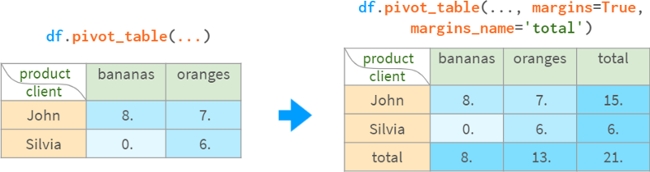

平均数的总计通常会基于原始数据重新聚合，不应把它简单看成各个显示均值的相加或未加权平均。只有在业务明确规定“无购买就是零”时，才使用 `fill_value=0`。

创建后的透视表仍是普通 DataFrame，可以用熟悉的标签、布尔条件和算术方法继续处理。

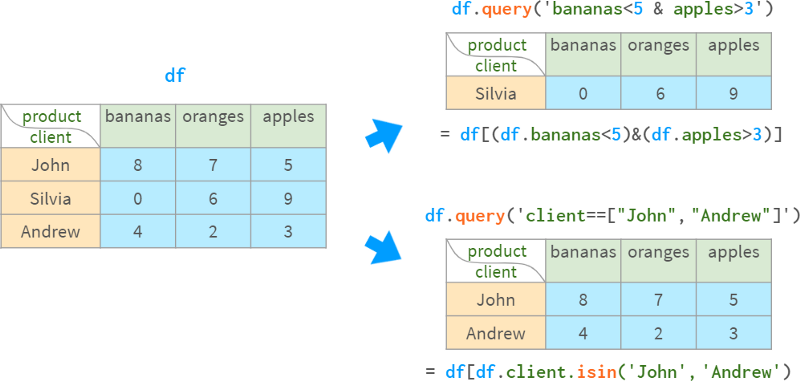

透视表与多列聚合常生成 MultiIndex。理解多重索引，就能把这些看起来复杂的表头当作可以操作的坐标。[Pandas 重塑与透视指南](https://pandas.pydata.org/docs/user_guide/reshaping.html)

## 第四部分：MultiIndex

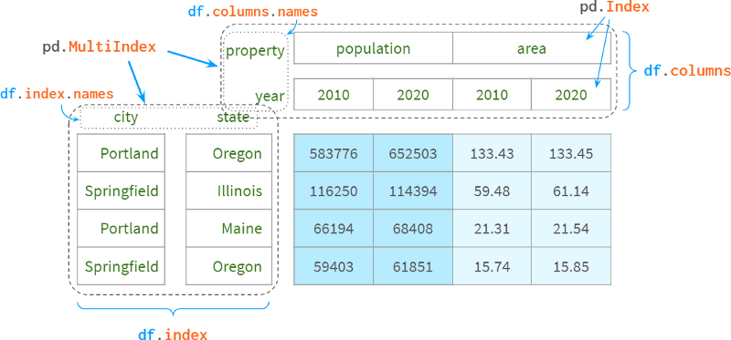

MultiIndex（多重索引）用多个级别共同描述一个轴上的标签。最直接的用途是消除歧义：不同州可能有同名城市，仅用城市名不能唯一标识记录，而“城市、州”的组合更明确。这类似关系数据库中的复合键，但 Pandas 不会仅因使用 MultiIndex 就自动保证组合唯一。

可以在读取 CSV 时用多个字段建立索引，也可以对已有表执行 `set_index`。

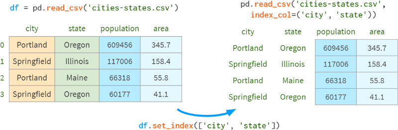

```python
df = pd.read_csv("cities.csv", index_col=[0, 1])
# 或者：df = raw.set_index(["city", "state"])
```

`append=True` 表示把指定列增加到已有行索引之后。

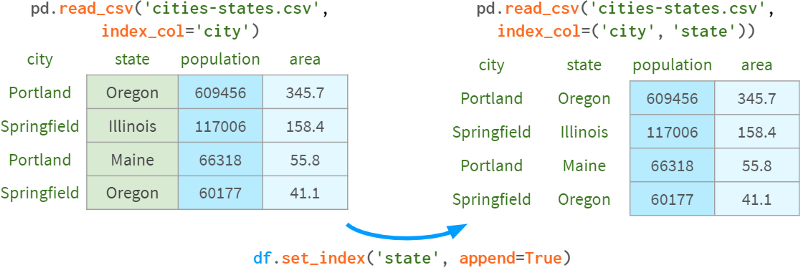

```python
df = df.set_index("year", append=True)
```

另一个用途是表示多维观察，例如社会调查、Titanic 数据、历史天气或历年赛事成绩。它们常包含“对象、时间、类别、指标”等多个坐标。这类面板数据也是 Pandas 名称的来源之一。

在城市与州之外加入年份后，可以把跨年的指标并列展示。

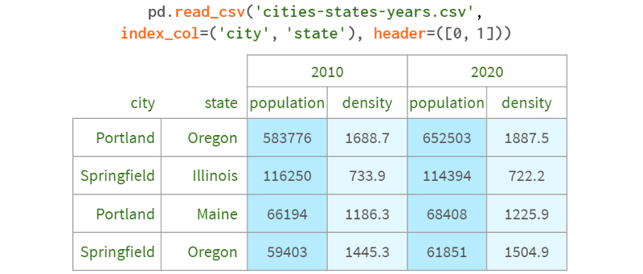

从分析角度看，这里有年份、城市、州和指标四个坐标；指标可以是人口、面积、密度等。但城市与州并非一定构成完整笛卡尔积，表中只保存实际存在的组合。

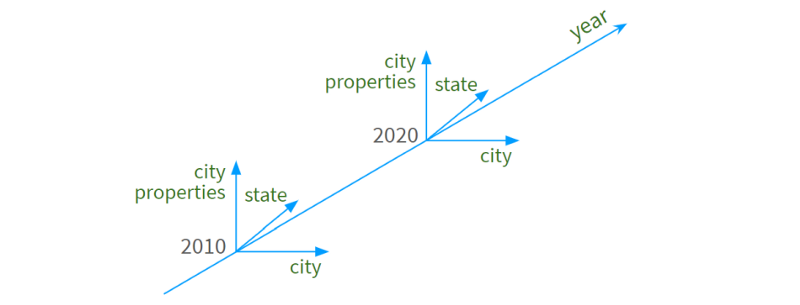

DataFrame 仍有行、列两个轴，只是每个轴上的标签可以由多个级别组成。给索引及各列级别命名，有助于解释这些坐标。

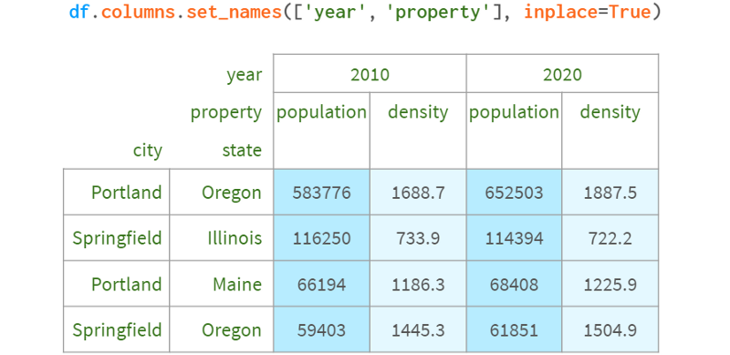

表头为级别名称留出了额外空间。看起来“上移”的标题是元信息布局，并不是多出了一条数据记录。

### 分组

MultiIndex 的显示经常把连续重复的外层标签省略，让数据看起来已经分组。实际上，它本身只是层级标签结构，没有执行统计聚合。

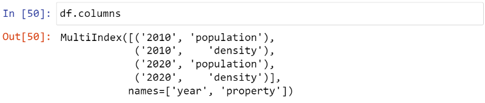

`sort_index()` 可以把相近标签排列在一起，形成视觉上的分组效果。

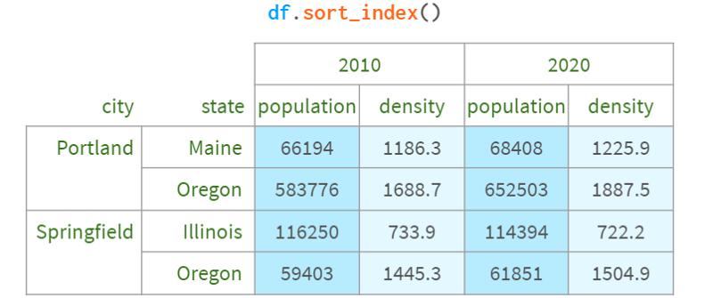

真正的聚合需要显式调用：

```python
summary = df.groupby(level="state").sum(numeric_only=True)
```

如果希望每行都完整显示所有标签，可以设置：

```python
pd.options.display.multi_sparse = False
```

它只影响显示，不改变索引与数据。可以用 `pd.option_context("display.multi_sparse", False)` 在一个局部上下文中临时设置。

### 类型转换

数字 `2020` 和字符串 `"2020"` 是不同标签。从 CSV 的多行表头读取的年份可能是文本；需要数值范围与数值排序时，可以把相应级别转换为整数。

配套工具将“读取完整级别标签”和“替换级别标签”封装成 `pdi.get_level`、`pdi.set_level`：

```python
pdi.set_level(df.columns, 0, pdi.get_level(df.columns, 0).astype("int"))
```

标准 Pandas 可以转换某个级别的唯一标签集合，再赋回列索引。

```python
df.columns = df.columns.set_levels(
    df.columns.levels[0].astype("int64"), level=0
)
```

这种方式要求转换后的级别值仍满足唯一性。例如 `"01"` 和 `"1"` 转成整数后会碰撞，不能忽略这个问题。

理解 `levels` 和 `codes` 可以解释 MultiIndex 的存储方式：

```python
mi = pd.MultiIndex.from_arrays(
    [[2010, 2010, 2020, 2020], ["population", "area", "population", "area"]],
    names=["year", "metric"],
)

mi.get_level_values("year").tolist() # [2010, 2010, 2020, 2020]
mi.levels[0].tolist()                # [2010, 2020]
mi.codes[0].tolist()                 # [0, 0, 1, 1]
```

`levels[0]` 是去重后的年份词典，`codes[0]` 是每个位置在该词典中的编号；缺失标签可以用代码 `-1` 表示。`get_level_values` 展开的是每个位置的标签，长度与轴长度一致。不要把 `codes` 当作业务标签，也不要把它当作 `Int64Index`。[Pandas MultiIndex 指南](https://pandas.pydata.org/docs/user_guide/advanced.html)

### 使用多重索引构建 DataFrame

除了读取文件和 `set_index`，Pandas 还提供几种构造器。

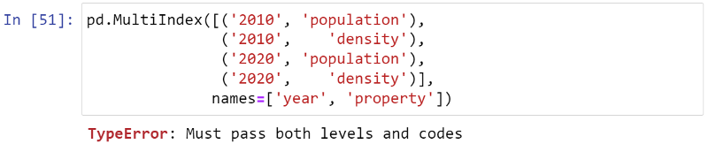

直接调用低层 `MultiIndex(levels=..., codes=...)`，必须分别提供唯一标签与代码；把每层完整标签数组当作 `levels` 传入，并不会自动得到期望的结构。大多数使用场景无需手动管理代码。

从逐层数组构建，用 `from_arrays`。

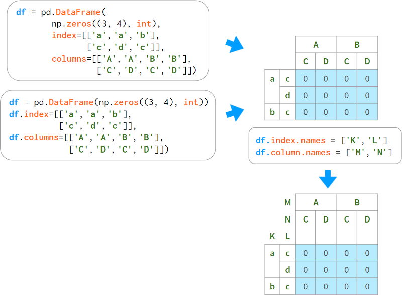

```python
index = pd.MultiIndex.from_arrays(
    [["Portland", "Portland"], ["Maine", "Oregon"]],
    names=["city", "state"],
)
```

从每条记录的完整元组构建，用 `from_tuples`；从表的多列构建，用 `from_frame`。这些构造器可以同时指定或继承级别名称。

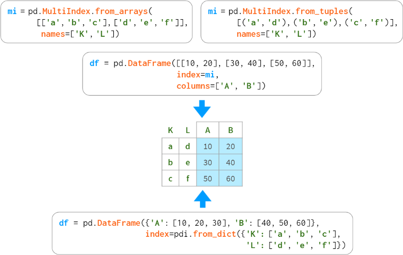

```python
index = pd.MultiIndex.from_tuples(
    [("Portland", "Maine"), ("Portland", "Oregon")],
    names=["city", "state"],
)
```

当数据确实覆盖各级标签的全部组合时，`from_product` 可以生成笛卡尔积。

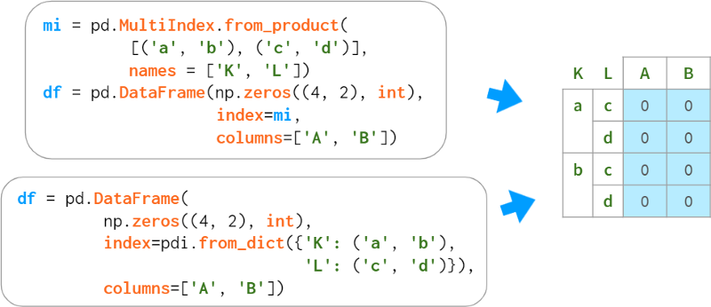

```python
index = pd.MultiIndex.from_product(
    [["A", "B"], [2020, 2021]], names=["group", "year"]
)
```

上述方法也适用于列轴。

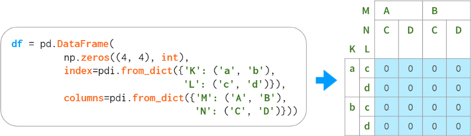

```python
columns = pd.MultiIndex.from_product(
    [["population", "area"], [2010, 2020]], names=["metric", "year"]
)
df = pd.DataFrame(np.zeros((2, 4)), columns=columns)
```

应区分“实际出现的组合”与“所有可能组合”。后者可能远大于原始数据，不宜无条件扩展。

### 使用多重索引进行索引

MultiIndex 的外层标签可以一次选择一个子表，完整元组则定位具体组合。

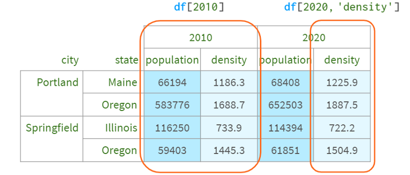

```python
df["population"]
df[("population", 2020)]
```

行与单元格使用 `.loc`。

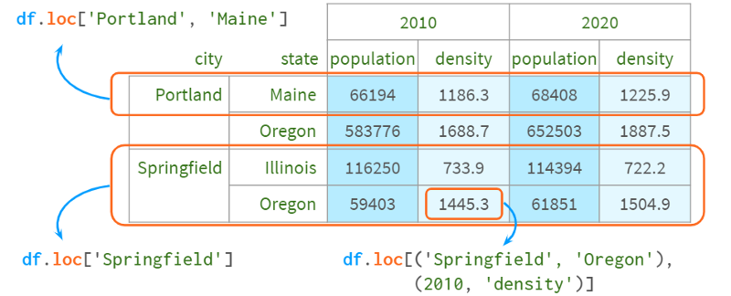

```python
df.loc[("Portland", "Oregon"), :]
df.loc[("Portland", "Oregon"), ("population", 2020)]
```

只指定外层键可能降低索引层数。希望保留原层级时，可以使用完整标签列表，或在 `xs` 中指定 `drop_level=False`。

选择某个内层级别时，Python 语法有两点值得理解：`df["a", "b"]` 与 `df[("a", "b")]` 是同一个元组键；冒号切片语法只能直接写在方括号中，不能把裸冒号写进普通元组。因此，不应把 `df[:, "Oregon"]` 理解为通用的第二层行选择。

图解的 `pdi` 通过补丁提供了 `.mi`、`.co` 等辅助索引方式，分别简化多层行、列选择。

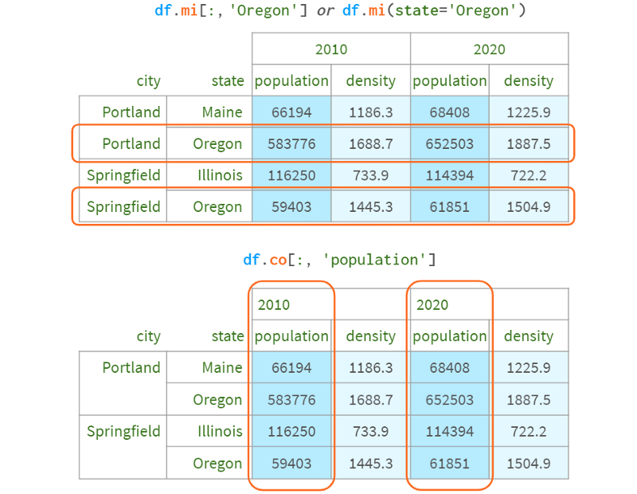

这些属于第三方扩展。连续经过两个索引器再赋值，会先得到中间对象；在 CoW 语义下，不能依赖它修改原表。标准 Pandas 有以下几种表达方式。

1. **交换级别后选择。** 当只有两层时，可以把目标内层交换到外层。

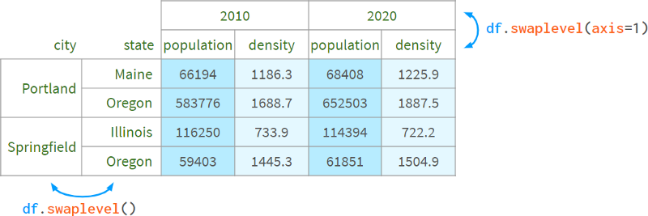

例如列结构为 `(year, metric)` 时，`df.swaplevel(axis=1)["population"]` 可以选择指标。多于两层时，`reorder_levels` 更适合明确整个顺序。交换层级不会自动排序，也不是对原表执行赋值。

2. **使用横截面 `xs`。** 指定级别和轴，不必把目标级别移到最外侧。

```python
population = df.xs("population", level="metric", axis=1)
oregon = df.xs("Oregon", level="state", axis=0, drop_level=False)
```

`xs` 每次针对一个轴，适合读取横截面，不提供直接设置值的接口。

3. **使用 `IndexSlice` 与 `.loc`。** 这适合同时选择多层行列，也可以直接赋值。

```python
idx = pd.IndexSlice
selected = df.loc[idx[:, "Oregon"], idx["population", :]]
df.loc[idx[:, "Oregon"], idx["population", :]] = 10
```

此处假定行级别顺序为 `(city, state)`，列级别顺序为 `(metric, year)`。

4. **使用显式 `slice`。** `slice(None)` 对应完整的冒号切片。

```python
selected = df.loc[(slice(None), "Oregon"), ("population", slice(None))]
```

它与 `IndexSlice` 的思路一致，只是写法更显式。`a[3:10:2]` 本来就等价于 `a[slice(3, 10, 2)]`。

5. **使用 `query` 根据有名称的行级别筛选。**

```python
selected = df.query('state == "Oregon" or city == "Portland"')
```

它适合简短行条件，但字符串表达式的编辑器检查能力有限，也不能直接筛选列或更新原表。为了查询列而反复转置，可能把混合列转换成统一 dtype，因此列选择通常优先使用 `.loc` 或 `xs`。

需要跨多层进行范围切片时，先用 `sort_index()` 排序；未达到必要排序深度的索引可能触发 `UnsortedIndexError`。

### 堆叠与拆分

`set_index` 通常把普通列移到行索引。希望把行索引中的一个级别移到列轴时，使用 `unstack`。

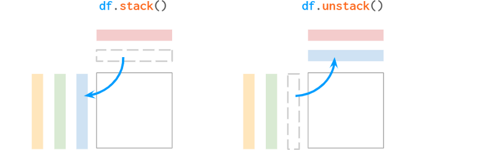

这与 NumPy 的 `stack` 不同：NumPy `stack` 沿新轴组合数组，Pandas `stack` 把列级别压入行索引，`unstack` 把行索引级别展开到列。

可以把列想成横向并排的一排书，`stack` 把它们竖向堆起来。Series 没有列轴，所以没有 DataFrame 意义上的 `stack`，但有多重行索引时可以 `unstack` 成 DataFrame。

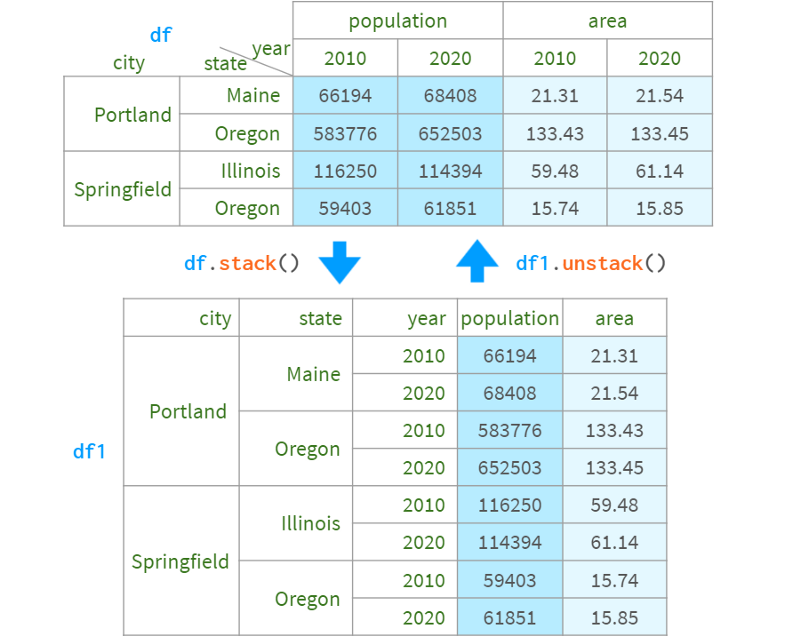

```python
long = df.stack(level="year")
wide = long.unstack(level="year")
```

可以用级别名称、整数位置或级别列表指定移动对象。默认处理最内层；移动后的级别放到目标轴的内层。需要其他顺序时，再执行 `swaplevel` 或 `reorder_levels`，需要按标签排序时再 `sort_index`。

`stack` 与 `unstack` 是相反方向的变换，但返回形状、顺序和缺失值布局不一定在任意输入下都自动完全恢复。这里应理解为移动同一个坐标级别，而不是两个调用得到相同方向的结果。

重复组合可能使重塑无法唯一确定单元格。

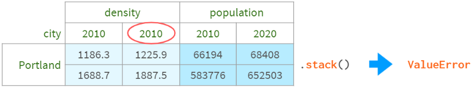

`stack` 要求相关列标签能明确识别输入；`unstack` 要求行键组合能唯一映射到输出单元格。遇到重复时，应先按业务决定聚合、保留哪条记录，或增加新的标识级别。[Pandas unstack](https://pandas.pydata.org/docs/reference/api/pandas.DataFrame.unstack.html)

### 如何控制堆叠与拆分后的顺序

重塑时，标签顺序有两个来源：输入中的出现顺序和标签本身的排序规则。两者未必相同，星期尤其能说明问题。

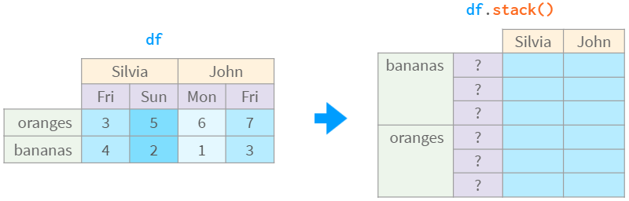

如果 John 的数据中星期一在星期五前，Silvia 的数据中星期五在星期日前，可以推测出部分相对顺序，却不能据此推出所有星期的业务顺序。不同人出现的日期还可能不完整，甚至给出相互冲突的局部顺序。

星期日究竟是一周的开始还是结束，需要业务明确；州名、产品等级和流程阶段也一样，Pandas 无法仅凭字符串推断这些规则。

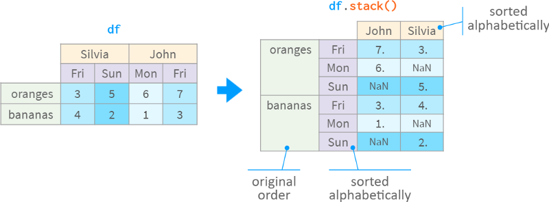

当前 `stack()` 使用保留输入组织方式的新实现，不应再认为它必然按字母排序；`unstack()` 默认排序，可用 `sort=False` 控制。默认的新 `stack` 不接受显式的 `sort`、`dropna` 设置；需要删除缺失或排序时，在返回对象上调用对应方法。

```python
stacked = df.stack()
unstacked = stacked.unstack(sort=False)
```

如果最终展示必须与已有表一模一样，可以保留原轴，再按它重新排列：

```python
original_rows = df.index
original_columns = df.columns
restored = df.stack().unstack(sort=False)
restored = restored.reindex(index=original_rows, columns=original_columns)
```

此示例假定索引满足重塑要求。`reindex` 控制标签顺序，不会恢复已被聚合丢掉的信息。

对于独立于输入顺序的业务排序，使用有序分类标签。

```python
weekdays = ["Mon", "Tue", "Wed", "Thu", "Fri", "Sat", "Sun"]
day_index = pd.CategoricalIndex(
    ["Fri", "Mon", "Sun"], categories=weekdays, ordered=True, name="day"
)
```

类别列表保存完整顺序，包括当前没有出现的星期。对简单 Index，可用其首次出现的唯一值作为类别顺序；对 MultiIndex，可用分类数组重新构造对应级别。

图中的 `pdi.locked` 与 `pdi.lock` 把这些操作包装为“锁定顺序”。`lock` 是偏向原地操作的便捷形式。

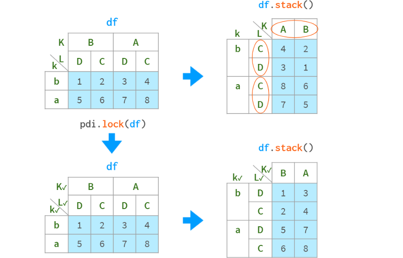

级别名旁的勾选标记来自 `pdi` 的可视化功能，不是 Pandas 数据模型中的额外锁。`pdi.vis(df)` 可用于显示，`pdi.vis_patch()` 可对 Notebook 的 HTML 表示应用补丁。

简单标签可以使用当前出现顺序；星期等需要完整业务顺序的标签应明确给出类别。

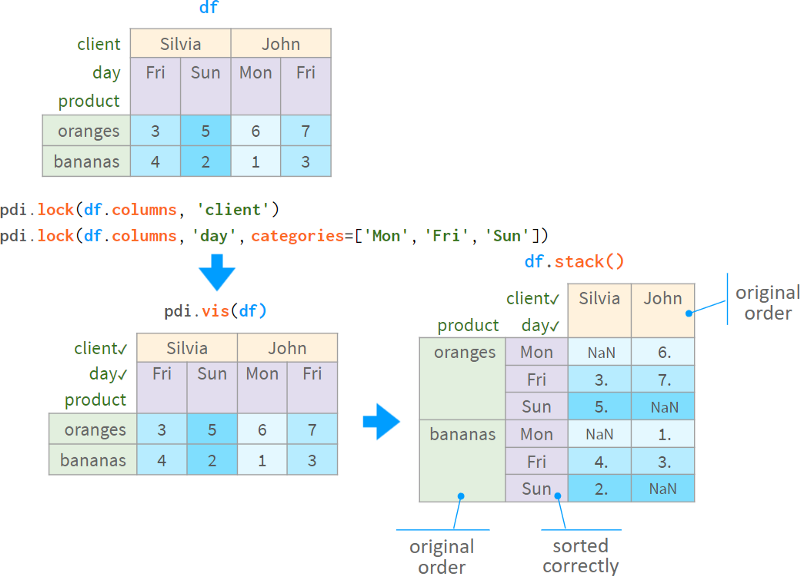

CategoricalIndex 提供排序依据，但不能把它理解为所有后续操作都保证自动保持完整轴顺序。连接、添加新标签和类型转换可能改变类别表示；新类别通常要先加入类别集合。尤其是分类分组，`observed=True` 只保留观察到的组合，与“保留完整星期列表”的需求不同。

`pdi` 为类别顺序提供了插入等辅助操作。只使用标准 Pandas 时，显式维护 `categories`，并在最终结果上按目标轴 `reindex`，通常更容易检查。

### 操作级别

配套工具把级别看作“与轴一样长的一列标签”，隐藏 `levels` 与 `codes` 的编码细节。相关接口包括读取、替换、增加、删除和移动级别。

- `pdi.get_level(obj, level_id)`：按名称或位置取得某级别的展开标签。
- `pdi.set_level(obj, level_id, labels)`：用给定标签数组替换该级别。

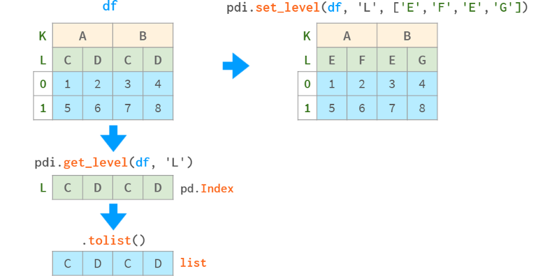

标准 Pandas 使用 `index.get_level_values(level)` 读取完整标签。若每个位置的标签都要变换，可以重新组装 MultiIndex，避免误把展开标签传给 `set_levels`。

```python
mi = df.index
arrays = [mi.get_level_values(i) for i in range(mi.nlevels)]
arrays[0] = arrays[0].astype(str)
df.index = pd.MultiIndex.from_arrays(arrays, names=mi.names)
```

- `pdi.insert_level(obj, pos, labels, name)`：插入级别，必要时广播标签。
- `pdi.drop_level(obj, level_id)`：删除级别。

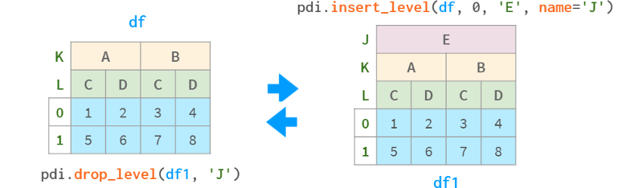

标准接口删除级别可以使用 `df.droplevel("state", axis=0)`；增加固定的来源级别可以用 `pd.concat` 的 `keys`，增加普通列形成行级别可以用 `set_index(..., append=True)`。任意级别位置的构造则可通过 `from_arrays` 明确完成。

- `pdi.swap_levels(obj, src=-2, dst=-1)`：交换两个级别。
- `pdi.move_level(obj, src, dst)`：把一个级别移到指定位置。

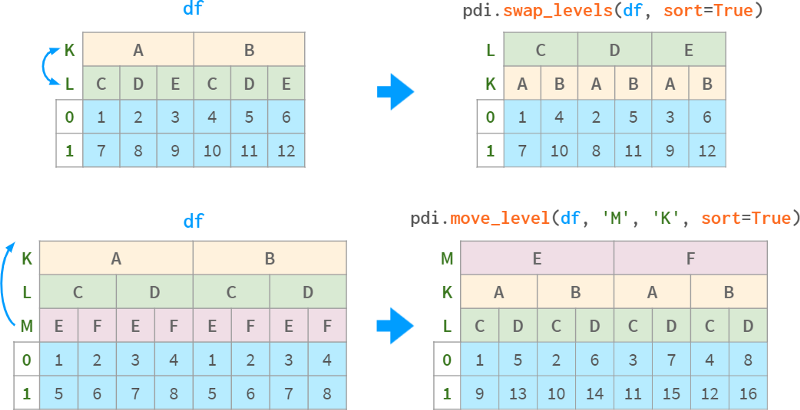

标准 Pandas 的 `swaplevel` 交换两层，`reorder_levels` 一次指定完整顺序。

```python
df = df.swaplevel("city", "state", axis=0)
# 三层列索引示意：
# df.columns = df.columns.reorder_levels(["M", "L", "K"])
```

这些 `pdi` 辅助函数还提供轴选择、可选排序和原地修改等参数。其 `axis=None` 通常对 DataFrame 指列轴，对 Series 指行索引；`sort=False` 表示不额外排序；支持 `inplace=False` 的接口通常返回结果。独立 Index 的标签不可原地逐项修改，需要接收或赋回新索引。

修改标签值与修改级别名称是两件事。`rename` 可以接收映射或函数，转换标签，必要时指定 `level` 限制作用范围。

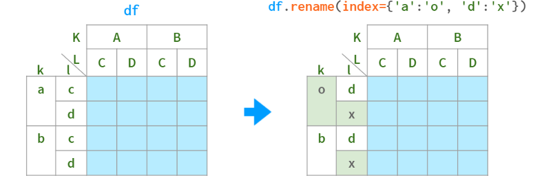

```python
df = df.rename(index={"Oregon": "OR"}, level="state")
```

级别名称存储在 `.names` 中，不能写 `df.index.names[1] = "region"` 修改其单个位置，但可以整体替换。

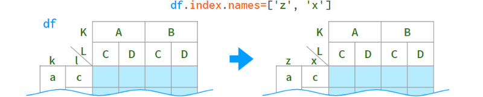

```python
df.index.names = ["city", "region"]
```

只改一个级别名称，可以用 `set_names`。

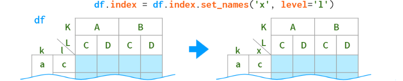

```python
df.index = df.index.set_names("state", level="region")
```

`rename_axis` 也适合修改轴和级别名称，尤其在方法链中很清楚。

### 将多重索引转换为平面索引并恢复

多层列名有时不方便导出、展示或传给只接受普通列名的工具。`pdi.join_levels` 用分隔符连接各级标签，`pdi.split_level` 再拆开。

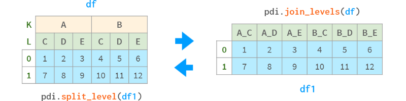

两者都有轴选择和原地修改等参数。标准 Pandas 可以保留元组，也可以显式连接成字符串：

```python
original = df.columns
flat_tuples = original.to_flat_index()
restored = pd.MultiIndex.from_tuples(flat_tuples, names=original.names)

flat_strings = ["_".join(map(str, key)) for key in original]
```

如果需要可逆转换，元组方式更稳妥。字符串拼接会丢失数字等标签的类型；标签本身含分隔符时，还可能碰撞。`("a_b", "c")` 和 `("a", "b_c")` 都会得到 `"a_b_c"`。字符串拆分只有在层数、分隔符和类型规则明确时才可可靠恢复；否则应保留原索引或单独保存映射。

### 排序 MultiIndex

多重索引排序仍使用 `sort_index`，只是可以指定级别及每层的升降序。

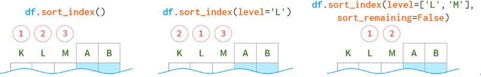

```python
df = df.sort_index(level=["state", "city"], ascending=[True, False])
```

`sort_remaining=False` 表示只按指定级别排序，不继续排序剩余级别；`na_position` 可控制缺失标签的位置，具体支持以索引类型为准。列索引排序使用 `axis=1`。

排序不会交换级别的先后结构。如果希望把州作为外层，应先 `reorder_levels` 或 `swaplevel`；若希望高效执行多级范围切片，应按实际级别顺序完成适当排序。

### 将多重索引 DataFrame 读写到磁盘

`to_csv` 能写出多层行列标签，但读回时需要明确层数。

```python
df.to_csv("df.csv")
loaded = pd.read_csv(
    "df.csv", header=[0, 1, 2], index_col=[0, 1, 2, 3]
)
```

这个示例对应三层列标签与四层行索引：前三行是列头，每条记录的前四个字段是行索引。多行表头下，按字段位置说明行索引列通常最直接。

CSV 保存的是文本，不能自动完整恢复每层 dtype、分类顺序、时区和所有元数据。读取后应检查类型与名称，必要时按明确规则转换。

另一种方案是先把列级别 `stack` 到行侧，形成更接近长表的表示，再保存；读取后按已知级别 `unstack`。这种方式减少多行表头，但仍需要记录结构、数据类型和缺失值规则，不能自动解决所有往返问题。

只在 Python 环境中保存对象，可以使用 pickle：

```python
df.to_pickle("df.pkl")
loaded = pd.read_pickle("df.pkl")
```

它便于保存 Pandas 对象结构，但不适合作为与版本无关的长期交换格式。只读取可信来源的 pickle 文件，因为反序列化可以执行代码。

Jupyter/IPython 也提供 `%store df` 和 `%store -r df` 持久化、恢复变量。数据通常存放在当前 IPython profile 的数据库目录，例如 `~/.ipython/profile_default/db/autorestore`，具体路径由配置决定。

需要与电子表格软件交换数据时，可以使用 Excel：

```bash
python -m pip install openpyxl
```

```python
df.to_excel("df.xlsx", engine="openpyxl")
loaded = pd.read_excel(
    "df.xlsx", header=[0, 1, 2], index_col=[0, 1, 2, 3], engine="openpyxl"
)
```

这里同样假定三层列索引、四层行索引，读取其他结构时应调整参数。Excel 在多层表头、合并单元格和类型恢复方面仍需检查。

对于较大的分析数据，还可以考虑 Parquet：

```python
df.to_parquet("df.parquet", engine="pyarrow", index=True)
loaded = pd.read_parquet("df.parquet", engine="pyarrow")
```

它需要相应引擎，通常比 CSV 更能保留类型并提供压缩。复杂列索引与类别元数据是否能完全往返，仍取决于引擎及读取工具；面向其他生态系统时，先转换为列名明确的长表往往更方便。

### MultiIndex 算术

多重索引表同样按标签对齐。外层指标为 `population`、`area`，内层为年份时，选择一个指标得到的子表以年份作为列标签。

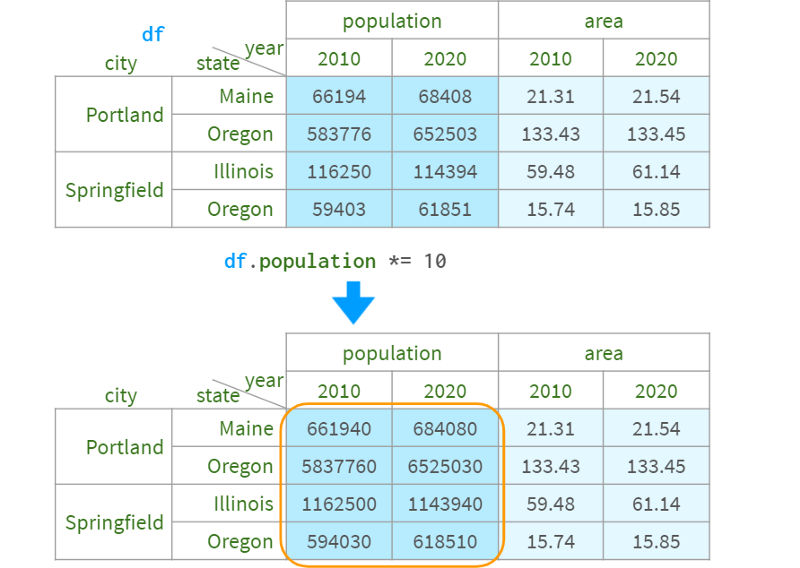

放大所有人口列，可以在原对象上用完整的行列选择赋值。

```python
idx = pd.IndexSlice
df.loc[:, idx["population", :]] = df.loc[:, idx["population", :]] * 10
```

右侧保留与左侧相同的完整列标签，避免子表降级后出现标签不匹配。若希望保留原表，可以先 `df1 = df.copy()`，再修改 `df1`。`df.assign(population=df["population"] * 10)` 也是表达生成新对象的一种方式；`assign` 返回结果，应接收它，不能期待调用本身原地改变对象。

人口除以面积就能得到按年份对齐的密度子表。

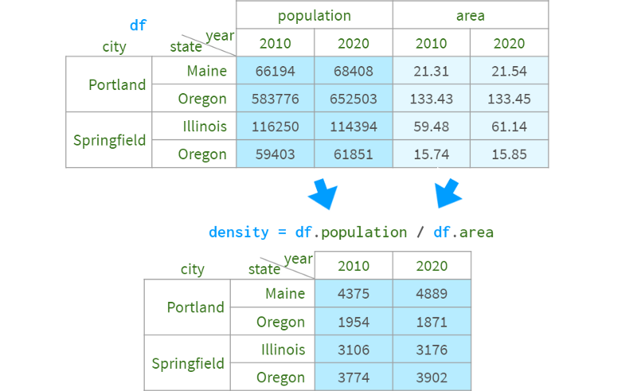

```python
density = df["population"].div(df["area"])
```

这里两者的行索引和年份列会自动对齐。面积为零或缺失时，应按数据含义处理；如果此前放大或缩放过人口，也要确认计算使用的单位。

把多个年份的密度加入原表，需要创建对应的完整多层列标签，不能把整个多列 DataFrame 当作一个普通新列直接交给 `assign`。一个标准写法是逐个完整列键赋值：

```python
result = df.copy()
for year in density.columns:
    result[("density", year)] = density[year]
```

也可以先把与当前计算无关的列级别移到行索引，按普通列进行计算，再恢复宽表。

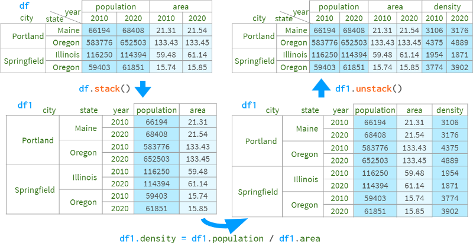

```python
long = df.stack(level="year")
long = long.assign(density=long["population"] / long["area"])
result = long.unstack(level="year", sort=False)
```

需要固定结果次序时，可按原来的年份顺序和希望的指标顺序重新构造列索引，再 `reindex(columns=...)`。这种做法同时说明了为何长表常适合中间计算。

配套工具的 `pdi.assign` 则把添加多层指标的过程封装起来。

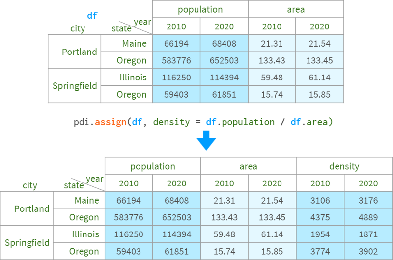

它还考虑了通过分类索引维护的顺序。只使用标准 Pandas 时，也可以给计算结果补上指标层，再一次拼接：

```python
density_block = pd.concat({"density": density}, axis=1)
density_block.columns = density_block.columns.set_names(df.columns.names)
result = pd.concat([df, density_block], axis=1)
```

这保留了数据与坐标之间的关系：先在相同年份和城市上计算，再给结果附上新的指标名称。掌握标签对齐、聚合和级别移动之后，复杂的多重索引表也可以拆成一系列含义明确的操作。

