# 正则化

模型训练通过降低训练损失来估计参数，但训练损失较低并不意味着模型在新样本上具有较小误差。正则化关注的是：在有限数据能够支持的多种模型之间，如何引入合理的约束或偏好，使模型更有可能学习到可推广的规律。

本文依次讨论显式正则化、概率解释、L2 正则化、隐式正则化，以及早停、集成、Dropout、噪声、贝叶斯推理、迁移学习、多任务学习、自监督学习和数据增强。重点在于这些方法如何影响模型选择、训练过程与预测结果。

## 1. 泛化与正则化

### 训练风险与泛化风险

设训练集为 $\mathcal D=\{(x_i,y_i)\}_{i=1}^{N}$，模型为 $f(x;\theta)$，单个样本的损失为 $\ell(f(x;\theta),y)$。本文采用平均训练损失：

$$
L(\theta)=\frac{1}{N}\sum_{i=1}^{N}\ell(f(x_i;\theta),y_i).
$$

它描述模型在已经观测到的样本上的拟合程度。真正希望降低的是模型在目标数据分布 $P(x,y)$ 上的期望损失，即泛化风险：

$$
\mathcal R(\theta)
=\mathbb E_{(x,y)\sim P}\bigl[\ell(f(x;\theta),y)\bigr].
$$

实际训练中无法直接计算这个期望，只能用独立验证集、测试集进行估计。训练集用于估计参数，验证集用于选择正则化强度等超参数，测试集用于评价最终确定的模型。

**过拟合的关键不只是训练误差很小，而是模型对训练样本的适应没有转化为对新样本的有效预测。** 模型可能拟合观测噪声，也可能在训练点之间产生缺乏数据支持的变化。即使训练标签没有噪声，有限样本也通常不足以唯一确定整个输入空间上的预测函数。

### 正则化的基本作用

假设多个函数都能经过全部训练点，它们在这些点上的训练损失可以相同，但在其他位置的预测可能差异很大。正则化为这种选择加入额外依据，例如倾向于较小的权重、对微小扰动更稳定的输出，或能同时解释多组数据的共享特征。

正则化可从两个层面理解：

- **显式正则化**：直接在优化目标中加入惩罚项，规定哪些参数或函数更受偏好。
- **隐式正则化**：即使目标函数不变，初始化、优化算法、学习率和训练时长等因素也可能使训练偏向某类解。

更广义的正则化还包括集成、数据增强和利用其他任务的数据等提高泛化能力的方法。它们不一定减少参数数量，也不一定能写成一个简单的参数惩罚项。

正则化通常是在拟合训练数据与限制不必要的变化之间取得平衡。约束过弱可能保留过拟合，约束过强则可能阻碍模型表达真实规律，产生欠拟合。因此，正则化强度应通过验证表现选择，而不能仅根据训练损失判断。

下文以 $\theta$ 表示全部参数，以 $w$ 表示受到惩罚的权重；偏置是否包含在正则项中将单独说明。配图中的 $\phi$ 与正文的 $\theta$ 均表示模型参数。

## 2. 显式正则化

### 正则化目标

显式正则化将训练目标改写为

$$
J(\theta)=L(\theta)+\lambda\Omega(\theta),
\qquad
\hat\theta\in\arg\min_\theta J(\theta),
$$

其中，$\Omega(\theta)$ 为正则项，$\lambda\geq0$ 为正则化系数。$L$ 衡量模型对观测数据的拟合，$\Omega$ 衡量参数与预设偏好之间的偏离程度。

当 $\lambda=0$ 时，目标退化为原来的训练损失。随着 $\lambda$ 增大，参数选择更加重视正则项。最终解未必使 $L$ 或 $\Omega$ 单独达到最小，而是使两者之和达到较小值。

若目标可微，内点最优解满足

$$
\nabla L(\hat\theta)+\lambda\nabla\Omega(\hat\theta)=0.
$$

这个条件说明：在正则化后的解处，数据拟合产生的梯度可以与正则项产生的梯度相互抵消。因此，正则化后的参数通常并不是原训练损失的驻点。

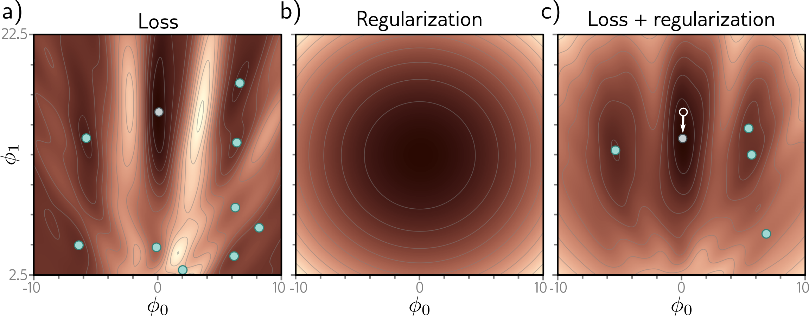

*图 9.1｜左图为数据损失，中图为偏好较小参数的正则项，右图为两者之和。加入正则项后，目标函数的低值区域和参数解的位置发生变化。*

### 惩罚形式与约束形式

对模型施加偏好也可以写成约束问题：

$$
\min_\theta L(\theta)
\quad\text{subject to}\quad
\Omega(\theta)\leq c.
$$

惩罚形式通过 $\lambda$ 控制违反偏好的代价，约束形式通过 $c$ 控制允许的范围。在满足相应最优性与对偶条件时，两者可以建立对应；对于一般非凸神经网络，不能假设任意给定的 $c$ 都有唯一对应的 $\lambda$。

这一视角有助于理解正则化的几何意义：模型仍希望降低训练损失，但参数不能任意向正则项很大的区域移动。

本文采用平均损失。如果将 $L$ 改为样本损失之和，为保持相同的最优解，正则化系数也应乘以 $N$。**正则化系数的数值必须结合损失的归一化方式理解。**

## 3. 正则化的概率解释

### 从最大似然到最大后验

设模型给出条件概率 $p(y\mid x,\theta)$。在样本条件独立的假设下，训练数据的似然为

$$
p(\mathcal D\mid\theta)
=\prod_{i=1}^{N}p(y_i\mid x_i,\theta),
$$

其中省略了对输入的条件记号。最大似然估计只根据这项似然选择参数：

$$
\hat\theta_{\mathrm{ML}}
\in\arg\max_\theta p(\mathcal D\mid\theta).
$$

如果额外指定参数先验 $p(\theta)$，贝叶斯公式给出

$$
p(\theta\mid\mathcal D)
=\frac{p(\mathcal D\mid\theta)p(\theta)}{p(\mathcal D)}.
$$

分母与待优化的参数无关。最大后验估计因而满足

$$
\begin{aligned}
\hat\theta_{\mathrm{MAP}}
&\in\arg\max_\theta p(\mathcal D\mid\theta)p(\theta)\\
&=\arg\min_\theta\left[
-\frac{1}{N}\sum_{i=1}^{N}\log p(y_i\mid x_i,\theta)
-\frac{1}{N}\log p(\theta)
\right].
\end{aligned}
$$

因此，在平均负对数似然的约定下，正则项可以解释为先验的负对数除以 $N$。先验概率较高的参数受到的惩罚较小，先验概率较低的参数受到的惩罚较大。

这种解释要求明确概率模型与损失之间的对应。不能把任意尺度下的损失直接当作负对数似然而忽略比例系数。

### 高斯先验与 L2 正则化

假设被正则化的 $d$ 个权重相互独立，且满足零均值高斯先验：

$$
p(w)=\prod_{j=1}^{d}
\frac{1}{\sqrt{2\pi\tau^2}}
\exp\left(-\frac{w_j^2}{2\tau^2}\right).
$$

取负对数得到

$$
-\log p(w)
=\frac{1}{2\tau^2}\sum_{j=1}^{d}w_j^2+C
=\frac{1}{2\tau^2}\|w\|_2^2+C,
$$

其中 $C$ 不依赖于 $w$，不会影响最优解。于是最大后验估计对应于

$$
J(\theta)=L(\theta)+\frac{\lambda}{2}\|w\|_2^2,
\qquad
\lambda=\frac{1}{N\tau^2},
$$

这里 $L$ 是平均负对数似然。**先验方差越小，权重越被限制在零附近，L2 正则化就越强。**

若采用高斯回归模型 $y_i\sim\mathcal N(f(x_i;\theta),\sigma_y^2)$，并将数据项写成 $\frac{1}{2N}\sum_i(f(x_i;\theta)-y_i)^2$，则相同的推导给出 $\lambda=\sigma_y^2/(N\tau^2)$。比例系数的变化来自对整个负对数后验的等比例缩放。

最大后验估计最终仍选择一组参数；完整的贝叶斯预测则保留并综合参数的不确定性。两者的区别将在后文展开。

## 4. L2 正则化

### 参数收缩与函数变化

L2 正则化采用平方范数惩罚：

$$
J(\theta)=L(\theta)+\frac{\lambda}{2}\sum_jw_j^2.
$$

因子 $1/2$ 只是为了简化求导。如果将正则项写成 $\lambda\sum_jw_j^2$，对应的梯度会多出因子 $2$，两种定义使用的 $\lambda$ 不能直接比较。对于权重矩阵 $W$，所有元素的平方和就是 Frobenius 范数的平方 $\|W\|_F^2$，因此矩阵形式与上述向量形式是一致的。

较大的权重通常会使模型对输入变化更敏感。以线性模型 $f(x)=w^\top x+b$ 为例，输入扰动 $\Delta x$ 导致

$$
|f(x+\Delta x)-f(x)|
=|w^\top\Delta x|
\leq\|w\|_2\|\Delta x\|_2.
$$

因此，控制 $\|w\|_2$ 可以直接限制线性模型的输入敏感性。对于多层网络，输入敏感性取决于各层权重与激活函数的共同作用；“小权重使函数更平缓”是有用的解释，但不能据此断言任意网络的每一点都会更加平滑。

权重正则化也不等同于直接约束函数的二阶导数。即使采用 L2，ReLU 网络仍可具有分段线性函数的折点。

实践中常将偏置排除在权重惩罚之外，因为偏置主要调节整体位置，而非线性模型的斜率。是否惩罚偏置属于模型设计选择，应与所使用的先验保持一致。

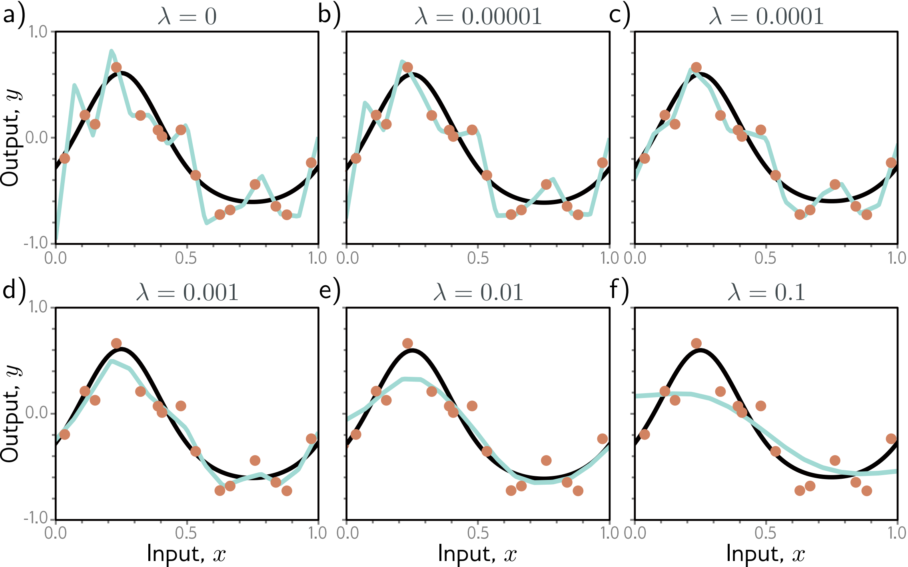

*图 9.2｜弱正则化时，拟合函数可能追随样本中的局部波动；适中的正则化抑制不必要的变化；正则化过强时，模型难以表达真实函数的变化。图中的系数只适用于该示例的损失定义与模型。*

### 线性回归中的解析形式

对于中心化后的线性回归问题，暂不单独讨论截距，目标为

$$
J(w)=\frac{1}{2N}\|Xw-y\|_2^2+\frac{\lambda}{2}\|w\|_2^2.
$$

令梯度为零：

$$
\frac{1}{N}X^\top(Xw-y)+\lambda w=0,
$$

得到岭回归解

$$
\hat w=(X^\top X+N\lambda I)^{-1}X^\top y,
\qquad\lambda>0.
$$

即使 $X^\top X$ 存在零特征值，加上 $N\lambda I$ 后也成为正定矩阵，因而解唯一。正则化降低了模型对数据中约束较弱方向的敏感性，但也引入向零收缩的偏差。

最简单的单参数例子是

$$
J(w)=\frac12(w-a)^2+\frac{\lambda}{2}w^2,
\qquad
\hat w=\frac{a}{1+\lambda}.
$$

未经正则化时最优解为 $a$，加入 L2 后其绝对值缩小。当 $a\neq0$ 且 $\lambda$ 有限时，解仍然不为零。这也说明 L2 通常产生连续收缩，而不是直接产生稀疏解。

### L2 与权重衰减

设 $g_t=\nabla_wL(\theta_t)$。在不含动量的普通梯度下降或 SGD 中，对正则化目标求梯度得到

$$
\nabla_wJ(\theta_t)=g_t+\lambda w_t.
$$

于是

$$
\begin{aligned}
w_{t+1}
&=w_t-\alpha(g_t+\lambda w_t)\\
&=(1-\alpha\lambda)w_t-\alpha g_t.
\end{aligned}
$$

更新包含两部分：按数据梯度更新权重，以及将原权重乘以 $1-\alpha\lambda$。当 $0<\alpha\lambda<1$ 时，后一部分使权重向零收缩，称为权重衰减。

若单独将每步衰减比例记作 $\delta$，即 $w_{t+1}=(1-\delta)w_t-\alpha g_t$，则在上述约定下 $\delta=\alpha\lambda$。若正则项没有 $1/2$，则变为 $\delta=2\alpha\lambda$。学习率变化时，固定正则化系数与固定每步衰减比例不是同一设置。[\[1\]](#%E5%8F%82%E8%80%83%E6%96%87%E7%8C%AE1)

这一等价关系依赖具体更新规则。对 Adam 而言，将 $\lambda w_t$ 加入梯度会使它进入一阶矩、二阶矩和逐坐标缩放，通常不等价于直接收缩参数。AdamW 将两部分分开：

$$
w_{t+1}=(1-\alpha\lambda)w_t
-\alpha\frac{\hat m_{t+1}}{\sqrt{\hat v_{t+1}}+\epsilon},
$$

其中矩估计只使用数据损失梯度。这里的 $\lambda$ 是解耦衰减系数，不能直接赋予与 L2 惩罚完全相同的作用。

### 稀疏性与其他惩罚

正则项的形状决定它所偏好的参数结构：

| 正则项 | 形式 | 主要作用 |
|---|---|---|
| L0 计数 | $\sum_j\mathbf1(w_j\neq0)$ | 直接惩罚非零参数数量，通常涉及困难的离散选择 |
| L1 | $\sum_j|w_j|$ | 具有非光滑的零点，可产生稀疏最优解 |
| L2 | $\frac12\sum_jw_j^2$ | 连续收缩权重，通常不使参数精确为零 |
| 弹性网 | $\lambda_1\|w\|_1+\frac{\lambda_2}{2}\|w\|_2^2$ | 同时引入稀疏偏好与平方收缩 |

L0 是常用名称，严格说来并不是范数。L1 在 $w_j\neq0$ 时的导数为 $\operatorname{sign}(w_j)$，在零点使用次梯度。

用单参数问题可以直接看到 L1 的稀疏作用：

$$
\min_w\frac12(w-a)^2+\lambda|w|
\quad\Longrightarrow\quad
\hat w=\operatorname{sign}(a)\max(|a|-\lambda,0).
$$

当 $|a|\leq\lambda$ 时，最优解精确为零；而 L2 的解为 $a/(1+\lambda)$。两者差异来自惩罚在零附近的形状。一般网络中，L1 的稀疏最优解性质不意味着普通固定步长 SGD 的每个迭代值都会精确变为零。

还可以使用 $\sum_j|w_j|^p$ 且 $0<p<1$ 的惩罚增强稀疏偏好，但这类目标非凸，求解更困难。选择正则项应依据希望引入的结构，而非只比较惩罚大小。

## 5. 隐式正则化

### 优化过程的选择偏好

在过参数化模型中，可能存在许多训练误差相近甚至相同的解。训练算法从何处出发、以何种步长更新以及如何抽取批次，会影响最终到达的解。因此，即使没有加入显式惩罚，优化过程也可能具有正则化作用。

隐式正则化不是一个对所有算法都相同的隐藏损失。下文的修正目标用于解释特定条件下 GD 和 SGD 的有限步长效应，不应直接推广到动量、Adam 或任意学习率。

### 梯度下降的有限步长效应

连续梯度流满足

$$
\frac{\mathrm d\theta}{\mathrm dt}=-\nabla L(\theta),
$$

而离散梯度下降按有限步长更新：

$$
\theta_{t+1}=\theta_t-\alpha\nabla L(\theta_t).
$$

离散更新并不严格沿着原损失的连续梯度流运动。对足够光滑的损失和足够小的有限步长，保留学习率的一阶修正，可以用下列修正损失的梯度流近似解释离散轨迹：

$$
\widetilde L_{\mathrm{GD}}(\theta)
=L(\theta)+\frac{\alpha}{4}\|\nabla L(\theta)\|_2^2.
$$

附加项与损失梯度的平方范数成正比。它描述有限步长对优化路径的影响，而不是算法实际计算并加入了这个惩罚项。

为理解它与局部几何的关系，记 $g=\nabla L$、$H=\nabla^2L$，则

$$
\nabla\|g\|_2^2=2Hg,
\qquad
\nabla\widetilde L_{\mathrm{GD}}=g+\frac{\alpha}{2}Hg.
$$

修正后的方向同时依赖梯度和曲率。原损失的驻点满足 $g=0$，在该近似修正目标中仍是驻点；变化主要体现在驻点附近的几何与到达它们的路径，不能解释为“所有尖锐极小值都被删除”。

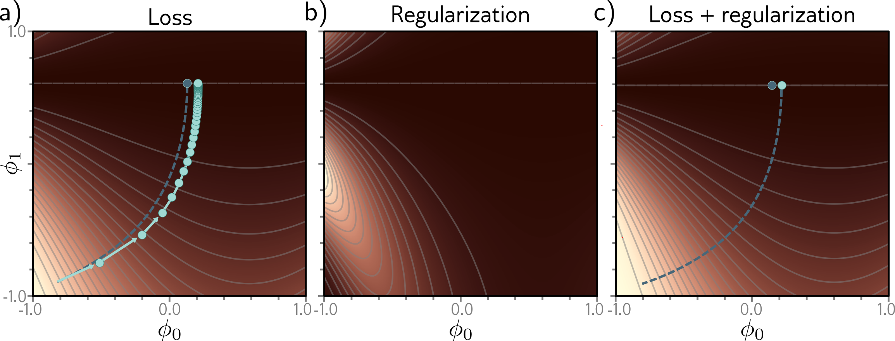

*图 9.3｜有限步长带来的修正可改变连续路径的形状。显式加入的参数惩罚与此处的梯度范数修正作用对象不同：前者直接限制参数，后者与损失地形及步长相关。*

该近似不能推出学习率越大泛化越好。学习率过大可能使迭代振荡或发散，也会超出近似成立的范围。

### 随机梯度下降的批量效应

设训练集被划分为 $M$ 个等大的批次，每个批次含 $b$ 个样本，$N=Mb$。第 $m$ 个批次的平均损失与梯度记作 $L_m$ 和 $g_m$，则

$$
L=\frac{1}{M}\sum_{m=1}^{M}L_m,
\qquad
g=\nabla L=\frac{1}{M}\sum_{m=1}^{M}g_m.
$$

在每个 epoch 随机排列这些批次、每个样本使用一次、学习率较小且损失足够光滑的分析中，一个 epoch 后对批次顺序取平均的 SGD 迭代，可由以下修正目标的梯度流近似描述：

$$
\widetilde L_{\mathrm{SGD}}
=L+\frac{\alpha}{4M}\sum_{m=1}^{M}\|g_m\|_2^2.
$$

这里描述的是平均演化，并非每条随机轨迹都精确等于该目标的梯度流。

利用 $\sum_m(g_m-g)=0$，有

$$
\frac{1}{M}\sum_m\|g_m\|_2^2
=\|g\|_2^2+\frac{1}{M}\sum_m\|g_m-g\|_2^2.
$$

因此

$$
\widetilde L_{\mathrm{SGD}}
=L+\frac{\alpha}{4}\|g\|_2^2
+\frac{\alpha}{4M}\sum_m\|g_m-g\|_2^2.
$$

第一项修正与 GD 相同，第二项衡量不同批次梯度之间的分歧。即使全梯度接近零，各批次梯度也可能仍然较大，只是在平均时相互抵消。SGD 的修正因而能够区分一些全梯度相近的参数位置。

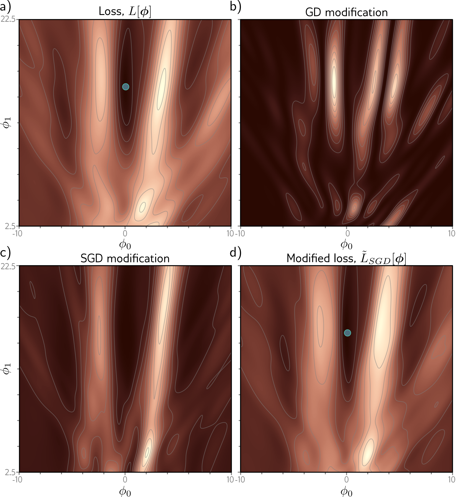

*图 9.4｜GD 的修正与全梯度有关，SGD 还受到批次梯度差异的影响。修正后的低值区域可能变化，这为不同采样方式产生不同解提供了一种解释。*

当批次扩大至整个训练集时，$M=1$ 且 $g_1=g$，梯度分歧项消失。较小批次通常具有较大的梯度波动，但具体大小仍取决于样本之间的相关性、采样方法与模型所处位置。

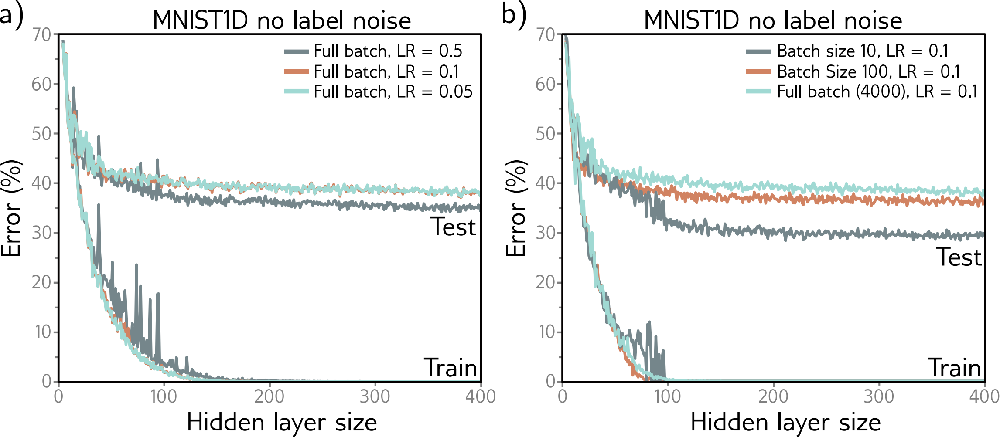

*图 9.5｜示例中横轴为隐藏层宽度，纵轴为分类错误率。左图改变全批量 GD 的学习率，右图改变 SGD 的批量大小。较低的训练误差不一定对应较低的测试误差；图中的趋势不能当作所有任务的固定规律。*

### 平坦性与泛化

在相同参数表示和扰动尺度下，若参数受到小扰动时损失变化较小，可以称该区域相对平坦。平坦区域对参数扰动具有一定稳定性，这使它成为理解某些正则化现象的直观工具。

但是，参数空间中的平坦性依赖参数化方式。同一个预测函数可能通过不同权重缩放获得不同的曲率，而实际预测与泛化表现不变。因此，“更平坦”不能脱离参数尺度直接等同于“泛化必然更好”。

## 6. 泛化改进方法

### 6.1 早停

训练的早期阶段，模型通常先学习数据中较显著的结构；继续优化可能进一步拟合样本中的局部波动。早停通过限制训练时长，选择训练过程中的某个中间解，而非一直降低训练损失。

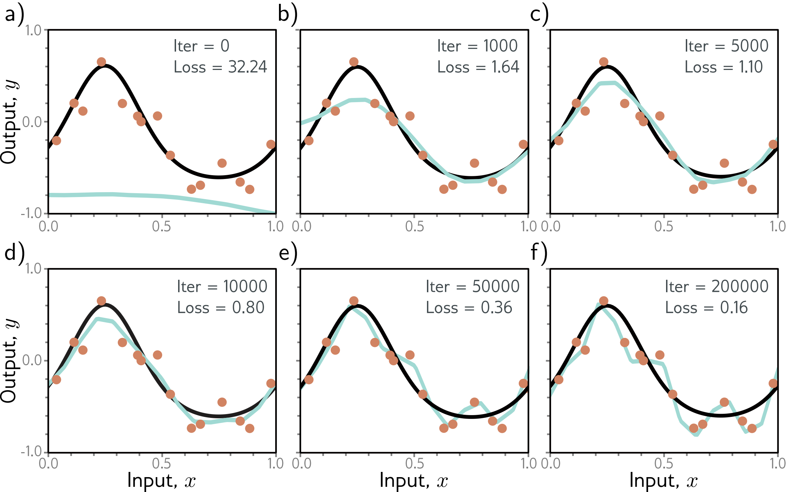

*图 9.6｜随着迭代增加，训练损失持续下降，但拟合函数也可能逐渐追随观测噪声。适当的中间迭代结果可能更接近生成数据的真实函数。*

实际应用中通常无法观察真实函数，因此依据验证集选择停止时刻：定期计算验证指标，保存最佳参数；当指标在一定次数内没有有效改善时停止，并恢复此前保存的最佳参数。

停止时刻可写为

$$
t^*\in\arg\min_{t\in\mathcal T}L_{\mathrm{val}}(\theta_t),
$$

其中 $\mathcal T$ 是已经评估的候选时刻。容忍次数用于缓和验证曲线的随机波动，不意味着最终必须使用最后一次迭代的参数。

早停与 L2 都可能限制参数偏离初始状态的程度，但二者一般不完全等价。对于从零开始的单参数二次目标 $L(w)=\frac a2(w-w^*)^2$，若 $0<\alpha a<1$，则

$$
w_t=\bigl[1-(1-\alpha a)^t\bigr]w^*.
$$

有限时刻的解只走向最优参数的一部分。多维情况下，不同曲率方向以不同速度学习，因此停止时刻也会影响模型已学到哪些变化方向。这为早停的收缩作用提供了简单解释，但不要求一般网络都遵循相同的学习顺序。

### 6.2 集成学习

集成学习将多个模型的预测组合起来。对于回归，最常见的形式是预测平均：

$$
\bar f(x)=\frac1K\sum_{k=1}^{K}f_k(x).
$$

如果不同模型的误差不完全相同，平均可以抵消部分波动。设某个输入处各模型误差的方差均为 $\sigma^2$，任意两模型误差的相关系数均为 $\rho$，则

$$
\operatorname{Var}\!\left(\frac1K\sum_k e_k\right)
=\frac{1}{K^2}\left[K\sigma^2+K(K-1)\rho\sigma^2\right]
=\sigma^2\left[\rho+\frac{1-\rho}{K}\right].
$$

当误差不相关时，方差变为 $\sigma^2/K$；当误差完全一致时，平均不能降低方差。该推导针对误差的波动，不能说明平均会自动消除所有模型共有的系统偏差。

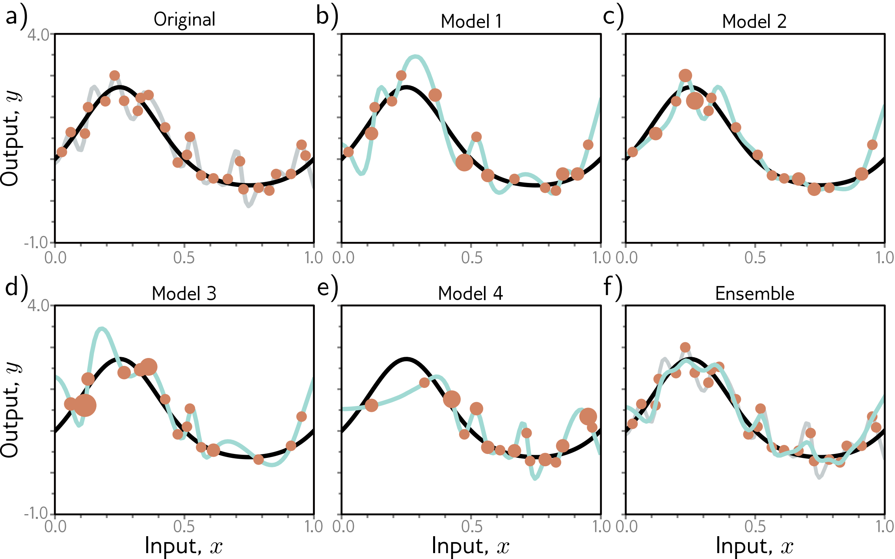

*图 9.7｜从原始数据中有放回地抽样，得到不同训练集并分别训练模型；各模型在局部的变化不同，预测平均可以减弱部分变化。图中重复抽到的样本以较大的点表示。*

模型多样性可以来自不同初始化、不同数据子集、不同结构或不同超参数。Bagging 使用有放回抽样生成多个训练集；每个训练集可与原数据等大，但会包含重复样本，也会遗漏一些原始样本。

分类任务可以平均类别概率：

$$
\bar p(y=c\mid x)=\frac1K\sum_kp_k(y=c\mid x),
$$

也可以平均 logits 后再应用 softmax，或者对预测类别投票。这些规则并不相同，尤其因为 softmax 是非线性的，平均 logits 通常不等于平均概率。

集成通常需要保存和评估多个模型，因而增加训练或推理开销。也可利用一次训练中的多个快照构建集成，但这些模型之间往往有较强相关性。参数平均则是另一种操作：对于一般神经网络，平均参数后得到的预测不等于平均多个模型的预测。

### 6.3 Dropout

Dropout 在训练时随机将部分隐藏单元的激活置零，使每次前向传播使用不同的子网络。保留下来的单元必须在其他单元可能缺失的条件下完成预测，从而减少对特定激活组合的依赖。

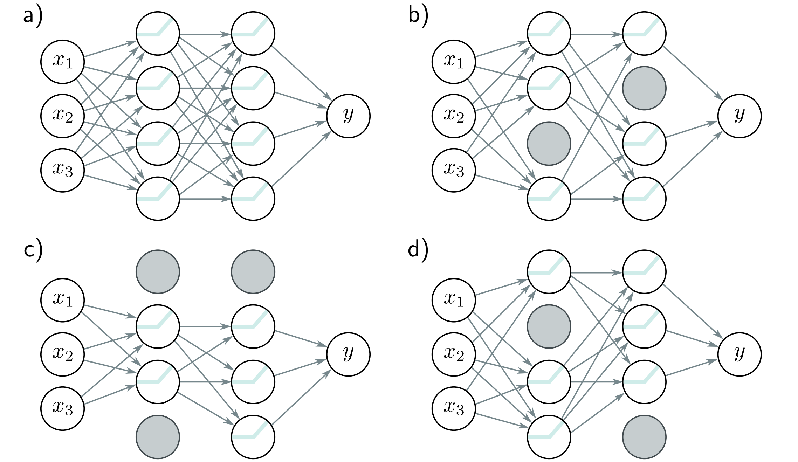

*图 9.8｜灰色单元在当前计算中被丢弃，其相连路径不再贡献输出。不同随机掩码产生不同子网络，但这些子网络共享原网络中的参数*

设丢弃概率为 $p$，保留概率为 $q=1-p>0$，隐藏激活为 $h_j$，随机掩码满足 $r_j\sim\operatorname{Bernoulli}(q)$。

一种定义在训练时使用 $r_jh_j$，其期望为 $qh_j$，推理时用 $qh_j$ 代替随机激活。更常见的反向缩放形式在训练时采用

$$
\widetilde h_j=\frac{r_j}{q}h_j,
\qquad
\mathbb E_r[\widetilde h_j]=h_j,
$$

推理时直接使用完整激活 $h_j$。两种形式都在匹配激活的尺度，但缩放的位置不同，不能在训练和推理时重复缩放。

由于后续网络通常是非线性的，匹配某层激活的期望，并不意味着完整网络的确定性预测严格等于所有随机子网络预测的平均。

从优化角度，Dropout 的训练目标可理解为对随机掩码取期望：

$$
\min_\theta\frac1N\sum_i
\mathbb E_r\left[\ell(f(x_i;\theta,r),y_i)\right].
$$

实际训练用随机掩码近似这个期望。因此，Dropout 与集成具有联系，但它没有独立训练所有子网络，而是让大量子网络共享权重。

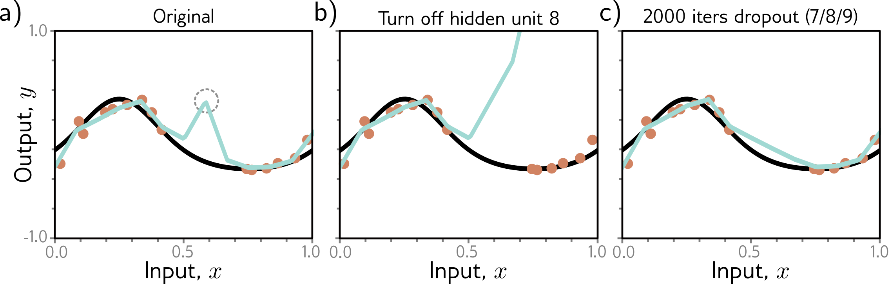

*图 9.9｜某些隐藏单元共同产生训练点之间的额外突起。随机丢弃会破坏这种依赖关系，继续训练可使模型减少不稳定的局部变化。该例解释一种作用机制，并非保证所有网络都会得到更平滑的函数。*

丢弃率过高会减少每次计算可用的信息，使拟合更困难。Dropout 的效果也依赖网络结构和数据规模，不能仅凭训练损失增加就判断它有益或有害。

### 6.4 噪声与标签平滑

#### 输入噪声

训练时给输入施加扰动，要求模型在原样本附近也具有合理预测。其目标可以写成

$$
J_{\mathrm{noise}}(\theta)
=\frac1N\sum_i\mathbb E_\varepsilon
\left[\ell(f(x_i+\varepsilon;\theta),y_i)\right].
$$

当扰动不改变样本语义时，这种训练可以抑制模型对无关细节的过度敏感。但如果噪声使输入不再对应原标签，就可能破坏监督信号。[\[1\]](#%E5%8F%82%E8%80%83%E6%96%87%E7%8C%AE1)[\[7\]](#%E5%8F%82%E8%80%83%E6%96%87%E7%8C%AE7)

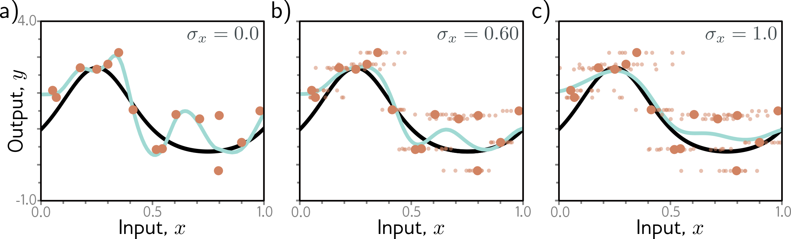

*图 9.10｜带噪输入使训练点在输入方向扩散，模型需要适应原样本附近的一片区域。过强的噪声也会掩盖原始函数的结构，导致欠拟合。*

在线性模型中，可以直接推导输入噪声与 L2 的联系。设 $f(x)=a+bx$，噪声满足 $\mathbb E[\varepsilon]=0$、$\mathbb E[\varepsilon^2]=\sigma_x^2$。记 $e_i=a+bx_i-y_i$，则

$$
\begin{aligned}
\mathbb E_\varepsilon\left[\frac12\bigl(a+b(x_i+\varepsilon)-y_i\bigr)^2\right]
&=\frac12\mathbb E_\varepsilon[(e_i+b\varepsilon)^2]\\
&=\frac12 e_i^2+\frac12 b^2\sigma_x^2.
\end{aligned}
$$

对样本取平均后得到

$$
\mathbb E[L_{\mathrm{noise}}(a,b)]
=L_{\mathrm{clean}}(a,b)+\frac{\sigma_x^2}{2}b^2.
$$

因此，在这一线性模型与平方损失设定中，零均值输入噪声恰好等价于对斜率加入 L2 惩罚，而截距不受额外惩罚。相应的期望梯度为

$$
\mathbb E\!\left[\frac{\partial L_{\mathrm{noise}}}{\partial a}\right]
=\frac{\partial L_{\mathrm{clean}}}{\partial a},
\qquad
\mathbb E\!\left[\frac{\partial L_{\mathrm{noise}}}{\partial b}\right]
=\frac{\partial L_{\mathrm{clean}}}{\partial b}+\sigma_x^2b.
$$

多维线性模型中，若输入噪声协方差为 $\Sigma$，附加项为 $\frac12w^\top\Sigma w$；只有各向同性噪声 $\Sigma=\sigma_x^2I$ 才得到相同强度的 L2 惩罚。对非线性网络，噪声的作用与函数对输入的局部导数有关，一般不能直接等同于普通权重 L2。

#### 权重噪声

另一种方法是在训练时扰动权重，并降低扰动后的平均损失：

$$
\mathbb E_\eta[L(\theta+\eta)].
$$

当 $\eta$ 是较小的零均值各向同性噪声，且损失足够光滑时，二阶展开给出

$$
\mathbb E_\eta[L(\theta+\eta)]
\approx L(\theta)+\frac{\sigma_w^2}{2}\operatorname{tr}(H(\theta)).
$$

这里 $\operatorname{tr}(H)$ 是 Hessian 对角元素之和。在局部极小值附近，较大的正曲率会增加扰动后的平均损失，从而解释了权重噪声对宽阔低损失区域的偏好。这是小扰动下的局部解释，仍受参数尺度影响。

随机噪声也可以改为有目的地选择较不利的输入扰动，即对抗训练。它在指定扰动范围内提高预测稳定性，所要求的鲁棒性比对随机噪声取平均更强；扰动范围仍须符合任务语义。

#### 标签平滑

分类的独热标签将正确类别的目标概率设为 $1$，其他类别设为 $0$。最小化交叉熵会持续鼓励正确类别概率接近 $1$，使模型可能形成过度确定的预测。

设类别数为 $C\geq2$，真实类别为 $y$。采用将较小的总质量 $\rho\in[0,1)$ 分给其余类别的约定：

$$
q_c=
\begin{cases}
1-\rho,&c=y,\\
\rho/(C-1),&c\neq y.
\end{cases}
$$

平滑后的交叉熵为

$$
\ell_{\mathrm{LS}}
=-\sum_{c=1}^{C}q_c\log p_c
=-(1-\rho)\log p_y
-\frac{\rho}{C-1}\sum_{c\neq y}\log p_c.
$$

例如，十分类中取 $\rho=0.1$，正确类别目标为 $0.9$，其余九类各为 $0.1/9$，总和仍为 $1$。它也等价于下列随机标签过程的期望损失：以概率 $1-\rho$ 保留原类别，以概率 $\rho$ 均匀替换为其他类别。

若 $p=\operatorname{softmax}(z)$，则

$$
\frac{\partial\ell_{\mathrm{LS}}}{\partial z_c}=p_c-q_c.
$$

当模型已经给正确类别非常高的概率时，平滑标签不再持续要求它向 $1$ 靠近。对于单个样本，如果模型能够精确匹配目标 $q$，其最优概率为 $p=q$，而非独热分布。

另一种常见定义是 $q=(1-\varepsilon)y_{\mathrm{onehot}}+\varepsilon\mathbf1/C$，将均匀质量分配给包括正确类别在内的所有类别。此时正确类别为 $1-\varepsilon+\varepsilon/C$，它与前述约定对应于 $\rho=\varepsilon(C-1)/C$。因此，同一个数值的 $\rho$ 与 $\varepsilon$ 表示不同的平滑强度。

标签平滑改变的是训练目标，能够限制过强的类别置信度，但是否改善准确率或概率校准，仍需要在独立数据上评价。

### 6.5 贝叶斯推理

最大后验估计仅使用后验分布中概率密度最高的一组参数。贝叶斯预测则对所有可能参数的预测进行加权，权重由参数后验决定：

$$
p(y\mid x,\mathcal D)
=\int p(y\mid x,\theta)\,p(\theta\mid\mathcal D)\,\mathrm d\theta.
$$

在多个函数都能解释训练数据时，这种方法保留它们的不确定性，而不是过早只选择一个函数。它与集成具有共同点，但贝叶斯方法使用后验权重，普通集成并不自动构成后验采样。

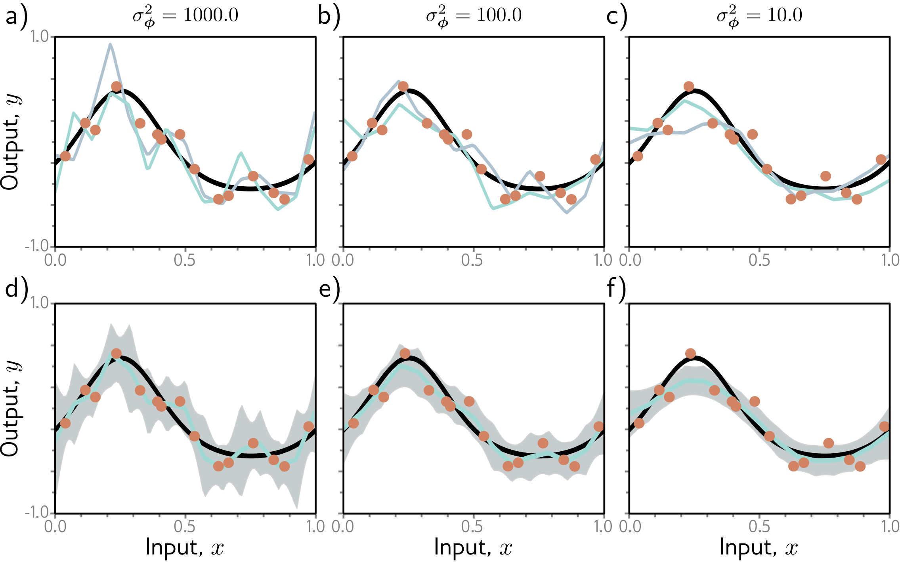

*图 9.11｜上排在三种先验方差下分别展示两组后验参数样本对应的函数；下排对参数后验加权得到预测均值，灰色区域表示均值两侧各两个标准差的范围。该范围不在任意预测分布下都具有固定的覆盖概率。先验过强同样可能导致欠拟合。*

需要区分“平均预测”和“平均参数”：

$$
\mathbb E_{\theta\mid\mathcal D}[f(x;\theta)]
\neq f\!\left(x;\mathbb E[\theta\mid\mathcal D]\right)
$$

通常成立，因为神经网络对参数一般是非线性的。贝叶斯预测需要前者，而不能简单用平均权重代替积分。

对于回归，全方差公式把预测不确定性分解为

$$
\operatorname{Var}(y\mid x,\mathcal D)
=\mathbb E_{\theta\mid\mathcal D}
\bigl[\operatorname{Var}(y\mid x,\theta)\bigr]
+\operatorname{Var}_{\theta\mid\mathcal D}
\bigl(\mathbb E[y\mid x,\theta]\bigr).
$$

第一部分来自给定参数后仍存在的观测随机性，第二部分来自参数不确定性。增加相关数据通常主要帮助减少后一部分，但这一解释依赖模型及其概率假设是否合理。

大型网络的精确后验积分通常不可行，需要采样或变分近似等方法。MC Dropout 是一种相关近似：推理时继续随机丢弃单元，多次计算预测，再统计均值与波动。它在特定假设下具有贝叶斯近似解释，但随机前向传播的方差不自动等于全部预测不确定性；如果还要表示观测噪声，需要相应的输出概率模型。

### 6.6 迁移学习与多任务学习

#### 迁移学习

迁移学习利用源任务中已经学到的表示，帮助目标任务训练。将网络写成

$$
f(x)=h_\omega(g_\psi(x)),
$$

其中 $g_\psi$ 是特征提取部分，$h_\omega$ 是任务输出部分。源任务训练后，可以更换输出层以适应目标任务。

常见方式包括：固定 $\psi$、只学习新的 $\omega$；或者以预训练参数为起点，继续微调部分或全部网络。前者对可训练部分施加更强限制，后者允许表示适应新任务。

迁移学习的作用不仅来自初始化更好。源数据还提供了目标训练集之外的统计结构，使模型无需仅凭少量目标标签重新学习全部特征。若源任务与目标任务不相关，已有偏好也可能妨碍学习，产生负迁移。

#### 多任务学习

多任务学习同时训练若干相关任务。网络共享表示参数 $\psi$，为第 $k$ 个任务保留独立输出参数 $\omega_k$，其目标可以写成

$$
J(\psi,\omega_1,\ldots,\omega_K)
=\sum_{k=1}^{K}a_kL_k(\psi,\omega_k),
\qquad a_k\geq0.
$$

共享部分必须同时支持多个任务，因此难以只适应某个任务的偶然特征。例如，同一场景的语义分割与深度估计可能共同促进对边界、物体和空间结构的表示。

不同任务的损失尺度和数据量可能不同，权重 $a_k$ 决定它们对共享参数的相对影响。如果任务要求相互冲突，共享参数的梯度也可能相互干扰。因此，任务数量增加不必然提高每个任务的性能。

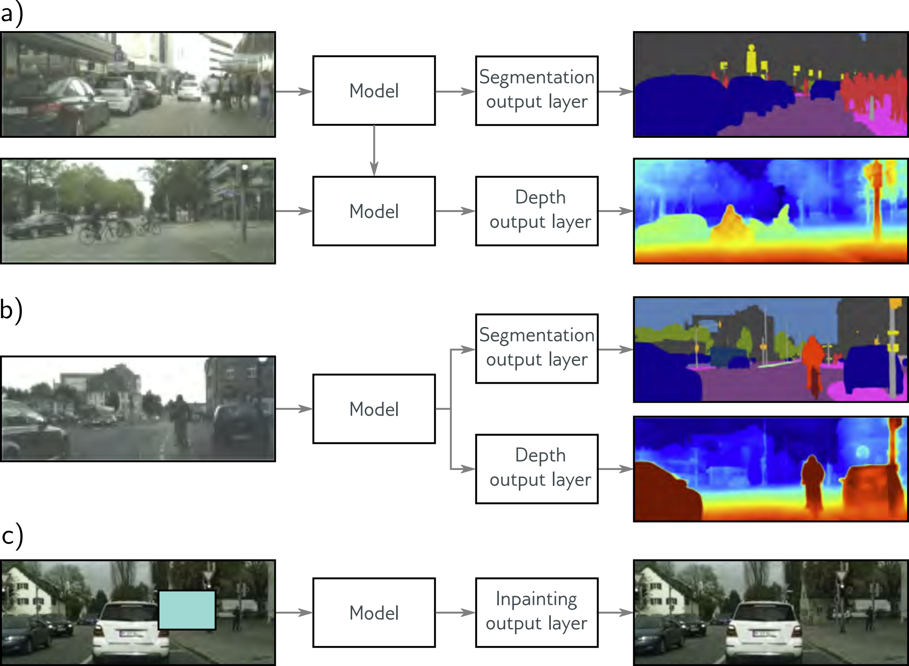

*图 9.12｜上图展示从一个任务迁移到另一个任务；中图用共享表示同时预测语义分割与深度；下图通过补全缺失图像区域学习表示。前两种方法利用任务之间的相关性，第三种方法从数据本身构造监督信号。*

### 6.7 自监督学习

自监督学习从数据本身构造训练目标，不依赖逐样本的人工标签。它仍然有明确的监督信号，只是该信号由输入的一部分、变换结果或其他可观测结构自动生成。

例如，将图像的一块区域遮挡，要求模型根据剩余区域预测缺失内容；或者遮挡文本中的词，要求模型根据上下文预测。模型只有利用数据中的结构关系，才能完成这些任务。

另一类方法使用同一样本的不同增强视图学习表示。以对比学习为例，相关视图的表示应接近，与无关样本的表示应有所区分。也存在不显式使用负样本的自监督方法，因此“自监督学习”不能简单等同于“对比正负样本”。

自监督学习通常先在大量未标注数据上预训练，再将表示迁移到下游任务。这使它与迁移学习形成衔接：前者说明监督信号的来源，后者说明学到的知识如何用于另一个任务。

预训练任务必须提供与下游任务相关的结构。仅仅能够很好地完成重建，不代表一定保留了所有下游判别信息；同样，过强的增强也可能使模型丢失目标任务所需要的细节。

### 6.8 数据增强

数据增强通过变换已有样本，构造额外的训练输入。其核心假设是：某些输入变化不应改变目标，或者目标应当按已知方式同步变化。

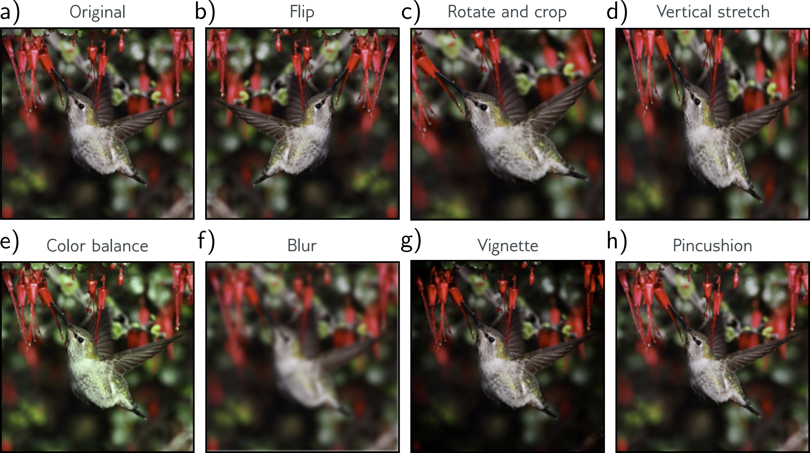

*图 9.13｜翻转、旋转裁剪、拉伸、色彩变化、模糊与畸变等变换可生成同一图像的不同视图。具体变换是否合理，取决于任务中哪些信息必须保留。*

对分类任务，如果变换 $T$ 保持类别，则期望

$$
f(T(x))\approx f(x).
$$

这是对预测不变性的要求。对语义分割等空间预测任务，旋转输入后，标签图也应同步旋转，要求的是

$$
f(T(x))\approx T_y(f(x)),
$$

即输出随输入按相应规则变化的等变性。两者不能混淆。

增强后的训练目标可以统一写为

$$
J_{\mathrm{aug}}(\theta)
=\frac1N\sum_i\mathbb E_T
\left[\ell(f(T(x_i);\theta),T_y(y_i))\right].
$$

对保持类别的分类增强，$T_y(y_i)=y_i$。在线训练时，每次访问样本重新抽取变换，可以让模型看到多种视图，而不必事先保存全部增强数据。

增强相当于把“哪些变化不重要”的先验写入训练过程。它扩大了训练输入的覆盖范围，但没有创造同等数量的独立原始观测。应先划分训练、验证和测试数据，再分别处理，避免同一原始样本的不同增强版本跨越数据划分。

变换需要尊重语义。例如，某些数字旋转后可能改变类别；图像裁剪可能删去目标；在文本中删除否定词可能反转含义。因此，增强强度与种类应由任务决定，不能只追求变化更多。

除单个样本的变换外，mixup 还在两个样本之间进行插值：

$$
\widetilde x=\gamma x_i+(1-\gamma)x_j,
\qquad
\widetilde y=\gamma y_i+(1-\gamma)y_j,
\quad0\leq\gamma\leq1.
$$

分类时 $y_i,y_j$ 为独热向量，混合后成为软标签。它鼓励模型在样本之间具有较平缓的预测变化。mixup 与标签平滑都使用软目标，但 mixup 的目标由另一个样本的标签及输入插值共同决定，而不是向固定的均匀分布移动。

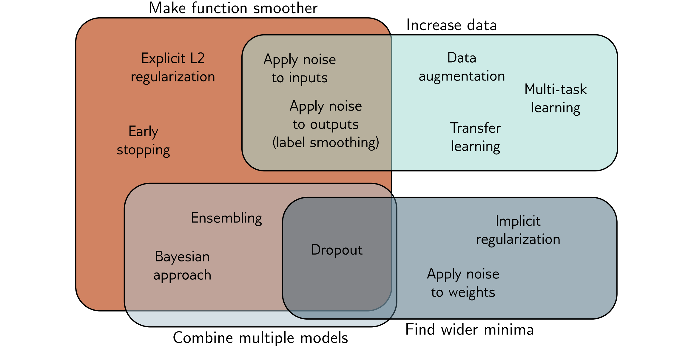

*图 9.14｜各种方法可从函数变化、数据利用、预测组合和参数扰动稳定性等角度理解。这些作用存在重叠，并不是互斥的分类；图中联系用于建立直观认识，不表示每种方法都具有无条件保证。*

数据增强直接规定输入变换的规律，网络结构也可以内置类似偏好。例如，卷积中的局部连接与权重共享限制了模型的表达方式，使模型能够复用不同位置上的特征。显式惩罚、优化过程、数据构造和网络结构由此共同决定模型的归纳偏好；它们是否适合当前问题，最终应由独立数据上的泛化表现检验。

## 参考资料

### 参考文献1

Simon J. D. Prince，*Understanding Deep Learning*，第 9 章 Regularization。[作者教材主页](https://udlbook.github.io/udlbook/)。

### 参考文献2

Ilya Loshchilov、Frank Hutter，[Decoupled Weight Decay Regularization](https://arxiv.org/abs/1711.05101)，ICLR 2019，预印本 2017。

### 参考文献3

David G. T. Barrett、Benoit Dherin，[Implicit Gradient Regularization](https://arxiv.org/abs/2009.11162)，ICLR 2021。

### 参考文献4

Samuel L. Smith、Benoit Dherin、David G. T. Barrett、Soham De，[On the Origin of Implicit Regularization in Stochastic Gradient Descent](https://arxiv.org/abs/2101.12176)，ICLR 2021，§1–2，式（1）–（2）。

### 参考文献5

Laurent Dinh、Razvan Pascanu、Samy Bengio、Yoshua Bengio，[Sharp Minima Can Generalize For Deep Nets](https://arxiv.org/abs/1703.04933)，2017。

### 参考文献6

Nitish Srivastava、Geoffrey Hinton、Alex Krizhevsky、Ilya Sutskever、Ruslan Salakhutdinov，[Dropout: A Simple Way to Prevent Neural Networks from Overfitting](https://www.jmlr.org/papers/v15/srivastava14a.html)，JMLR 15(56): 1929–1958，2014。

### 参考文献7

Christopher M. Bishop，[Training with Noise is Equivalent to Tikhonov Regularization](https://www.microsoft.com/en-us/research/publication/training-with-noise-is-equivalent-to-tikhonov-regularization/)，Neural Computation 7(1): 108–116，1995。

### 参考文献8

Christian Szegedy、Vincent Vanhoucke、Sergey Ioffe、Jonathon Shlens、Zbigniew Wojna，[Rethinking the Inception Architecture for Computer Vision](https://arxiv.org/abs/1512.00567)，CVPR 2016，§7。

### 参考文献9

Yarin Gal、Zoubin Ghahramani，[Dropout as a Bayesian Approximation: Representing Model Uncertainty in Deep Learning](https://proceedings.mlr.press/v48/gal16.html)，ICML，PMLR 48: 1050–1059，2016。

### 参考文献10

Hongyi Zhang、Moustapha Cisse、Yann N. Dauphin、David Lopez-Paz，[mixup: Beyond Empirical Risk Minimization](https://arxiv.org/abs/1710.09412)，ICLR 2018，预印本 2017。

